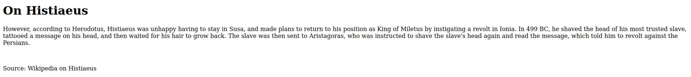

# Inspect HTML - picoCTF 2022 - CMU Cybersecurity Competition
Web Exploitation, 100 Points

## Description


 

## Inspect HTML Solution

By browsing the [website](http://saturn.picoctf.net:59430/) from the challenge description we can see the following web page:



We can simply get the flag ```picoCTF{1n5p3t0r_0f_h7ml_dd513514}``` by looking on the source file:
```html
<!DOCTYPE html>
<html lang="en">
  <head>
    <meta charset="UTF-8">
    <meta name="viewport" content="width=device-width, initial-scale=1.0">
    <meta http-equiv="X-UA-Compatible" content="ie=edge">
    <title>On Histiaeus</title>
  </head>
  <body>
    <h1>On Histiaeus</h1>
    <p>However, according to Herodotus, Histiaeus was unhappy having to stay in
       Susa, and made plans to return to his position as King of Miletus by 
       instigating a revolt in Ionia. In 499 BC, he shaved the head of his 
       most trusted slave, tattooed a message on his head, and then waited for 
       his hair to grow back. The slave was then sent to Aristagoras, who was 
       instructed to shave the slave's head again and read the message, which 
       told him to revolt against the Persians.</p>
    <br>
    <p> Source: Wikipedia on Histiaeus </p>
	<!--picoCTF{1n5p3t0r_0f_h7ml_dd513514}-->
  </body>
</html>

```