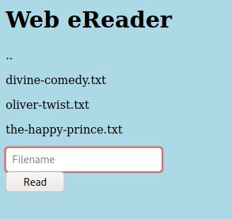

# Forbidden Paths - picoCTF 2022 - CMU Cybersecurity Competition
Web Exploitation, 200 Points

## Description


 
## Forbidden Paths Solution

By browsing the [website](http://saturn.picoctf.net:53295/) from the challenge description we can see the following web page:



According to the challenge description, we know we are on ```/usr/share/nginx/html/``` and the flag located on ```/flag.txt```,

Meaning that we need to read the path ```../../../../flag.txt```.

By reading this path we get the flag ``` picoCTF{7h3_p47h_70_5ucc355_26b22ab3}```.