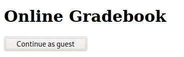

# Power Cookie - picoCTF 2022 - CMU Cybersecurity Competition
Web Exploitation, 200 Points

## Description


 
## Power Cookie Solution

By browsing the [website](http://saturn.picoctf.net:53295/) from the challenge description we can see the following web page:



By clicking on the button we get:
```
We apologize, but we have no guest services at the moment.
```

By observing the cookies we can see the following ```isAdmin=0```, If we are changing the cookie value to ```isAdmin=1``` we get the flag ```picoCTF{gr4d3_A_c00k13_dcb9f091}```.