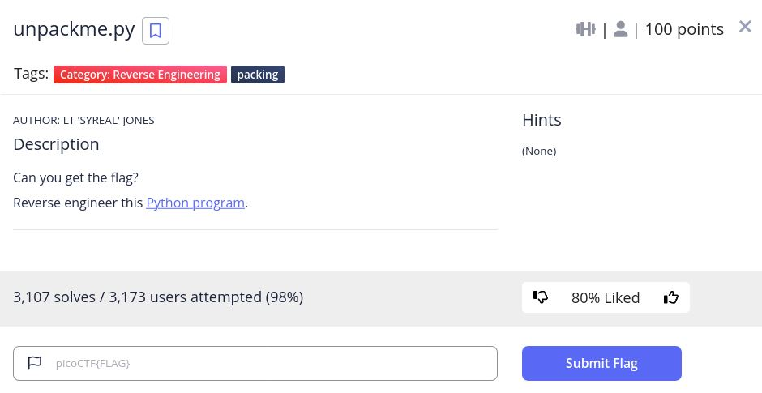

# unpackme.py - picoCTF 2022 - CMU Cybersecurity Competition
Reverse Engineering, 100 Points

## Description


 
## unpackme.py Solution

By observing the [attached code](./unpackme.flag.py) we can see the following code:
```python
import base64
from cryptography.fernet import Fernet


payload = b'gAAAAABiMD1Dt87s50caSunQlHoZqPOwtGNaQXexN-gjKwZeuLEN_-v6UcFJHVXOT4B6DcD1SB7cnd6yTcHg9e9LZCAeJY2cJ0r0sfyGPRiH60F-WbkyUjlAdDywI8RPdTpDYLuBmpZ_Kun-kHyTzMjeKR6R26Z4JITUS8n7Dj9X--9eNLajH6UuYD4GkjRACpsidl_8z33DlB86u_xDCMMm7HFK2oJTs8HG1fBex6enQsu0frUAJbx56DxhRvWawAysDMtLE50vaohrzkVV7Yaz4ClilwgfjQ=='

key_str = 'correctstaplecorrectstaplecorrec'
key_base64 = base64.b64encode(key_str.encode())
f = Fernet(key_base64)
plain = f.decrypt(payload)
exec(plain.decode())
```

We can see the payload is decrypted and then executed by ```exec```, Let's print the payload before the ```exec``` command by add ```print(plain.decode())``` before ```exec(exec(plain.decode()))```

Run it:
```console
┌─[evyatar@parrot]─[/pictoctf2022/reverse_engineering/unpackme.py]
└──╼ $ python3 unpackme.flag.py 

pw = input('What\'s the password? ')

if pw == 'batteryhorse':
  print('picoCTF{175_chr157m45_8aef58d2}')
else:
  print('That password is incorrect.')


What's the password? 
```

And we get the flag ```picoCTF{175_chr157m45_8aef58d2}```.