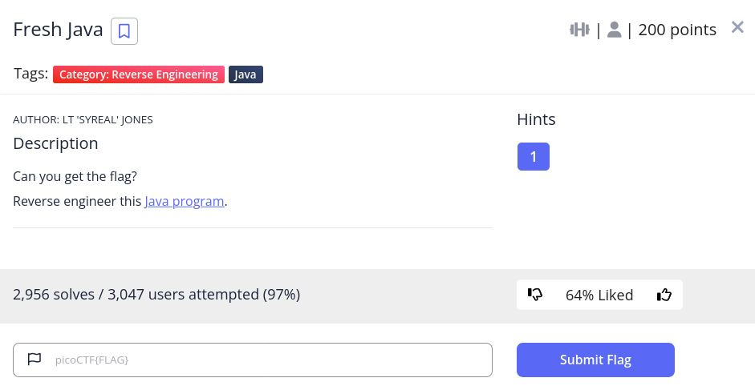

# Fresh Java - picoCTF 2022 - CMU Cybersecurity Competition
Reverse Engineering, 200 Points

## Description


 
## Fresh Java Solution

The attached file [KeygenMe.class](./KeygenMe.class) is java compiled file, Let's use [jadx](https://github.com/skylot/jadx/releases/tag/v1.3.4) to decompile it.

By decompiling it we found the following code:
```java
package defpackage;

import java.util.Scanner;

/* renamed from: KeygenMe  reason: default package */
/* loaded from: KeygenMe.class */
public class KeygenMe {
    public static void main(String[] strArr) {
        Scanner scanner = new Scanner(System.in);
        System.out.println("Enter key:");
        String nextLine = scanner.nextLine();
        if (nextLine.length() != 34) {
            System.out.println("Invalid key");
        } else if (nextLine.charAt(33) != '}') {
            System.out.println("Invalid key");
        } else if (nextLine.charAt(32) != '0') {
            System.out.println("Invalid key");
        } else if (nextLine.charAt(31) != 'f') {
            System.out.println("Invalid key");
        } else if (nextLine.charAt(30) != '9') {
            System.out.println("Invalid key");
        } else if (nextLine.charAt(29) != '5') {
            System.out.println("Invalid key");
        } else if (nextLine.charAt(28) != 'c') {
            System.out.println("Invalid key");
        } else if (nextLine.charAt(27) != '6') {
            System.out.println("Invalid key");
        } else if (nextLine.charAt(26) != '2') {
            System.out.println("Invalid key");
        } else if (nextLine.charAt(25) != '1') {
            System.out.println("Invalid key");
        } else if (nextLine.charAt(24) != '_') {
            System.out.println("Invalid key");
        } else if (nextLine.charAt(23) != 'd') {
            System.out.println("Invalid key");
        } else if (nextLine.charAt(22) != '3') {
            System.out.println("Invalid key");
        } else if (nextLine.charAt(21) != 'r') {
            System.out.println("Invalid key");
        } else if (nextLine.charAt(20) != '1') {
            System.out.println("Invalid key");
        } else if (nextLine.charAt(19) != 'u') {
            System.out.println("Invalid key");
        } else if (nextLine.charAt(18) != 'q') {
            System.out.println("Invalid key");
        } else if (nextLine.charAt(17) != '3') {
            System.out.println("Invalid key");
        } else if (nextLine.charAt(16) != 'r') {
            System.out.println("Invalid key");
        } else if (nextLine.charAt(15) != '_') {
            System.out.println("Invalid key");
        } else if (nextLine.charAt(14) != 'g') {
            System.out.println("Invalid key");
        } else if (nextLine.charAt(13) != 'n') {
            System.out.println("Invalid key");
        } else if (nextLine.charAt(12) != '1') {
            System.out.println("Invalid key");
        } else if (nextLine.charAt(11) != 'l') {
            System.out.println("Invalid key");
        } else if (nextLine.charAt(10) != '0') {
            System.out.println("Invalid key");
        } else if (nextLine.charAt(9) != '0') {
            System.out.println("Invalid key");
        } else if (nextLine.charAt(8) != '7') {
            System.out.println("Invalid key");
        } else if (nextLine.charAt(7) != '{') {
            System.out.println("Invalid key");
        } else if (nextLine.charAt(6) != 'F') {
            System.out.println("Invalid key");
        } else if (nextLine.charAt(5) != 'T') {
            System.out.println("Invalid key");
        } else if (nextLine.charAt(4) != 'C') {
            System.out.println("Invalid key");
        } else if (nextLine.charAt(3) != 'o') {
            System.out.println("Invalid key");
        } else if (nextLine.charAt(2) != 'c') {
            System.out.println("Invalid key");
        } else if (nextLine.charAt(1) != 'i') {
            System.out.println("Invalid key");
        } else if (nextLine.charAt(0) != 'p') {
            System.out.println("Invalid key");
        } else {
            System.out.println("Valid key");
        }
    }
}
```

We can see it compares each position on the user input which is ```nextLine``` from the end, nextLine at index ```0``` should be ```p```, nextLine at index ```1``` should be ```i``` etc.

According that we can build the flag ```picoCTF{700l1ng_r3qu1r3d_126c59f0}```