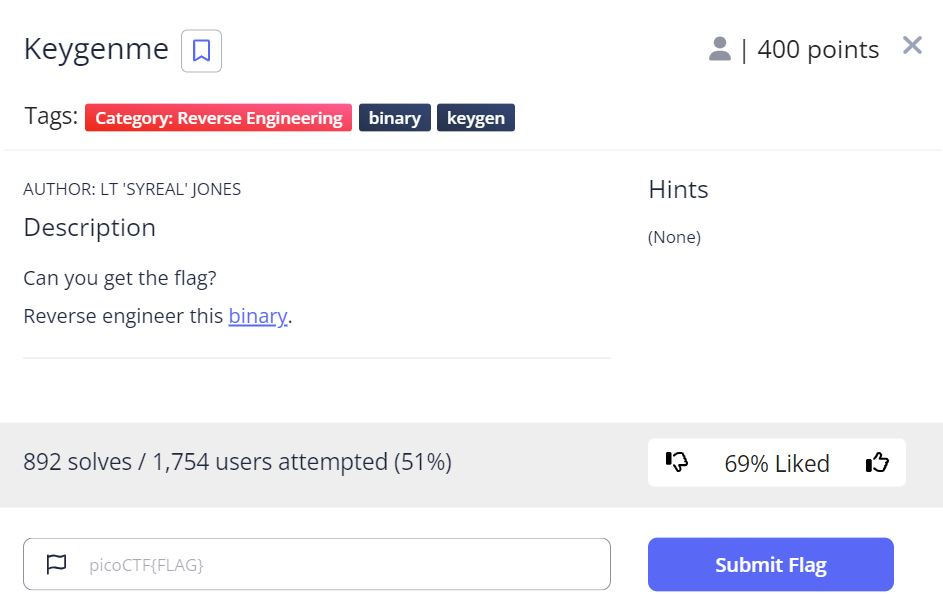
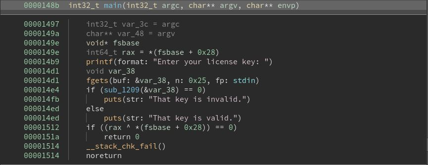

# Keygenme - picoCTF 2022 - CMU Cybersecurity Competition
Reverse Engineering, 300 Points

## Description


 
## Keygenme Solution

Let's run the binary using ```gdb```:
```console
┌─[evyatar@parrot]─[/pictoctf2022/reverse_engineering/keygenme]
└──╼ $ gdb keygenme
gef➤  r
Starting program: /pictoctf2022/reverse_engineering/keygenme/keygenme 
[Thread debugging using libthread_db enabled]
Using host libthread_db library "/lib/x86_64-linux-gnu/libthread_db.so.1".
Enter your license key: AAAAAAAA
That key is invalid.
```

As we can see, We need to enter a valid license key.

Let's decompile the binary using [Binary Ninja](https://binary.ninja/demo/).

By observing the ```main``` function we can see:



Because we are not able to find ```main``` function using ```gdb```, Let's add a breakpoint on ```printf``` function, using that we can find the ```main```:
```asm
ef➤  b *printf
Breakpoint 1 at 0x10b0
gef➤  r
...
───────────────────────────────────────────────────────────────────────────────────────────────────────────────────────────────────────────── threads ────
[#0] Id 1, Name: "keygenme", stopped 0x7ffff7b46cf0 in __printf (), reason: BREAKPOINT
─────────────────────────────────────────────────────────────────────────────────────────────────────────────────────────────────────────────── trace ────
[#0] 0x7ffff7b46cf0 → __printf(format=0x555555556009 "Enter your license key: ")
[#1] 0x5555555554be → mov rdx, QWORD PTR [rip+0x2b4b]        # 0x555555558010 <stdin>
[#2] 0x7ffff7b16d0a → __libc_start_main(main=0x55555555548b, argc=0x1, argv=0x7fffffffdfd8, init=<optimized out>, fini=<optimized out>, rtld_fini=<optimized out>, stack_end=0x7fffffffdfc8)
[#3] 0x55555555514e → hlt 
──────────────────────────────────────────────────────────────────────────────────────────────────────────────────────────────────────────────────────────
gef➤  
```

Now, Let's type ```finish``` to exit from the current function:
```asm
gef➤  finish
Run till exit from #0  __printf (format=0x555555556009 "Enter your license key: ") at printf.c:28
0x00005555555554be in ?? ()
...
─────────────────────────────────────────────────────────────────────────────────────────────────────────────────────────────────────────────── stack ────
0x00007fffffffdea0│+0x0000: 0x00007fffffffdfd8  →  0x00007fffffffe2f6  →  "/pictoctf2022/reverse_engineering/keygenme/keygenme"	 ← $rsp
0x00007fffffffdea8│+0x0008: 0x000000015555556d
0x00007fffffffdeb0│+0x0010: 0x0000000000000000
0x00007fffffffdeb8│+0x0018: 0x0000000000000000
0x00007fffffffdec0│+0x0020: 0x0000555555555520  →   endbr64 
0x00007fffffffdec8│+0x0028: 0x0000555555555120  →   endbr64 
0x00007fffffffded0│+0x0030: 0x00007fffffffdfd0  →  0x0000000000000001
0x00007fffffffded8│+0x0038: 0x156faa18dd049c00
───────────────────────────────────────────────────────────────────────────────────────────────────────────────────────────────────────── code:x86:64 ────
   0x5555555554ad                  lea    rdi, [rip+0xb55]        # 0x555555556009
   0x5555555554b4                  mov    eax, 0x0
   0x5555555554b9                  call   0x5555555550b0 <printf@plt>
 → 0x5555555554be                  mov    rdx, QWORD PTR [rip+0x2b4b]        # 0x555555558010 <stdin>
   0x5555555554c5                  lea    rax, [rbp-0x30]
   0x5555555554c9                  mov    esi, 0x25
   0x5555555554ce                  mov    rdi, rax
   0x5555555554d1                  call   0x5555555550d0 <fgets@plt>
   0x5555555554d6                  lea    rax, [rbp-0x30]
───────────────────────────────────────────────────────────────────────────────────────────────────────────────────────────────────────────── threads ────
[#0] Id 1, Name: "keygenme", stopped 0x5555555554be in ?? (), reason: TEMPORARY BREAKPOINT
─────────────────────────────────────────────────────────────────────────────────────────────────────────────────────────────────────────────── trace ────
[#0] 0x5555555554be → mov rdx, QWORD PTR [rip+0x2b4b]        # 0x555555558010 <stdin>
[#1] 0x7ffff7b16d0a → __libc_start_main(main=0x55555555548b, argc=0x1, argv=0x7fffffffdfd8, init=<optimized out>, fini=<optimized out>, rtld_fini=<optimized out>, stack_end=0x7fffffffdfc8)
[#2] 0x55555555514e → hlt 
──────────────────────────────────────────────────────────────────────────────────────────────────────────────────────────────────────────────────────────
gef➤  
```

And we can see we are on ```0x5555555554be```, Let's type twice ```si```:
```asm
...
───────────────────────────────────────────────────────────────────────────────────────────────────────────────────────────────────────── code:x86:64 ────
   0x5555555554b9                  call   0x5555555550b0 <printf@plt>
   0x5555555554be                  mov    rdx, QWORD PTR [rip+0x2b4b]        # 0x555555558010 <stdin>
   0x5555555554c5                  lea    rax, [rbp-0x30]
 → 0x5555555554c9                  mov    esi, 0x25
   0x5555555554ce                  mov    rdi, rax
   0x5555555554d1                  call   0x5555555550d0 <fgets@plt>
   0x5555555554d6                  lea    rax, [rbp-0x30]
   0x5555555554da                  mov    rdi, rax
   0x5555555554dd                  call   0x555555555209
───────────────────────────────────────────────────────────────────────────────────────────────────────────────────────────────────────────── threads ────
[#0] Id 1, Name: "keygenme", stopped 0x5555555554c9 in ?? (), reason: SINGLE STEP
──────────────────────────────────────────────────────────────────────────────────────────
```

We can see now the calling to ```call   0x555555555209``` which is ```sub_1209(&var_38)``` call from the ```main``` function.

Let's add a breakpoint on this function ```b *0x555555555209```.

By observing ```sub_1209``` function we can see:
```c
00001209  int64_t sub_1209(char* arg1)

0000121f      void* fsbase
0000121f      int64_t rax = *(fsbase + 0x28)
00001242      int64_t var_98 = 0x7b4654436f636970
00001249      int64_t var_90 = 0x30795f676e317262
0000125a      int64_t var_88 = 0x6b5f6e77305f7275
0000125e      int32_t var_80 = 0x5f7933
00001265      int16_t var_ba = 0x7d
00001278      uint64_t rax_1 = strlen(&var_98)
00001294      void var_b8
00001294      MD5(&var_98, rax_1, &var_b8, rax_1)
000012a3      uint64_t rax_2 = strlen(&var_ba)
000012bf      void var_a8
000012bf      MD5(&var_ba, rax_2, &var_a8, rax_2)
000012c4      int32_t var_d0 = 0
000012ce      int32_t var_cc = 0
00001328      char var_78
00001328      while (var_cc s<= 0xf)
000012fa          void* rcx_2 = &(&var_78)[sx.q(var_d0)]
0000130e          sprintf(s: rcx_2, format: "%02x", zx.q(*(&var_b8 + sx.q(var_cc))), rcx_2)
00001313          var_cc = var_cc + 1
0000131a          var_d0 = var_d0 + 2
0000132a      int32_t var_d0_1 = 0
00001334      int32_t var_c8 = 0
0000138e      while (var_c8 s<= 0xf)
00001360          void var_58
00001360          void* rcx_3 = &var_58 + sx.q(var_d0_1)
00001374          sprintf(s: rcx_3, format: "%02x", zx.q(*(&var_a8 + sx.q(var_c8))), rcx_3)
00001379          var_c8 = var_c8 + 1
00001380          var_d0_1 = var_d0_1 + 2
000013c6      void var_38
000013c6      for (int32_t var_c4 = 0; var_c4 s<= 0x1a; var_c4 = var_c4 + 1)
000013b4          *(&var_38 + sx.q(var_c4)) = *(&var_98 + sx.q(var_c4))
000013cc      char var_6f
000013cc      char var_1d = var_6f
000013d3      char var_1c = var_78
000013da      char var_5f
000013da      char var_1b = var_5f
000013e1      char var_5e
000013e1      char var_1a = var_5e
000013e8      char var_5b
000013e8      char var_19 = var_5b
000013ef      char var_43
000013ef      char var_18 = var_43
000013f6      char var_71
000013f6      char var_17 = var_71
000013fd      char var_16 = var_5f
00001407      char var_15 = var_ba.b
0000141d      int64_t rax_28
0000141d      if (strlen(arg1) != 0x24)
0000141f          rax_28 = 0
00001426      else
00001426          int32_t var_c0_1 = 0
0000146e          while (true)
0000146e              if (var_c0_1 s> 0x23)
00001470                  rax_28 = 1
00001470                  break
00001457              if (arg1[sx.q(var_c0_1)] != *(&var_38 + sx.q(var_c0_1)))
00001459                  rax_28 = 0
0000145e                  break
00001460              var_c0_1 = var_c0_1 + 1
00001482      if ((rax ^ *(fsbase + 0x28)) == 0)
0000148a          return rax_28
00001484      __stack_chk_fail()
00001484      noreturn
```

Let's observe the following code from ```sub_1209``` function:
```c
0000141d      if (strlen(arg1) != 0x24)
0000141f          rax_28 = 0
00001426      else
00001426          int32_t var_c0_1 = 0
0000146e          while (true)
0000146e              if (var_c0_1 s> 0x23)
00001470                  rax_28 = 1
00001470                  break
00001457              if (arg1[sx.q(var_c0_1)] != *(&var_38 + sx.q(var_c0_1)))
00001459                  rax_28 = 0
0000145e                  break
00001460              var_c0_1 = var_c0_1 + 1
```


According to ```if (strlen(arg1) != 0x24)``` we can see the argument to the function (which is our input) shuild be in length 0x24 (36).

As we can see on the ```while``` loop - the binary compares our input with a string on memory which is possible the license key.

Let's break on ```if (strlen(arg1) != 0x24)```.

First we need to break on ```sub_1209``` function:
```asm
gef➤  b *0x555555555209
Breakpoint 2 at 0x555555555209
gef➤  c
Continuing.
Enter your license key: AAAAAAAAAAAAAAAAAAAAAAAAAAAAAAAAAAA

```

Now we are on ```sub_1209``` function, Let's type ```display/120i $pc``` (you can use also ```layout asm```) to see the assembly code of this function:
```asm
gef➤  display/120i $pc
4: x/120i $pc
=> 0x555555555209:	endbr64 
   0x55555555520d:	push   rbp
   0x55555555520e:	mov    rbp,rsp
   0x555555555211:	sub    rsp,0xe0
   0x555555555218:	mov    QWORD PTR [rbp-0xd8],rdi
   0x55555555521f:	mov    rax,QWORD PTR fs:0x28
   0x555555555228:	mov    QWORD PTR [rbp-0x8],rax
   0x55555555522c:	xor    eax,eax
   0x55555555522e:	movabs rax,0x7b4654436f636970
   0x555555555238:	movabs rdx,0x30795f676e317262
   0x555555555242:	mov    QWORD PTR [rbp-0x90],rax
   0x555555555249:	mov    QWORD PTR [rbp-0x88],rdx
   0x555555555250:	movabs rax,0x6b5f6e77305f7275
   0x55555555525a:	mov    QWORD PTR [rbp-0x80],rax
   0x55555555525e:	mov    DWORD PTR [rbp-0x78],0x5f7933
   0x555555555265:	mov    WORD PTR [rbp-0xb2],0x7d
   0x55555555526e:	lea    rax,[rbp-0x90]
   0x555555555275:	mov    rdi,rax
   0x555555555278:	call   0x5555555550e0 <strlen@plt>
   0x55555555527d:	mov    rcx,rax
   0x555555555280:	lea    rdx,[rbp-0xb0]
   0x555555555287:	lea    rax,[rbp-0x90]
   0x55555555528e:	mov    rsi,rcx
   0x555555555291:	mov    rdi,rax
   0x555555555294:	call   0x5555555550f0 <MD5@plt>
   0x555555555299:	lea    rax,[rbp-0xb2]
   0x5555555552a0:	mov    rdi,rax
   0x5555555552a3:	call   0x5555555550e0 <strlen@plt>
   0x5555555552a8:	mov    rcx,rax
   0x5555555552ab:	lea    rdx,[rbp-0xa0]
   0x5555555552b2:	lea    rax,[rbp-0xb2]
   0x5555555552b9:	mov    rsi,rcx
   0x5555555552bc:	mov    rdi,rax
   0x5555555552bf:	call   0x5555555550f0 <MD5@plt>
   0x5555555552c4:	mov    DWORD PTR [rbp-0xc8],0x0
   0x5555555552ce:	mov    DWORD PTR [rbp-0xc4],0x0
   0x5555555552d8:	jmp    0x555555555321
   0x5555555552da:	mov    eax,DWORD PTR [rbp-0xc4]
   0x5555555552e0:	cdqe   
   0x5555555552e2:	movzx  eax,BYTE PTR [rbp+rax*1-0xb0]
   0x5555555552ea:	movzx  eax,al
   0x5555555552ed:	lea    rcx,[rbp-0x70]
   0x5555555552f1:	mov    edx,DWORD PTR [rbp-0xc8]
   0x5555555552f7:	movsxd rdx,edx
   0x5555555552fa:	add    rcx,rdx
   0x5555555552fd:	mov    edx,eax
   0x5555555552ff:	lea    rsi,[rip+0xcfe]        # 0x555555556004
   0x555555555306:	mov    rdi,rcx
   0x555555555309:	mov    eax,0x0
   0x55555555530e:	call   0x555555555100 <sprintf@plt>
   0x555555555313:	add    DWORD PTR [rbp-0xc4],0x1
   0x55555555531a:	add    DWORD PTR [rbp-0xc8],0x2
   0x555555555321:	cmp    DWORD PTR [rbp-0xc4],0xf
   0x555555555328:	jle    0x5555555552da
   0x55555555532a:	mov    DWORD PTR [rbp-0xc8],0x0
   0x555555555334:	mov    DWORD PTR [rbp-0xc0],0x0
   0x55555555533e:	jmp    0x555555555387
   0x555555555340:	mov    eax,DWORD PTR [rbp-0xc0]
   0x555555555346:	cdqe   
   0x555555555348:	movzx  eax,BYTE PTR [rbp+rax*1-0xa0]
   0x555555555350:	movzx  eax,al
   0x555555555353:	lea    rcx,[rbp-0x50]
   0x555555555357:	mov    edx,DWORD PTR [rbp-0xc8]
   0x55555555535d:	movsxd rdx,edx
   0x555555555360:	add    rcx,rdx
   0x555555555363:	mov    edx,eax
   0x555555555365:	lea    rsi,[rip+0xc98]        # 0x555555556004
   0x55555555536c:	mov    rdi,rcx
   0x55555555536f:	mov    eax,0x0
   0x555555555374:	call   0x555555555100 <sprintf@plt>
   0x555555555379:	add    DWORD PTR [rbp-0xc0],0x1
   0x555555555380:	add    DWORD PTR [rbp-0xc8],0x2
   0x555555555387:	cmp    DWORD PTR [rbp-0xc0],0xf
   0x55555555538e:	jle    0x555555555340
   0x555555555390:	mov    DWORD PTR [rbp-0xbc],0x0
   0x55555555539a:	jmp    0x5555555553bf
   0x55555555539c:	mov    eax,DWORD PTR [rbp-0xbc]
   0x5555555553a2:	cdqe   
   0x5555555553a4:	movzx  edx,BYTE PTR [rbp+rax*1-0x90]
   0x5555555553ac:	mov    eax,DWORD PTR [rbp-0xbc]
   0x5555555553b2:	cdqe   
   0x5555555553b4:	mov    BYTE PTR [rbp+rax*1-0x30],dl
   0x5555555553b8:	add    DWORD PTR [rbp-0xbc],0x1
   0x5555555553bf:	cmp    DWORD PTR [rbp-0xbc],0x1a
   0x5555555553c6:	jle    0x55555555539c
   0x5555555553c8:	movzx  eax,BYTE PTR [rbp-0x67]
   0x5555555553cc:	mov    BYTE PTR [rbp-0x15],al
   0x5555555553cf:	movzx  eax,BYTE PTR [rbp-0x70]
   0x5555555553d3:	mov    BYTE PTR [rbp-0x14],al
   0x5555555553d6:	movzx  eax,BYTE PTR [rbp-0x57]
   0x5555555553da:	mov    BYTE PTR [rbp-0x13],al
   0x5555555553dd:	movzx  eax,BYTE PTR [rbp-0x56]
   0x5555555553e1:	mov    BYTE PTR [rbp-0x12],al
   0x5555555553e4:	movzx  eax,BYTE PTR [rbp-0x53]
   0x5555555553e8:	mov    BYTE PTR [rbp-0x11],al
   0x5555555553eb:	movzx  eax,BYTE PTR [rbp-0x3b]
   0x5555555553ef:	mov    BYTE PTR [rbp-0x10],al
   0x5555555553f2:	movzx  eax,BYTE PTR [rbp-0x69]
   0x5555555553f6:	mov    BYTE PTR [rbp-0xf],al
   0x5555555553f9:	movzx  eax,BYTE PTR [rbp-0x57]
   0x5555555553fd:	mov    BYTE PTR [rbp-0xe],al
   0x555555555400:	movzx  eax,BYTE PTR [rbp-0xb2]
   0x555555555407:	mov    BYTE PTR [rbp-0xd],al
   0x55555555540a:	mov    rax,QWORD PTR [rbp-0xd8]
   0x555555555411:	mov    rdi,rax
   0x555555555414:	call   0x5555555550e0 <strlen@plt>
   0x555555555419:	cmp    rax,0x24
   0x55555555541d:	je     0x555555555426
   0x55555555541f:	mov    eax,0x0
   0x555555555424:	jmp    0x555555555475
   0x555555555426:	mov    DWORD PTR [rbp-0xb8],0x0
   0x555555555430:	jmp    0x555555555467
   0x555555555432:	mov    eax,DWORD PTR [rbp-0xb8]
   0x555555555438:	movsxd rdx,eax
   0x55555555543b:	mov    rax,QWORD PTR [rbp-0xd8]
   0x555555555442:	add    rax,rdx
   0x555555555445:	movzx  edx,BYTE PTR [rax]
   0x555555555448:	mov    eax,DWORD PTR [rbp-0xb8]
   0x55555555544e:	cdqe   
   0x555555555450:	movzx  eax,BYTE PTR [rbp+rax*1-0x30]
```

We can see the following compare ```0x555555555419:	cmp    rax,0x24``` which is ```if (strlen(arg1) != 0x24)```, Let's add a breakpoint on this line ```b *0x555555555419```:
```console
gef➤ b *0x555555555419
....
→ 0x555555555419                  cmp    rax, 0x24
   0x55555555541d                  je     0x555555555426
   0x55555555541f                  mov    eax, 0x0
   0x555555555424                  jmp    0x555555555475
   0x555555555426                  mov    DWORD PTR [rbp-0xb8], 0x0
   0x555555555430                  jmp    0x555555555467
───────────────────────────────────────────────────────────────────────────────────────────────────────────────────────────────────────────── threads ────
[#0] Id 1, Name: "keygenme", stopped 0x555555555419 in ?? (), reason: BREAKPOINT
─────────────────────────────────────────────────────────────────────────────────────────────────────────────────────────────────────────────── trace ────
[#0] 0x555555555419 → cmp rax, 0x24
[#1] 0x5555555554e2 → test al, al
[#2] 0x7ffff7b16d0a → __libc_start_main(main=0x55555555548b, argc=0x1, argv=0x7fffffffdfd8, init=<optimized out>, fini=<optimized out>, rtld_fini=<optimized out>, stack_end=0x7fffffffdfc8)
[#3] 0x55555555514e → hlt 
──────────────────────────────────────────────────────────────────────────────────────────────────────────────────────────────────────────────────────────
gef➤  
```

Now we can search for the flag pattern ```search-pattern picoCTF```:
```asm
gef➤  search-pattern picoCTF
[+] Searching 'picoCTF' in memory
[+] In '/pictoctf2022/reverse_engineering/keygenme/keygenme'(0x555555555000-0x555555556000), permission=r-x
  0x555555555230 - 0x555555555237  →   "picoCTF[...]" 
[+] In '[stack]'(0x7ffffffde000-0x7ffffffff000), permission=rw-
  0x7fffffffde00 - 0x7fffffffde1b  →   "picoCTF{br1ng_y0ur_0wn_k3y_" 
  0x7fffffffde60 - 0x7fffffffde67  →   "picoCTF[...]" 
```

We can see the pattern on ```0x7fffffffde00```, Let's print the flag:
```asm
gef➤  x/s 0x7fffffffde60
0x7fffffffde60:	"picoCTF{br1ng_y0ur_0wn_k3y_247d8a57}\377\177"
```

And we get the flag ```picoCTF{br1ng_y0ur_0wn_k3y_247d8a57}```.

NOTE: It's possible to search the pattern of the string without breaking on ```sub_1209``` function (from the ```main```).