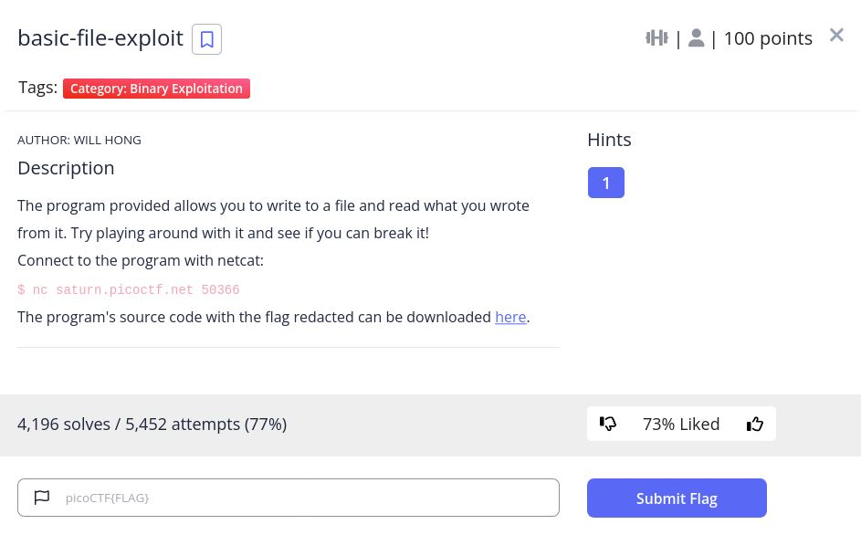
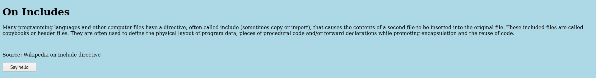

# Includes - picoCTF 2022 - CMU Cybersecurity Competition
Web Exploitation, 100 Points

## Description



 

## Includes Solution

By browsing the [website](http://saturn.picoctf.net:52895/) from the challenge description we can see the following web page:



If we are clicking on the button we get the following alert message:


Let's try to observe the source code:
```html
<!DOCTYPE html>
<html lang="en">
  <head>
    <meta charset="UTF-8">
    <meta name="viewport" content="width=device-width, initial-scale=1.0">
    <meta http-equiv="X-UA-Compatible" content="ie=edge">
    <link rel="stylesheet" href="style.css">
    <title>On Includes</title>
  </head>
  <body>
    <script src="script.js"></script>
  
    <h1>On Includes</h1>
    <p>Many programming languages and other computer files have a directive, 
       often called include (sometimes copy or import), that causes the 
       contents of a second file to be inserted into the original file. These 
       included files are called copybooks or header files. They are often used
       to define the physical layout of program data, pieces of procedural code
       and/or forward declarations while promoting encapsulation and the reuse
       of code.</p>
    <br>
    <p> Source: Wikipedia on Include directive </p>
    <button type="button" onclick="greetings();">Say hello</button>
  </body>
</html>
```

And we can see the file [script.js](http://saturn.picoctf.net:52895/script.js) which contains the following code:
```javascript

function greetings()
{
  alert("This code is in a separate file!");
}

//  f7w_2of2_f4593d9d}
```

We can see also the file [style.css](view-source:http://saturn.picoctf.net:52895/style.css) which contains the following code:
```css
body {
  background-color: lightblue;
}

/*  picoCTF{1nclu51v17y_1of2_  */

```

We can build the flag from the files ```picoCTF{1nclu51v17y_1of2_f7w_2of2_f4593d9d}```