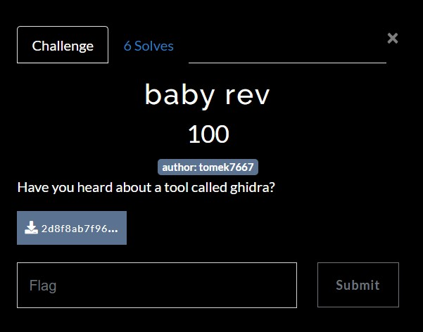
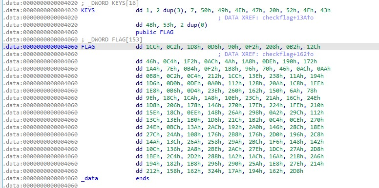
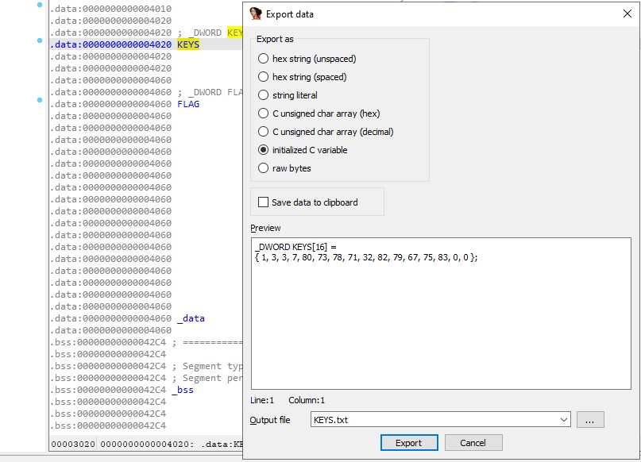

# pingCTF 2022 - Gdansk University of Technology
Reverse Engineering, 100 Points

## Description


 
## baby_rev Solution

By observing the binary using IDA/Ghidra we can see the following ```main``` function:
```c
int __cdecl main(int argc, const char **argv, const char **envp)
{
  char v4[104]; // [rsp+0h] [rbp-70h] BYREF
  unsigned __int64 v5; // [rsp+68h] [rbp-8h]

  v5 = __readfsqword(0x28u);
  puts("Hi! I'm baby rev!");
  puts("I'm a baby reverse engineering challenge!");
  puts("I'm not very good at reversing, but I'm trying my best!");
  puts("Can you help me?");
  puts("Please tell me the first flag!");
  printf("Input: ");
  __isoc99_scanf("%s", v4);
  if ( (unsigned __int8)checkflag(v4) )
    puts("Correct! :) So happy for you!!!");
  else
    puts("Incorrect! :(( But definitely try next time!!!!");
  return 0;
}
```

We can see that the ```main``` function asks for input and then calls to ```checkflag``` function with our input.

Let's observe ```checkflag``` function:
```c
__int64 __fastcall checkflag(_BYTE *a1)
{
  int i; // [rsp+18h] [rbp-38h]
  int j; // [rsp+1Ch] [rbp-34h]
  char v5[40]; // [rsp+20h] [rbp-30h]
  unsigned __int64 v6; // [rsp+48h] [rbp-8h]

  v6 = __readfsqword(0x28u);
  if ( *a1 != 'p' || a1[1] != 'i' || a1[2] != 'n' || a1[3] != 'g' || a1[4] != '{' || a1[37] != '}' )
    return 0LL;
  for ( i = 0; i <= 31; ++i )
    v5[i] = a1[i + 5];
  for ( j = 0; j <= 152; ++j )
  {
    if ( 4 * (v5[j % 31] ^ KEYS[j % 14]) + 2 * j != FLAG[j] )
      return 0LL;
  }
  return 1LL;
}
```

```checkflag``` function checks if our input starts with ```ping{``` and ends with ```}```, then takes our input without the flag prefix/postfix to ```v5``` array, and then makes some operations for each character in our input.

The most important part on this function is the following ```if```statement:
```c
...
if ( 4 * (v5[j % 31] ^ KEYS[j % 14]) + 2 * j != FLAG[j] )
...
```

We can write ```python``` script to find the relevant characters for this ```if``` statement.

First, Let's get ```KEYS``` and ```FLAG```:



We can export them using ```Shift+E``` and select ```Initialized C variable```:



Now we can use the following ```python``` script [solve.py](./solve.py):
```python
import string

FLAG = [ 460, 194, 472, 214, 144, 242, 520, 178, 300, 70, 196, 498, 172, 74, 424, 222, 400, 370, 420, 126, 180, 242, 440, 150, 112, 70, 172, 170, 184, 194, 196, 530, 460, 318, 568, 282, 404, 470, 208, 222, 160, 274, 296, 522, 456, 494, 488, 182, 212, 574, 608, 354, 336, 106, 120, 158, 396, 458, 424, 270, 572, 538, 364, 590, 472, 518, 376, 326, 624, 382, 548, 510, 528, 350, 396, 238, 328, 618, 664, 162, 668, 274, 316, 318, 432, 470, 540, 434, 196, 206, 624, 590, 188, 314, 684, 402, 672, 326, 652, 398, 636, 586, 264, 374, 696, 374, 720, 406, 712, 330, 316, 618, 600, 666, 700, 502, 328, 322, 268, 310, 680, 702, 684, 638, 476, 634, 728, 446, 708, 722, 648, 418, 428, 362, 536, 678, 404, 386, 440, 662, 656, 602, 488, 638, 532, 530, 344, 354, 804, 378, 404, 354, 728 ]


KEYS = [ 1, 3, 3, 7, 80, 73, 78, 71, 32, 82, 79, 67, 75, 83, 0, 0 ]

output=''      
length=0

for j in range(152):
    for c in string.printable:
        if 4 * (ord(c) ^ KEYS[j % 14]) + (2 * j) == FLAG[j]:
            output +=c
            length+=1
            continue
        if length >= 31:
            break
			
print(f"The flag is: {output}")
```

Run it:
```console
┌─[evyatar9@parrot]─[/pingctf2022/reverse_engineering/baby_rev]
└──╼ $ python3 solve.py
The flag is: r3v3rs1ng_c4n_b3_S0_muCH_FUN!!!
```

And we get the flag ```ping{r3v3rs1ng_c4n_b3_S0_muCH_FUN!!!}```.