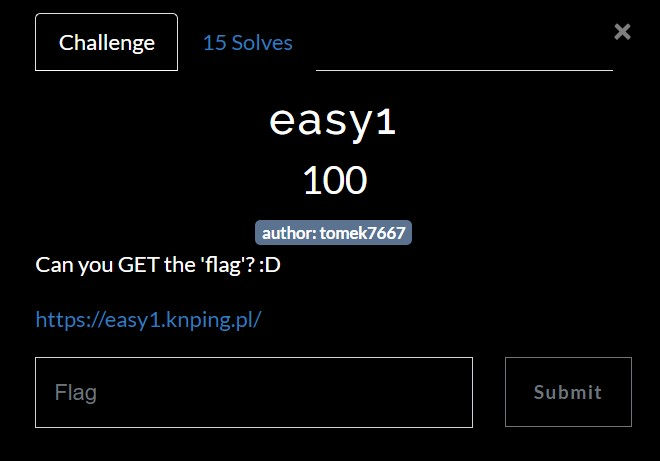
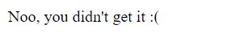

# pingCTF 2022 - Gdansk University of Technology
Web, 100 Points

## Description


 
## easy1 Solution

By browsing to the website on the challenge description [https://easy1.knping.pl/](https://easy1.knping.pl/) we get a web page which contains ```Hii :))``` message:


If we are trying to get ```/flag``` page we get the message ```Noo, you didn't get it :(```:



According to the challenge description and the hints we know that we need to send ```FLAG``` HTTP request instead of ```GET``` as following:
```HTTP
FLAG /flag HTTP/2
Host: easy1.knping.pl
User-Agent: Mozilla/5.0 (Windows NT 10.0; Win64; x64) AppleWebKit/537.36 (KHTML, like Gecko) Chrome/108.0.5359.125 Safari/537.36
Accept: text/html,application/xhtml+xml,application/xml;q=0.9,image/avif,image/webp,image/apng,*/*;q=0.8,application/signed-exchange;v=b3;q=0.9

```

And we get the following response:
```HTTP
HTTP/2 200 OK
Date: Thu, 22 Dec 2022 11:56:51 GMT
Content-Type: text/html
Cf-Cache-Status: DYNAMIC
Report-To: {"endpoints":[{"url":"https:\/\/a.nel.cloudflare.com\/report\/v3?s=el3ta%2FaahiR9vrlVfDHiNmmxzHotc9JtH%2FWsBPhxV8zHKOplccdJ9qif%2FbGiRmQy0LQDd%2B7Tuh7UZX8Qhwv8ioEg9%2BuRnR6%2FyvzASCuPT6JL2zPVIeLcs6cJ5oxkrnErUgQ%3D"}],"group":"cf-nel","max_age":604800}
Nel: {"success_fraction":0,"report_to":"cf-nel","max_age":604800}
Server: cloudflare
Cf-Ray: 77d8ad365c667d9b-TLV
Alt-Svc: h3=":443"; ma=86400, h3-29=":443"; ma=86400

Yaay :), I told you this was easy :D
ping{s0_34sy_ch4ll_f1n4lly}
```

And we get the flag ```ping{s0_34sy_ch4ll_f1n4lly}```.