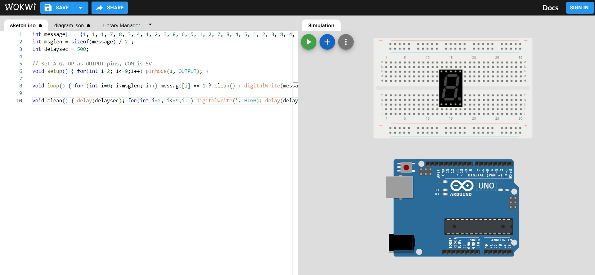
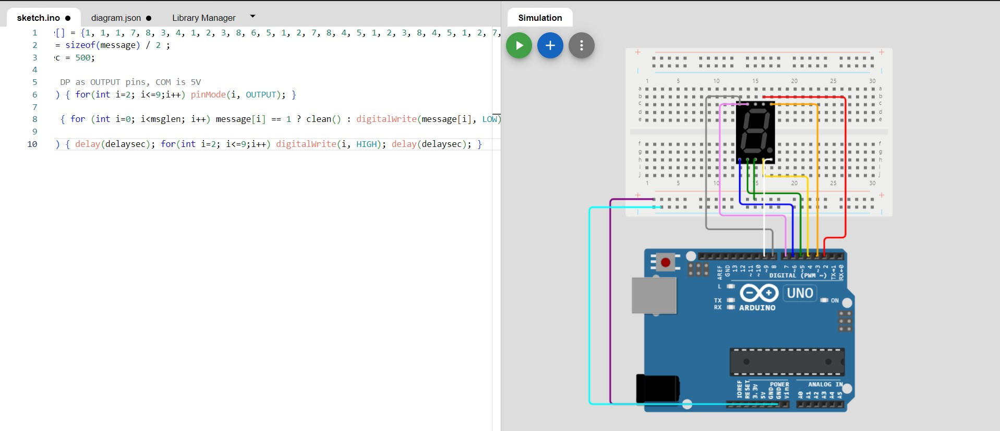
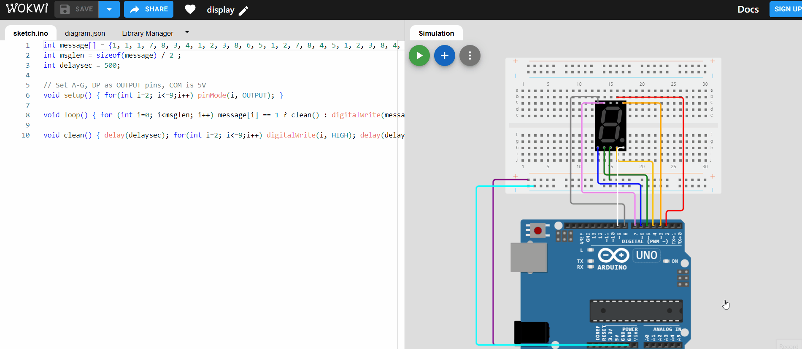

# BSides TLV CTF 2023 - [https://ctf23.bsidestlv.com/](https://ctf23.bsidestlv.com/)
Hardware, 100 Points

## Description


Attached file [pass.ino](./pass.ino) 

## passino

Let's examine the provided file [pass.ino](./pass.ino):
```c
int message[] = {1, 1, 1, 7, 8, 3, 4, 1, 2, 3, 8, 6, 5, 1, 2, 7, 8, 4, 5, 1, 2, 3, 8, 4, 5, 1, 2, 7, 6, 5, 8, 4, 1, 8, 7, 2, 3, 4, 1, 2, 7, 6, 5, 8, 4, 1, 7, 8, 3, 4, 1, 2, 7, 6, 5, 8, 4, 1, 2, 7, 8, 4, 5, 1, 2, 3, 4, 1, 2, 3, 8, 4, 5, 1, 2, 7, 8, 4, 5, 1, 7, 8, 3, 4, 1, 7, 8, 3, 4, 1, 2, 7, 6, 5, 1, 2, 7, 8, 4, 5, 1, 2, 7, 6, 5, 8, 4, 1, 2, 3, 8, 4, 5, 1, 2, 3, 8, 6, 5, 1, 2, 3, 8, 4, 5, 1, 2, 3, 4, 5, 6, 7, 1, 2, 3, 8, 4, 5, 1, 2, 3, 8, 6, 5, 1, 2, 3, 8, 4, 5, 1, 2, 3, 8, 4, 5, 1, 2, 3, 4, 1, 7, 6, 8, 4, 5, 1, 2, 7, 6, 5, 8, 4, 1, 2, 3, 4, 5, 6, 7, 8, 1, 2, 3, 8, 4, 5, 1, 7, 8, 3, 4, 1, 2, 7, 6, 5, 8, 4, 1, 7, 6, 1, 2, 3, 4, 1, 2, 3, 8, 6, 5, 1, 2, 7, 8, 4, 5, 1, 2, 3, 4, 1, 2, 7, 6, 5, 8, 4, 1, 2, 7, 8, 6, 1, 2, 3, 4, 1, 2, 3, 8, 6, 5, 1, 2, 7, 6, 5, 8, 4, 1, 7, 6, 8, 4, 5, 1, 7, 8, 3, 4, 1, 7, 6, 1, 2, 7, 6, 5, 8, 4, 1, 2, 7, 8, 6, 5, 1, 2, 7, 6, 5, 8, 4, 1, 7, 8, 3, 4, 1, 7, 8, 3, 4, 1, 2, 3, 4, 5, 6, 7, 8, 1, 2, 3, 8, 4, 5, 1, 7, 8, 3, 4, 1, 2, 3, 4, 1, 2, 3, 8, 6, 5, 1, 2, 7, 6, 5, 8, 4, 1, 7, 8, 3, 4, 1, 2, 3, 4, 1, 2, 3, 4, 1, 2, 7, 6, 5, 8, 4, 1, 7, 6, 1, 2, 3, 4, 1, 2, 3, 8, 6, 5, 1, 2, 3, 8, 4, 5, 1, 2, 3, 8, 4, 5, 1, 7, 8, 3, 4, 1, 2, 3, 8, 6, 5, 1, 2, 3, 8, 4, 5, 1, 2, 3, 4, 5, 6, 7, 1, 2, 3, 4, 1, 7, 8, 3, 4, 1, 2, 7, 6, 5, 8, 4, 1, 2, 3, 4, 5, 6, 7, 8, 1, 7, 8, 3, 4, 1, 7, 6, 1, 2, 3, 4, 1, 2, 3, 8, 6, 5, 1, 2, 3, 8, 4, 5, 1, 2, 3, 8, 4, 5, 1, 7, 8, 3, 4, 1, 2, 7, 6, 5, 8, 4, 1, 2, 3, 4, 1, 2, 7, 8, 4, 5, 1, 2, 7, 6, 5, 8, 4, 1, 2, 7, 8, 6, 5, 1, 2, 7, 8, 4, 5, 1, 8, 7, 2, 3, 4, 1, 2, 7, 6, 5, 8, 4, 1, 7, 6, 1, 2, 3, 4, 1, 8, 7, 2, 3, 4, 1, 2, 7, 6, 5, 8, 4, 1, 7, 6, 1, 2, 3, 4, 1, 8, 7, 2, 3, 4, 1, 2, 3, 4, 1, 3, 4, 8, 6, 5, 1};
int msglen = sizeof(message) / 2 ;
int delaysec = 500;

// Set A-G, DP as OUTPUT pins, COM is 5V
void setup() { for(int i=2; i<=9;i++) pinMode(i, OUTPUT); }

void loop() { for (int i=0; i<msglen; i++) message[i] == 1 ? clean() : digitalWrite(message[i], LOW); }

void clean() { delay(delaysec); for(int i=2; i<=9;i++) digitalWrite(i, HIGH); delay(delaysec); }
```

Based on the challenge description, we can infer that the device used is an Arduino Uno.

In the `loop` logic, when the byte equals `1`, the `digitalWrite` function is invoked with `HIGH` as the parameter for pins `2-9`.

To visualize the output, let's utilize the Arduino Uno simulator available at https://wokwi.com/projects/new/arduino-uno.

To accomplish the task, you will require the following components:

1. Arduino Uno board
2. Breadboard
3. Seven-segment display



Next, we need to connect it to the board as shown in the following ([‏‏Reference](images/board.JPG)):



We can also load it by utilizing the following [‏‏diagram.zip](./diagram.zip) file.

Start it:



We can observe the digits on the display. Now, let's proceed to write the digits `425369646573544C56323032337b68346172576f726b416e6448347264776172334230746841723346756e59617961797d`.

By converting it from hexadecimal, we obtain the flag `BSidesTLV2023{h4arWorkAndH4rdwar3B0thAr3FunYayay}`.