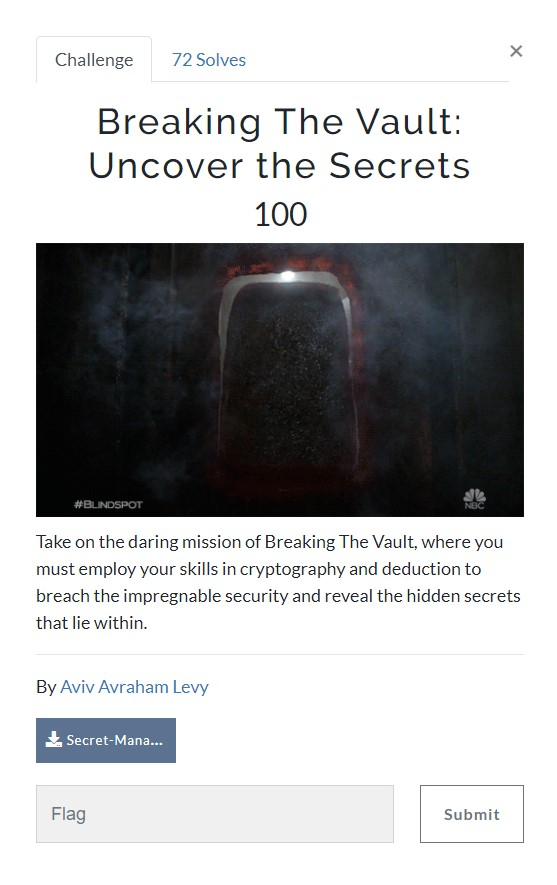
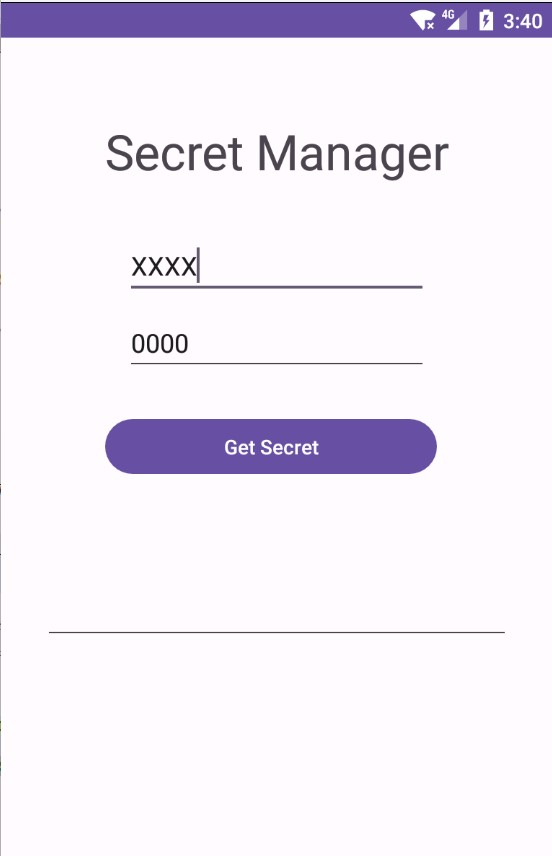
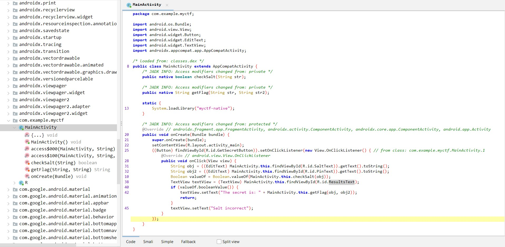
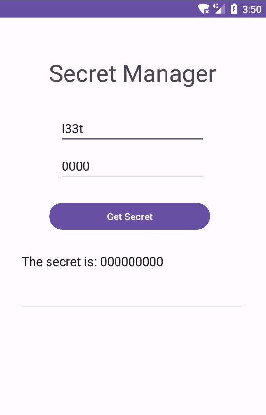
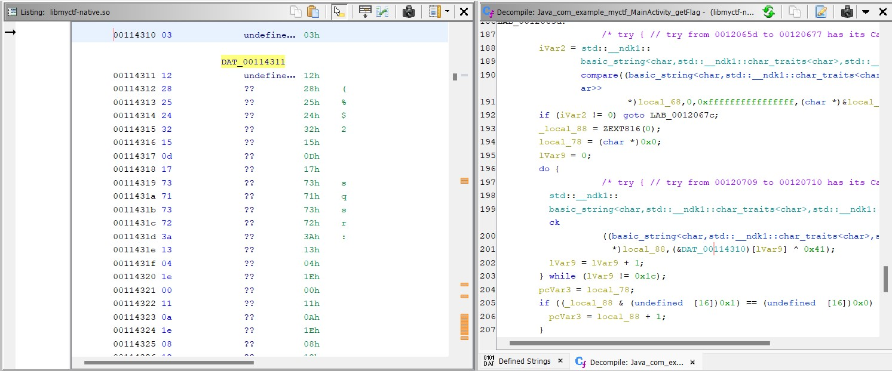

# BSides TLV CTF 2023 - [https://ctf23.bsidestlv.com/](https://ctf23.bsidestlv.com/)
Reversing, 100 Points

## Description



Attached file [Secret-Manager-App.apk](./Secret-Manager-App.apk) 

## Breaking The Vault: Uncover the Secrets

Let's install the application from the attached file on the [Genymotion](https://www.genymotion.com/) Android emulator:



By inspecting the APK file using [Jadx](https://github.com/skylot/jadx), we can observe the following code in the `MainActivity`:



The application prompts the user for two inputs, with the first one being the salt.

After the user provides the first input, the application passes it to the `checkSalt` function. If the salt is correct, the application then sends both the salt and the second user input to the `getFlag` function.

The `checkSalt` and `getFlag` functions are implemented in a `.so` file. In Android, a `.so` file is a compiled shared object file that contains native code, usually written in `C` or `C++`. These files offer additional functionality or system-level access to an Android application.

We can obtain the `.so` file by either using `adb` or by opening the APK file as an archive and extracting the `.so` file as following:


By analyzing the `.so` file [libmyctf-native.so](./libmyctf-native.so) using Ghidra, we can observe the following implementation of the `checkSalt` function:
```c
ulong Java_com_example_myctf_MainActivity_checkSalt
                (long *param_1,undefined8 param_2,undefined8 param_3)

{
  int iVar1;
  char *__s;
  size_t __n;
  void *__dest;
  ulong uVar2;
  long in_FS_OFFSET;
  undefined8 local_50;
  size_t local_48;
  void *local_40;
  long local_38;
  
  local_38 = *(long *)(in_FS_OFFSET + 0x28);
  __s = (char *)(**(code **)(*param_1 + 0x548))(param_1,param_3,0);
  __n = strlen(__s);
  if (0xffffffffffffffef < __n) {
    std::__ndk1::__basic_string_common<true>::__throw_length_error();
    goto LAB_0012028e;
  }
  if (__n < 0x17) {
    local_50 = local_50 & 0xffffffffffffff00 | (ulong)(byte)((char)__n * '\x02');
    __dest = (void *)((long)&local_50 + 1);
    if (__n != 0) goto LAB_001201da;
  }
  else {
    local_50 = __n + 0x10 & 0xfffffffffffffff0;
    __dest = operator.new(local_50);
    local_50 = local_50 | 1;
    local_48 = __n;
    local_40 = __dest;
LAB_001201da:
    memcpy(__dest,__s,__n);
  }
  *(undefined *)((long)__dest + __n) = 0;
  if ((local_50 & 1) == 0) {
    if ((byte)local_50 >> 1 == 4) goto LAB_00120252;
LAB_00120205:
    uVar2 = 0;
  }
  else {
    if (local_48 != 4) goto LAB_00120205;
LAB_00120252:
                    /* try { // try from 00120252 to 00120271 has its CatchHandler @ 00120293 */
    iVar1 = std::__ndk1::
            basic_string<char,std::__ndk1::char_traits<char>,std::__ndk1::allocator<char>>::compa re
                      ((basic_string<char,std::__ndk1::char_traits<char>,std::__ndk1::allocator<char >>
                        *)&local_50,0,0xffffffffffffffff,"l33t",4);
    uVar2 = __n & 0xffffffffffffff00 | (ulong)(iVar1 == 0);
  }
  if ((local_50 & 1) != 0) {
    operator.delete(local_40);
  }
  (**(code **)(*param_1 + 0x550))(param_1,param_3,__s);
  if (*(long *)(in_FS_OFFSET + 0x28) == local_38) {
    return uVar2 & 0xffffffff;
  }
LAB_0012028e:
                    /* WARNING: Subroutine does not return */
  __stack_chk_fail();
}
```

The critical part is the following `compare` function:
```c
basic_string<char,std::__ndk1::char_traits<char>,std::__ndk1::allocator<char>>::compa re
                      ((basic_string<char,std::__ndk1::char_traits<char>,std::__ndk1::allocator<char >>
                        *)&local_50,0,0xffffffffffffffff,"l33t",4)
```

As observed, the expected salt value is `l33t`. If we enter `l33t` in the application, we can confirm that no error message is displayed, indicating that the entered salt is correct:



By inspecting the `getFlag` function, we can identify a small section of logic that helps retrieve the flag. However, we can bypass that and directly proceed to the following loop:
```c
...
        do {
                    /* try { // try from 00120709 to 00120710 has its CatchHandler @ 001207b2 */
          std::__ndk1::
          basic_string<char,std::__ndk1::char_traits<char>,std::__ndk1::allocator<char>>::push_ba ck
                    ((basic_string<char,std::__ndk1::char_traits<char>,std::__ndk1::allocator<char>>
                      *)local_88,(&DAT_00114310)[lVar9] ^ 0x41);
          lVar9 = lVar9 + 1;
        } while (lVar9 != 0x1c);
...
```

We can observe that the loop performs XOR operation on `DAT_00114310` with `0x41`. The value of `DAT_00114310`:




Which is:
```c
0x03, 0x12, 0x28, 0x25, 0x24, 0x32, 0x15, 0x0d, 0x17, 0x73, 0x71, 0x73, 0x72, 0x3a, 0x13, 0x04, 0x1e, 0x00, 0x11, 0x0a, 0x1e, 0x08, 0x12, 0x1e, 0x07, 0x14, 0x0f, 0x3c
```

By [XORing DAT_00114310 with 0x41](https://gchq.github.io/CyberChef/#recipe=From_Hex('Auto')XOR(%7B'option':'Hex','string':'41'%7D,'Standard',false)Reverse('Character'/disabled)&input=MHgwMywgMHgxMiwgMHgyOCwgMHgyNSwgMHgyNCwgMHgzMiwgMHgxNSwgMHgwZCwgMHgxNywgMHg3MywgMHg3MSwgMHg3MywgMHg3MiwgMHgzYSwgMHgxMywgMHgwNCwgMHgxZSwgMHgwMCwgMHgxMSwgMHgwYSwgMHgxZSwgMHgwOCwgMHgxMiwgMHgxZSwgMHgwNywgMHgxNCwgMHgwZiwgMHgzYw) we can obtain the flag:
```
BSidesTLV2023{RE_APK_IS_FUN}
```