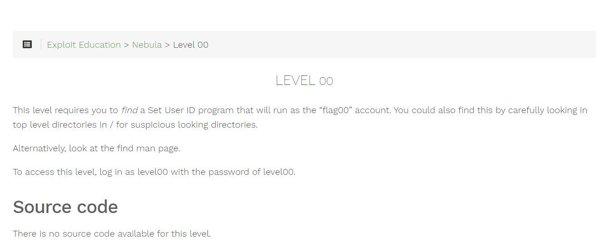
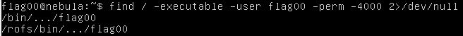
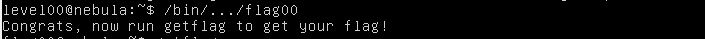
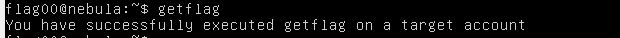

# Nebula - [LEVEL 00](https://exploit.education/nebula/level-00/)

Level Description:



# Nebula - [LEVEL 00](https://exploit.education/nebula/level-00/) - Solution

As described, Let's login as ```level00:level00```.

From the challenge description, we understand that we need to ```find``` file with SUID that will run as ```flag00``` user.

To do so, We can run the following command ```find / -executable -user flag00 -perm -4000 2> /dev/null```:



We can see the files, Let's run the first file:



And now let's run ```getflag``` to get the flag:




