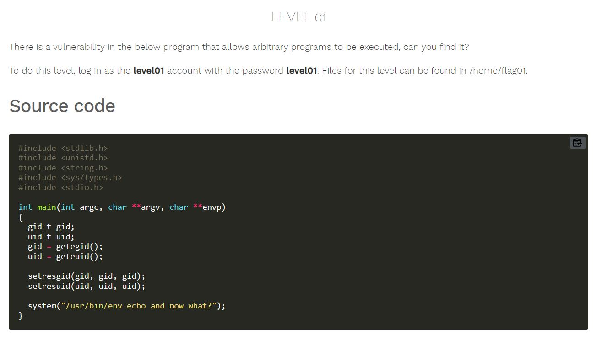
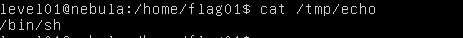
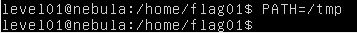
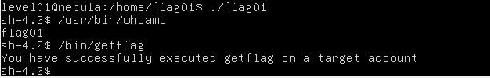

# Nebula - [LEVEL 01](https://exploit.education/nebula/level-01/)

Level Description:



# Nebula - [LEVEL 01](https://exploit.education/nebula/level-01/) - Solution

As we can see on the code, The binary runs ```echo``` command.

We can create our ```echo``` that contains ```/bin/sh``` to get shell as ```flag01``` user.

Let's create the following file on ```/tmp```:



Now, Let's change the ```PATH``` to ```/tmp``` only:



Now we just need to run the binary from ```/home/flag01/flag01``` to get shell as ```flag01``` user:

