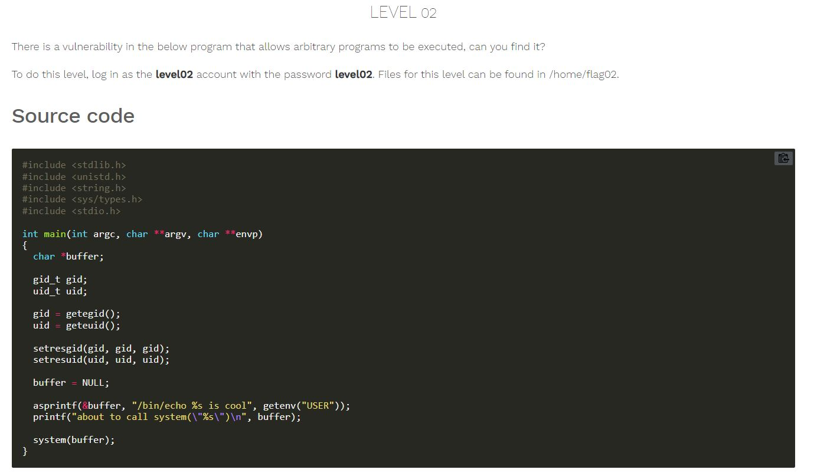
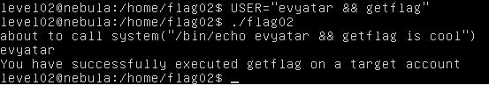

# Nebula - [LEVEL 02](https://exploit.education/nebula/level-02/)

Level Description:



# Nebula - [LEVEL 02](https://exploit.education/nebula/level-02/) - Solution

As we can see, The binary read from ```USER``` environment variable.

We can change ```USER``` variable to inject another command (```getflag```) to be executed by ```system```.

Let's change ```USER``` to ```USER=evyatar && getflag``` and then let's run the binary:

