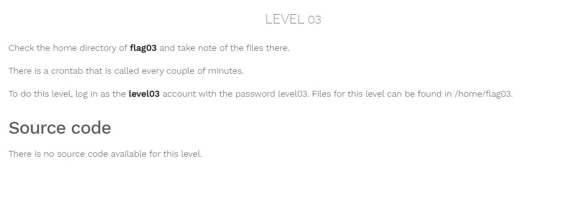
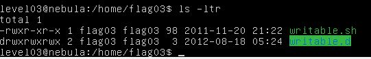
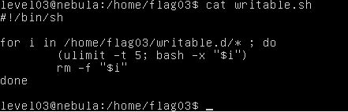
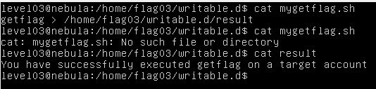

# Nebula - [LEVEL 03](https://exploit.education/nebula/level-03/)

Level Description:



# Nebula - [LEVEL 03](https://exploit.education/nebula/level-03/) - Solution

By observing ```/home/flag03``` directory we can see the following files:



```writable.sh``` file contains the following code:



According to the challenge description we can assume that this script will run by crontab, Let's create on ```writable.d``` directory our script to run ```getflag``` command and write the result of the command to the same directory:
```console
getflag > /home/flag03/writable.d/result
```

Wait a couple of minutes and we get:

 
