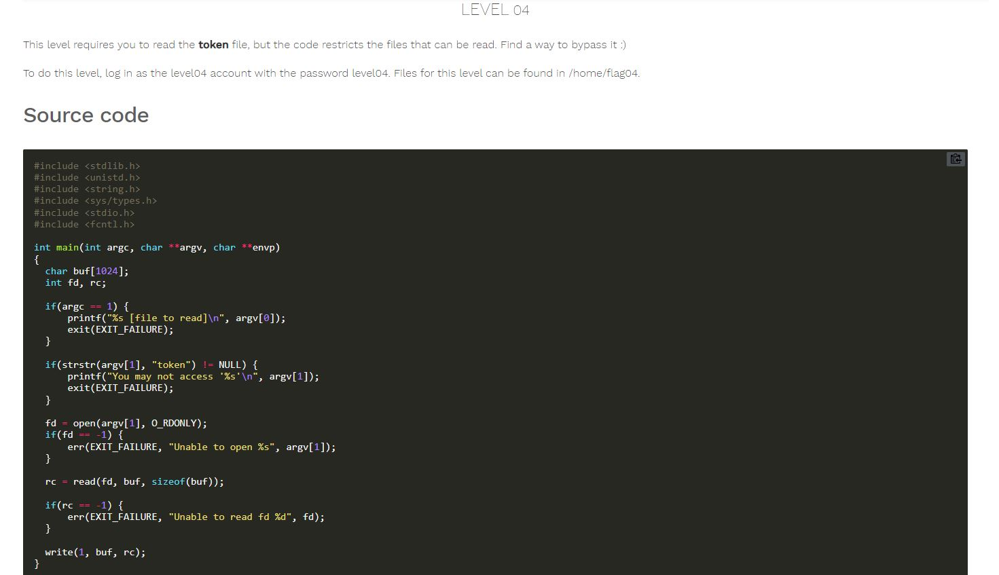
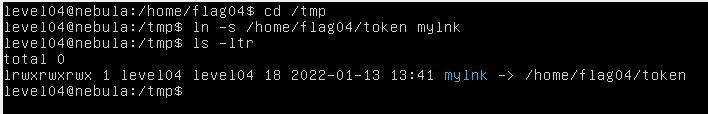
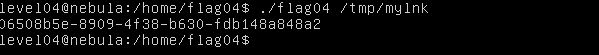

# Nebula - [LEVEL 04](https://exploit.education/nebula/level-04/)

Level Description:



# Nebula - [LEVEL 04](https://exploit.education/nebula/level-04/) - Solution

As we can see, If the argument to the binary contains the word ```token``` we get an error by ```printf("You may not access '%s'\n", argv[1]);```.

We can bypass it by creating a symlink to this file as follow:



Now, let's run the binary with the symlink path as an argument:


