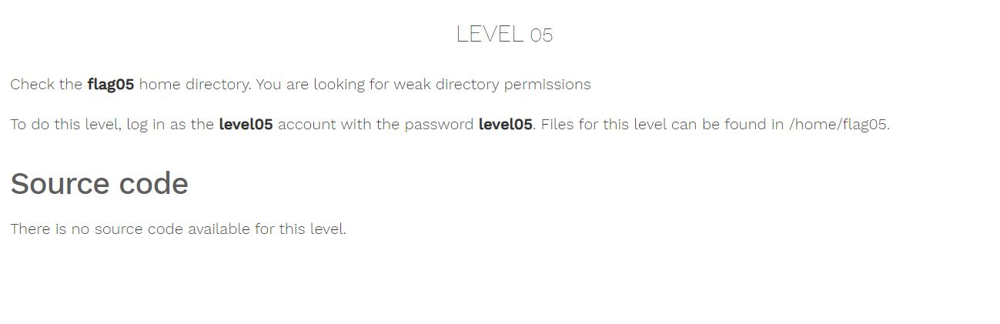
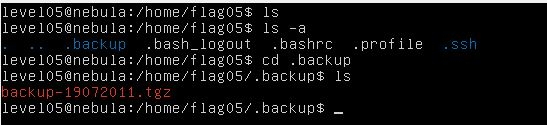
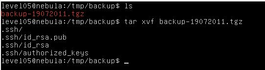
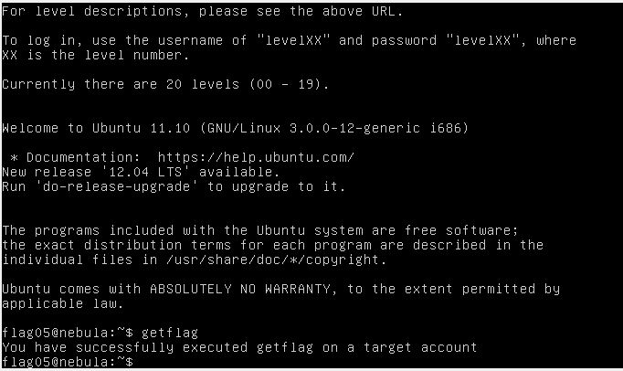

# Nebula - [LEVEL 05](https://exploit.education/nebula/level-05/)

Level Description:



# Nebula - [LEVEL 05](https://exploit.education/nebula/level-05/) - Solution

By running ```ls -a``` we can see hidden directory called ```.backup```:



Let's copy the file to ```/tmp/backup``` directory and extract the file using ```tar xvf backup-19072011.tgz```:



We can see the private SSH key (```id_rsa```) of ```flag05``` user, Let's use it by running ```ssh -i .ssh/id_rsa flag05@localhost```:

