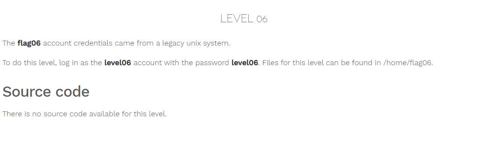
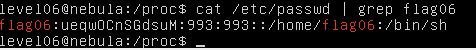
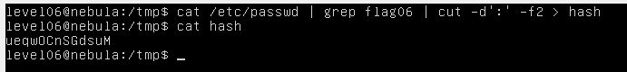
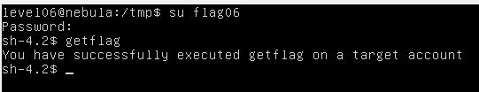

# Nebula - [LEVEL 06](https://exploit.education/nebula/level-06/)

Level Description:



# Nebula - [LEVEL 06](https://exploit.education/nebula/level-06/) - Solution

According to the challenge description, we need to find the password of ```flag06``` user, Earlier, passwords were stored in ```/etc/passwd``` file, because ```/etc/passwd``` accessible by everyone - the passwords were later moved to ```/etc/shadow```.

By observing the file ```/etc/passwd``` we found the hashed password of ```flag06```:



Let's save the hash:



By cracking this hash using ```john``` we get the password ```hello```, Let's login as ```flag06``` using this password to run ```getflag```:




