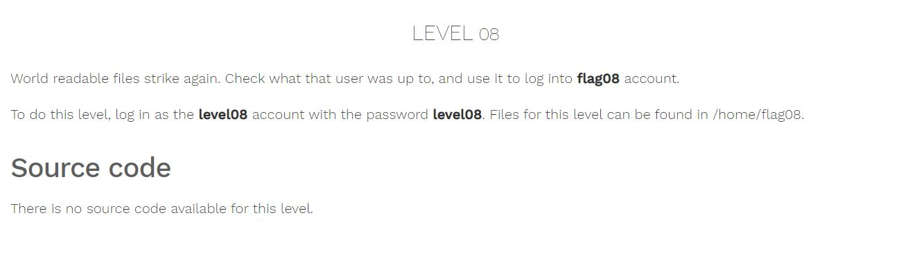
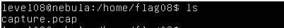
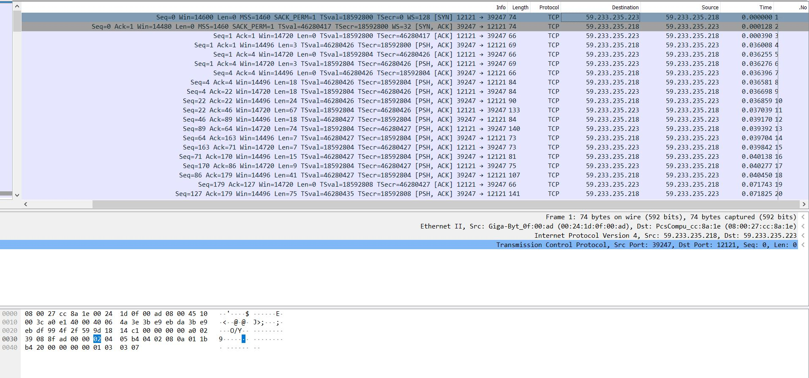
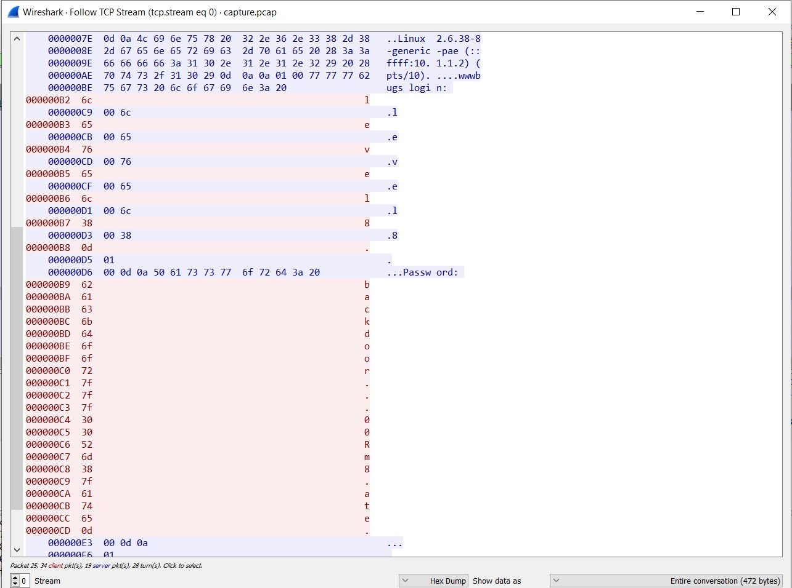
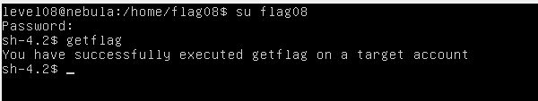

# Nebula - [LEVEL 08](https://exploit.education/nebula/level-08/)

Level Description:



# Nebula - [LEVEL 08](https://exploit.education/nebula/level-08/) - Solution

By observing the ```/home/flag08``` directory we can see the following file:



Let's download the file from the machine, We can do so by ```python -m SimpleHTTPServer``` then downloading it from our host.

By analyzing the [capture.pcap](capture.pcap) file we can see:



Let's Follow TCP Stream of the first packet (Right click -> Follow -> TCP Stream):



We can see the password hex bytes:
```asm
000000B9  62                                                 b
000000BA  61                                                 a
000000BB  63                                                 c
000000BC  6b                                                 k
000000BD  64                                                 d
000000BE  6f                                                 o
000000BF  6f                                                 o
000000C0  72                                                 r
000000C1  7f                                                 .
000000C2  7f                                                 .
000000C3  7f                                                 .
000000C4  30                                                 0
000000C5  30                                                 0
000000C6  52                                                 R
000000C7  6d                                                 m
000000C8  38                                                 8
000000C9  7f                                                 .
000000CA  61                                                 a
000000CB  74                                                 t
000000CC  65                                                 e
000000CD  0d                                                 .
```

The character [7f](https://learn.parallax.com/support/reference/ascii-table-0-127) is ```DEL``` and [0d](https://learn.parallax.com/support/reference/ascii-table-0-127) in ```Enter```, So it's meaning the user type ```backdoor<DEL><DEL><DEL>00Rm8<DEL>ate<ENTER>``` which is ```backd00Rmate```.

So let's use this password and run ```getflag```:

