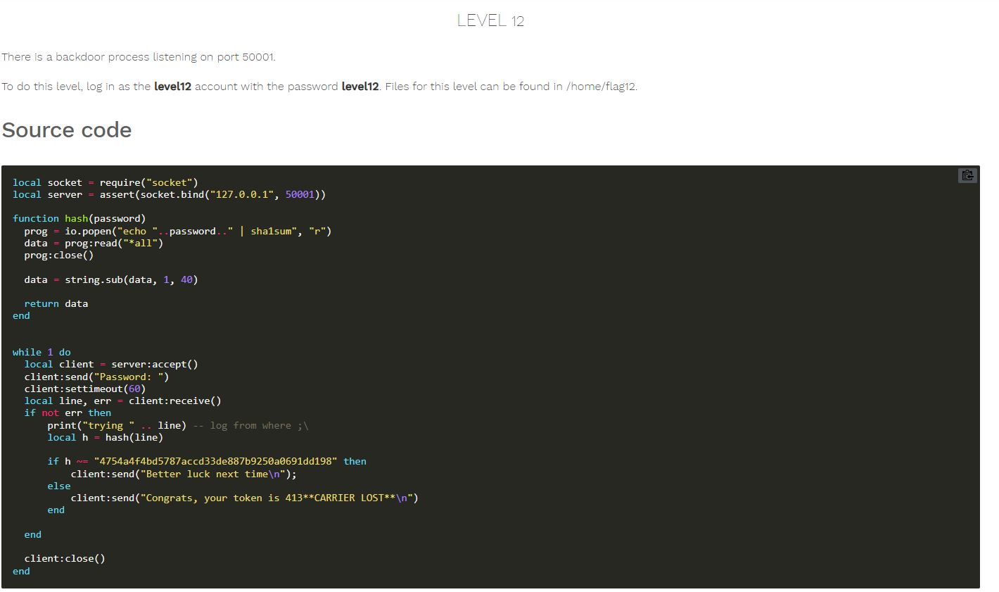
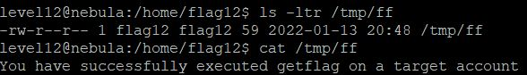

# Nebula - [LEVEL 12](https://exploit.education/nebula/level-12/)

Level Description:




# Nebula - [LEVEL 12](https://exploit.education/nebula/level-12/) - Solution

As we can see, The server runs the following line:
```lua
prog = io.popen("echo "..password.." | sha1sum", "r")
```

We can inject our command by sending the password ```X|getflag > /tmp/gf```.

Let's try it:



And we are successfully run ```getflag``` command as ```flag12``` user.