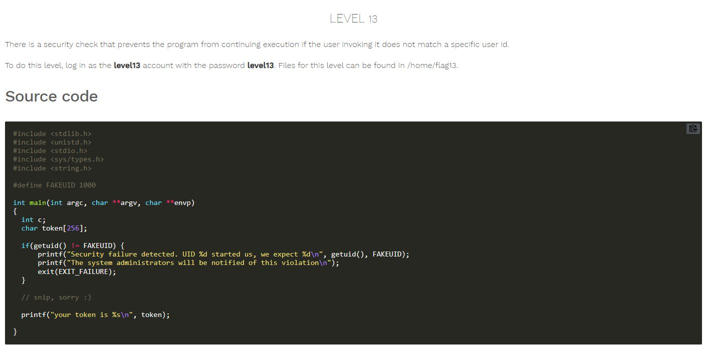

# Nebula - [LEVEL 13](https://exploit.education/nebula/level-13/)

Level Description:




# Nebula - [LEVEL 13](https://exploit.education/nebula/level-13/) - Solution

To solve this challenge we need to use [gdb](https://en.wikipedia.org/wiki/GNU_Debugger) or any other debugging tool.

Let's observe the ```main``` function using ```gdb``` by running the command ```disassemble main```:
```asm
(gdb) set disassembly-flavor intel
(gdb) disassemble main
Dump of assembler code for function main:
   0x080484c4 <+0>:     push   ebp
   0x080484c5 <+1>:     mov    ebp,esp
   0x080484c7 <+3>:     push   edi
   0x080484c8 <+4>:     push   ebx
   0x080484c9 <+5>:     and    esp,0xfffffff0
   0x080484cc <+8>:     sub    esp,0x130
   0x080484d2 <+14>:    mov    eax,DWORD PTR [ebp+0xc]
   0x080484d5 <+17>:    mov    DWORD PTR [esp+0x1c],eax
   0x080484d9 <+21>:    mov    eax,DWORD PTR [ebp+0x10]
   0x080484dc <+24>:    mov    DWORD PTR [esp+0x18],eax
   0x080484e0 <+28>:    mov    eax,gs:0x14
   0x080484e6 <+34>:    mov    DWORD PTR [esp+0x12c],eax
   0x080484ed <+41>:    xor    eax,eax
   0x080484ef <+43>:    call   0x80483c0 <getuid@plt>
   0x080484f4 <+48>:    cmp    eax,0x3e8
   0x080484f9 <+53>:    je     0x8048531 <main+109>
   0x080484fb <+55>:    call   0x80483c0 <getuid@plt>
   0x08048500 <+60>:    mov    edx,0x80486d0
   0x08048505 <+65>:    mov    DWORD PTR [esp+0x8],0x3e8
   0x0804850d <+73>:    mov    DWORD PTR [esp+0x4],eax
   0x08048511 <+77>:    mov    DWORD PTR [esp],edx
   0x08048514 <+80>:    call   0x80483a0 <printf@plt>
   0x08048519 <+85>:    mov    DWORD PTR [esp],0x804870c
   0x08048520 <+92>:    call   0x80483d0 <puts@plt>
   0x08048525 <+97>:    mov    DWORD PTR [esp],0x1
   0x0804852c <+104>:   call   0x80483f0 <exit@plt>
   0x08048531 <+109>:   lea    eax,[esp+0x2c]
   0x08048535 <+113>:   mov    ebx,eax
   0x08048537 <+115>:   mov    eax,0x0
   0x0804853c <+120>:   mov    edx,0x40
   0x08048541 <+125>:   mov    edi,ebx
   0x08048543 <+127>:   mov    ecx,edx
   0x08048545 <+129>:   rep stos DWORD PTR es:[edi],eax
   0x08048547 <+131>:   mov    edx,0x804874c
   0x0804854c <+136>:   lea    eax,[esp+0x2c]
   0x08048550 <+140>:   mov    ecx,DWORD PTR [edx]
   0x08048552 <+142>:   mov    DWORD PTR [eax],ecx
   0x08048554 <+144>:   mov    ecx,DWORD PTR [edx+0x4]
   0x08048557 <+147>:   mov    DWORD PTR [eax+0x4],ecx
   0x0804855a <+150>:   mov    ecx,DWORD PTR [edx+0x8]
   0x0804855d <+153>:   mov    DWORD PTR [eax+0x8],ecx
   0x08048560 <+156>:   mov    ecx,DWORD PTR [edx+0xc]
   0x08048563 <+159>:   mov    DWORD PTR [eax+0xc],ecx
   0x08048566 <+162>:   mov    ecx,DWORD PTR [edx+0x10]
   0x08048569 <+165>:   mov    DWORD PTR [eax+0x10],ecx
   0x0804856c <+168>:   mov    ecx,DWORD PTR [edx+0x14]
   0x0804856f <+171>:   mov    DWORD PTR [eax+0x14],ecx
   0x08048572 <+174>:   mov    ecx,DWORD PTR [edx+0x18]
```

We can see the following instructions:
```asm
...
0x080484ef <+43>:    call   0x80483c0 <getuid@plt>
0x080484f4 <+48>:    cmp    eax,0x3e8
0x080484f9 <+53>:    je     0x8048531 <main+109>
...
```

We need to set a breakpoint on ```main+48``` by running the command ```b *main+48```:
```asm
(gdb) b *main+48
Breakpoint 1 at 0x80484f4
```

Now, We have at least two methods to solve it:
1. To change the value of the EAX register (which contains the return value from ```getuid()``` command) to ```1000```:
```asm
(gdb) b *main+48
Breakpoint 1 at 0x80484f4
(gdb) r
Starting program: /home/flag13/flag13

Breakpoint 1, 0x080484f4 in main ()
(gdb) print $eax
$1 = 1014
(gdb) set $eax=1000
(gdb) c
Continuing.
your token is b705702b-76a8-42b0-8844-3adabbe5ac58
```

2. To simply ```jump``` to ```main+109``` by running the command ```jump *main+109```:
```asm
(gdb) b *main+48
Breakpoint 1 at 0x80484f4
(gdb) r
Starting program: /home/flag13/flag13

Breakpoint 1, 0x080484f4 in main ()
(gdb) jump *main+109
Continuing at 0x8048531.
your token is b705702b-76a8-42b0-8844-3adabbe5ac58
```

And we successfully get the token.