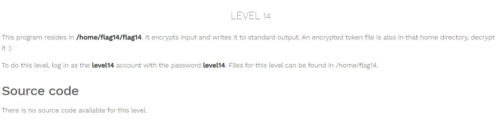
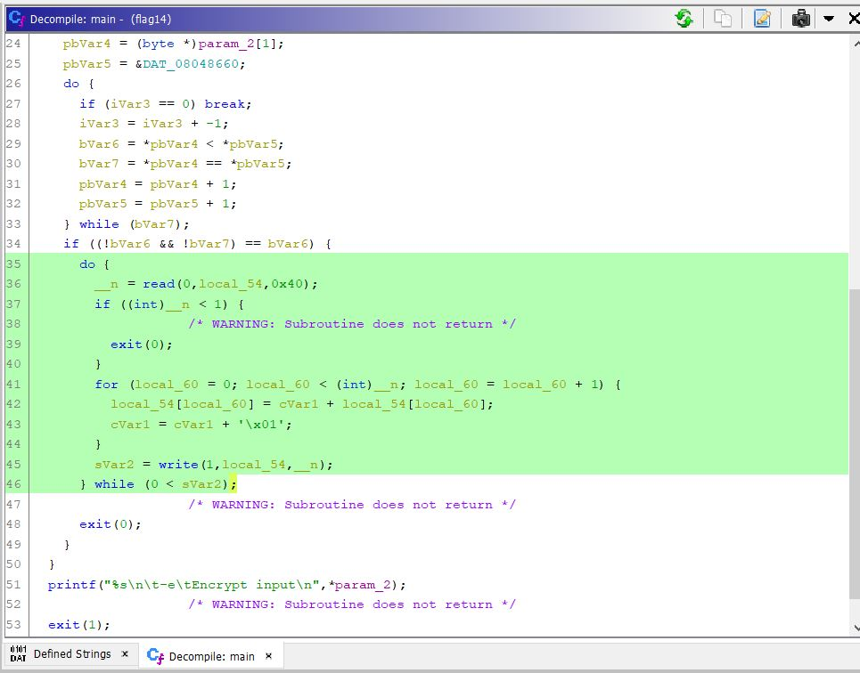
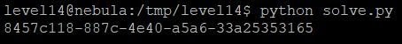

# Nebula - [LEVEL 14](https://exploit.education/nebula/level-14/)

Level Description:



# Nebula - [LEVEL 14](https://exploit.education/nebula/level-14/) - Solution

By decrypting the binary using [Ghidra](https://ghidra-sre.org/) we can see the following ```main``` function:



Let's observe the marked section:
```c
...
      do {
        __n = read(0,local_54,0x40);
        if ((int)__n < 1) {
                    /* WARNING: Subroutine does not return */
          exit(0);
        }
        for (local_60 = 0; local_60 < (int)__n; local_60 = local_60 + 1) {
          local_54[local_60] = cVar1 + local_54[local_60];
          cVar1 = cVar1 + '\x01';
        }
        sVar2 = write(1,local_54,__n);
      } while (0 < sVar2);
...
```

We can see that the code takes the first byte from the encrypt message and add it the ```cVar``` value which is ```0```, Then for the next byte it will add the new value of ```cVar``` which is ```cVar+1=1``` etc...

We can get the flag with the following ```python``` code:
```python
token = open('/home/flag14/token','rb').read()

cVar1 = 0

dec_token=bytearray()

for i in range(len(token)-1):
        dec_token.append(cVar1 + ord(token[i]));
        cVar1 = cVar1 - 1;

print(dec_token)
```

Run it:



And we successfully get the token.