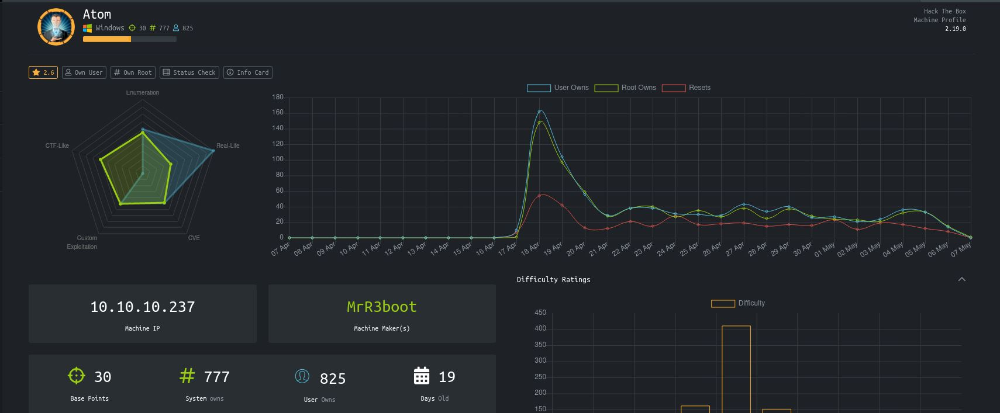
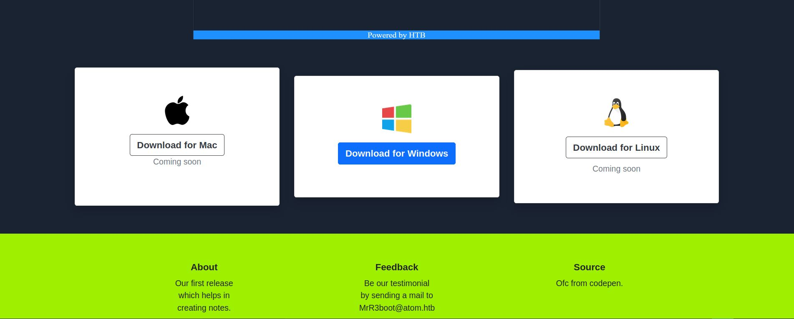

# Atom - HackTheBox
Windows, 30 Base Points, Medium

## Machine


 
## Atom Solution

### User

So let's start with ```nmap``` scanning:

```console
┌─[evyatar@parrot]─[/hackthebox/Atom]
└──╼ $ nmap -sC -sV -oA nmap/Atom 10.10.10.237
# Nmap 7.80 scan initiated Sat Apr 17 22:01:25 2021 as: nmap -sC -sV -oA nmap/Atom 10.10.10.237
Nmap scan report for 10.10.10.237
Host is up (0.11s latency).
Not shown: 996 filtered ports
PORT    STATE SERVICE      VERSION
80/tcp  open  http         Apache httpd 2.4.46 ((Win64) OpenSSL/1.1.1j PHP/7.3.27)
| http-methods: 
|_  Potentially risky methods: TRACE
|_http-server-header: Apache/2.4.46 (Win64) OpenSSL/1.1.1j PHP/7.3.27
|_http-title: Heed Solutions
135/tcp open  msrpc        Microsoft Windows RPC
443/tcp open  ssl/http     Apache httpd 2.4.46 ((Win64) OpenSSL/1.1.1j PHP/7.3.27)
| http-methods: 
|_  Potentially risky methods: TRACE
|_http-server-header: Apache/2.4.46 (Win64) OpenSSL/1.1.1j PHP/7.3.27
|_http-title: Heed Solutions
| ssl-cert: Subject: commonName=localhost
| Not valid before: 2009-11-10T23:48:47
|_Not valid after:  2019-11-08T23:48:47
|_ssl-date: TLS randomness does not represent time
| tls-alpn: 
|_  http/1.1
445/tcp open  microsoft-ds Windows 10 Pro 19042 microsoft-ds (workgroup: WORKGROUP)
Service Info: Host: ATOM; OS: Windows; CPE: cpe:/o:microsoft:windows

Host script results:
|_clock-skew: mean: 2h23m49s, deviation: 4h02m31s, median: 3m47s
| smb-os-discovery: 
|   OS: Windows 10 Pro 19042 (Windows 10 Pro 6.3)
|   OS CPE: cpe:/o:microsoft:windows_10::-
|   Computer name: ATOM
|   NetBIOS computer name: ATOM\x00
|   Workgroup: WORKGROUP\x00
|_  System time: 2021-04-17T12:06:09-07:00
| smb-security-mode: 
|   account_used: guest
|   authentication_level: user
|   challenge_response: supported
|_  message_signing: disabled (dangerous, but default)
| smb2-security-mode: 
|   2.02: 
|_    Message signing enabled but not required
| smb2-time: 
|   date: 2021-04-17T19:06:07
|_  start_date: N/A

Service detection performed. Please report any incorrect results at https://nmap.org/submit/ .
# Nmap done at Sat Apr 17 22:02:58 2021 -- 1 IP address (1 host up) scanned in 93.11 seconds

```

Let's try to observe port 80:



So we can see site with download link for Heed program, one user ```MrR3boot``` and domain ```atom.htb```.

Let's try to enumerate the smb shares using ```smbclient```:
```console
┌─[evyatar@parrot]─[/hackthebox/Atom]
└──╼ $ smbclient -L 10.10.10.237
Enter WORKGROUP\user's password: 

	Sharename       Type      Comment
	---------       ----      -------
	ADMIN$          Disk      Remote Admin
	C$              Disk      Default share
	IPC$            IPC       Remote IPC
	Software_Updates Disk      
SMB1 disabled -- no workgroup available
```

By browsing the share ```Software_Updates Disk``` we can get intresting pdf file ```UAT_Testing_Procedures.pdf```:
```console
┌─[evyatar@parrot]─[/hackthebox/Atom]
└──╼ $ smbclient \\\\10.10.10.237\\Software_Updates Disk
Try "help" to get a list of possible commands.
smb: \> ls
  .                                   D        0  Fri May  7 01:55:37 2021
  ..                                  D        0  Fri May  7 01:55:37 2021
  client1                             D        0  Fri May  7 01:55:37 2021
  client2                             D        0  Fri May  7 01:55:37 2021
  client3                             D        0  Fri May  7 01:55:37 2021
  UAT_Testing_Procedures.pdf          A    35202  Fri Apr  9 14:18:08 2021

		4413951 blocks of size 4096. 1364689 blocks available
smb: \> get UAT_Testing_Procedures.pdf
getting file \UAT_Testing_Procedures.pdf of size 35202 as UAT_Testing_Procedures.pdf (89.5 KiloBytes/sec) (average 89.5 KiloBytes/sec)
smb: \> 
```

## Atom is still active machine - [Full writeup](Atom-Writeup.pdf) avaliable with root hash password only.

Telegram: [@evyatar9](https://t.me/evyatar9)

Discord: [evyatar9](https://discordapp.com/users/812805349815091251)