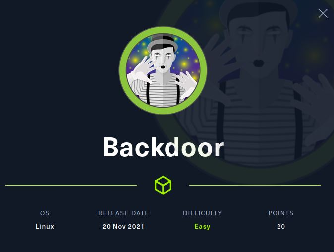
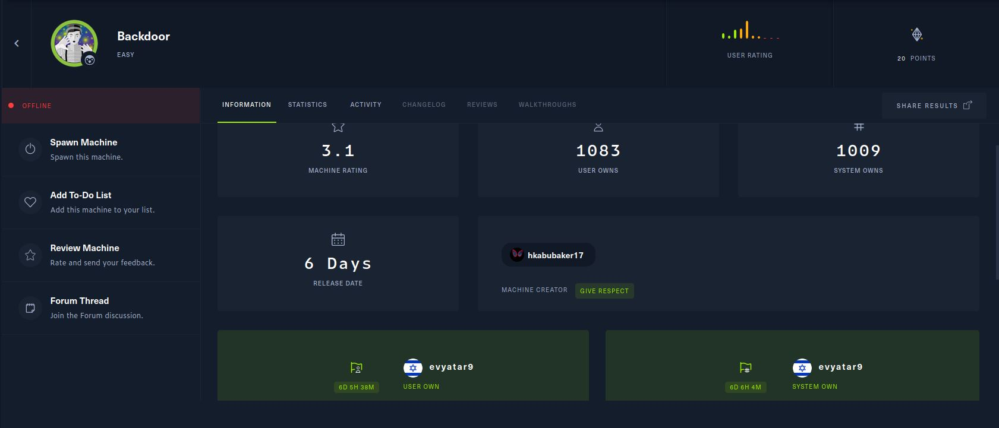

# Backdoor - HackTheBox - Writeup
Linux, 20 Base Points, Easy



## Machine


 

## Backdoor Solution

### User

Let's start with ```nmap``` scanning:

```console
┌─[evyatar@parrot]─[/hackthebox/Backdoor]
└──╼ $ nmap -sV -sC -oA nmap/Backdoor 10.10.11.125
Starting Nmap 7.80 ( https://nmap.org ) at 2021-11-25 22:56 IST
Nmap scan report for 10.10.11.125
Host is up (0.18s latency).
Not shown: 998 closed ports
PORT   STATE SERVICE VERSION
22/tcp open  ssh     OpenSSH 8.2p1 Ubuntu 4ubuntu0.3 (Ubuntu Linux; protocol 2.0)
80/tcp open  http    Apache httpd 2.4.41 ((Ubuntu))
|_http-generator: WordPress 5.8.1
|_http-server-header: Apache/2.4.41 (Ubuntu)
|_http-title: Backdoor &#8211; Real-Life
|_https-redirect: ERROR: Script execution failed (use -d to debug)
Service Info: OS: Linux; CPE: cpe:/o:linux:linux_kernel
1337/tcp closed waste


```

By observing port 80 we get the following web page:


## Backdoor is still active machine - [Full writeup](Backdoor-Writeup.pdf) available with root hash password only.

Telegram: [@evyatar9](https://t.me/evyatar9)

Discord: [evyatar9](https://discordapp.com/users/812805349815091251)

